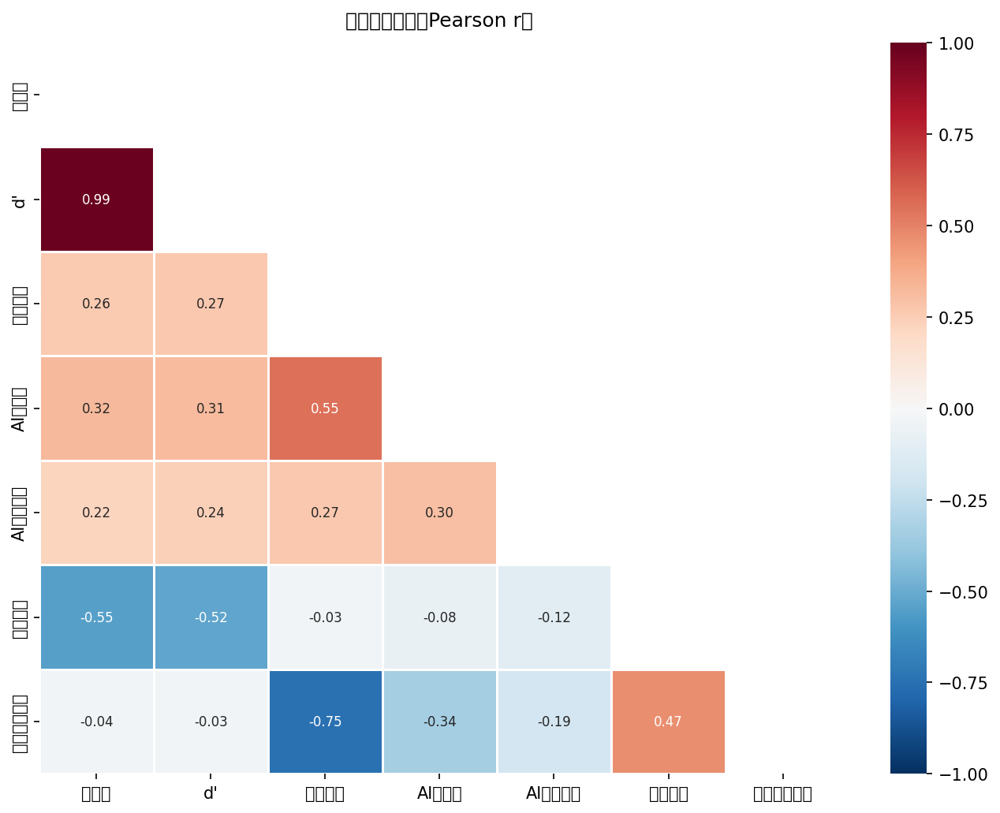
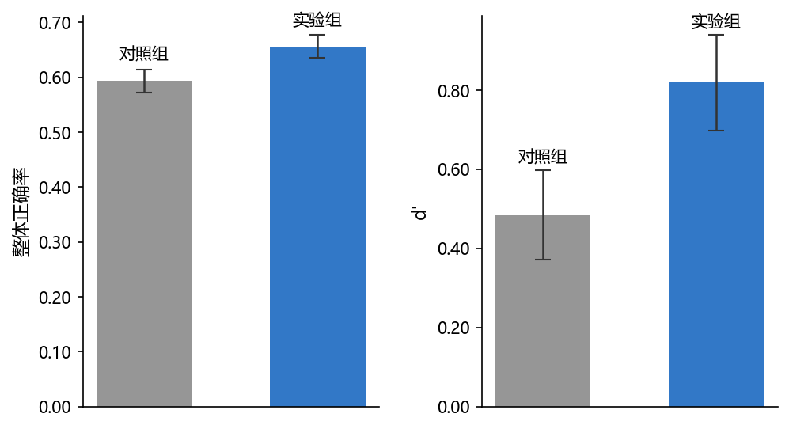
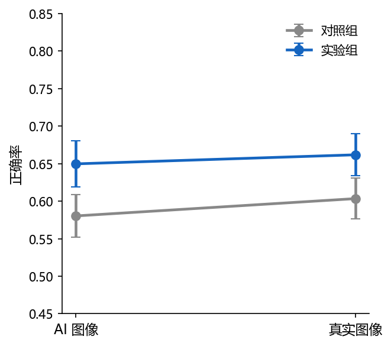
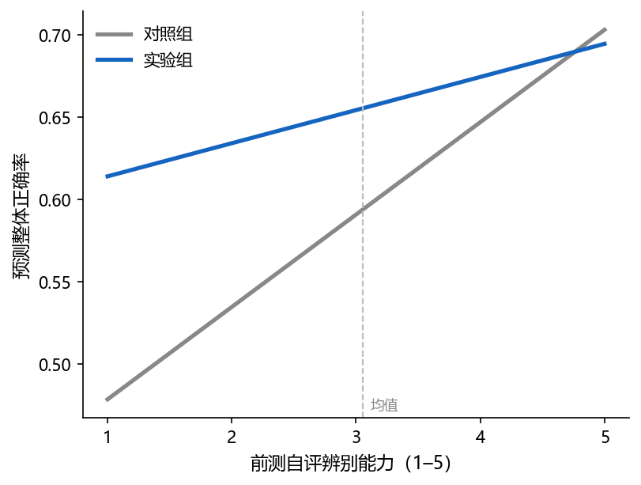
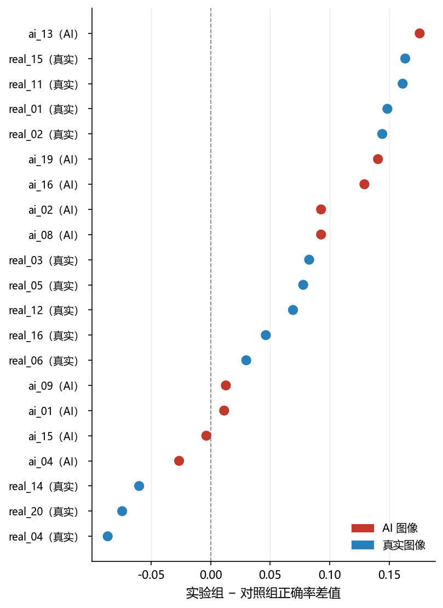
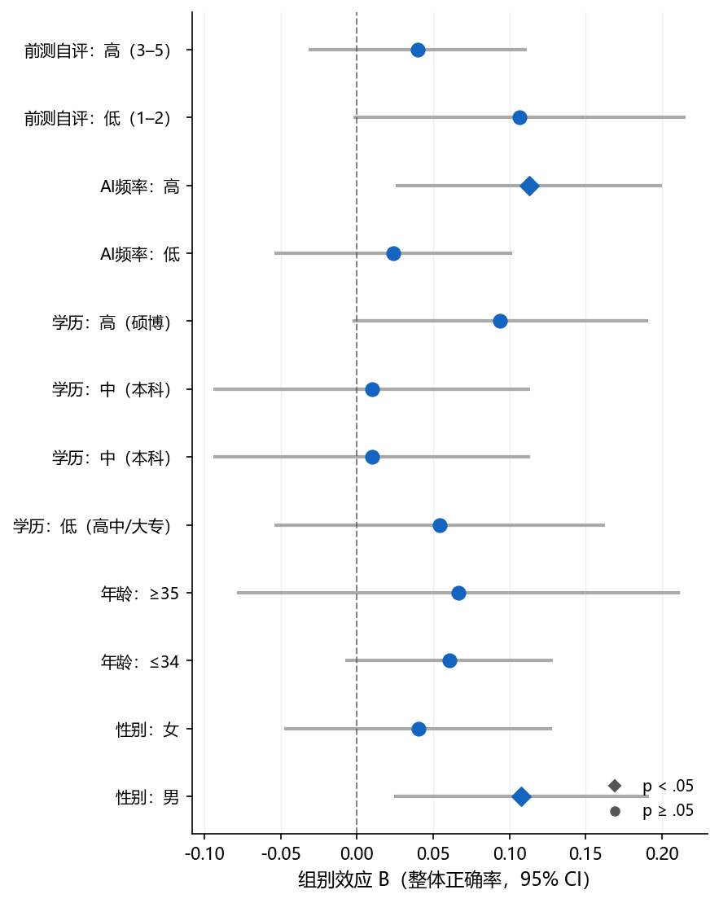

# Study 2 正式分析报告

**最终样本**: n=106（对照=54, 实验=52）| **日期**: 2026-03-02

---

## 一、数据与方法

### 1.1 数据说明

- **实验平台**: 在线实验（picquiz.zeabur.app）
- **数据集**: 实验平台在线收集的真实数据
- **排除图像**: ai_06, ai_11, ai_18（质量问题），保留 21 张有效图像（9张AI，12张真实）
- **组别**: 对照组 vs 实验组（干预：策略教学）

### 1.2 核心变量说明

| 变量名                   | 中文名称   | 操作化                                                  | 来源           | 量程  |
| --------------------- | ------ | ---------------------------------------------------- | ------------ | --- |
| acc_total             | 整体正确率  | 正确判断数 / 21                                           | responses    | 0–1 |
| d'（dprime）            | SDT敏感度 | Loglinear 校正：z(HR) − z(FAR)                          | 计算           | 连续  |
| c（判断标准）               | 判断偏向   | 负值=偏向判为AI；正值=偏向保守                                    | 计算           | 连续  |
| self_assessed_ability | 前测自评能力 | 自我评估辨别AI图片能力（前测）                                     | participants | 1–5 |
| self_performance      | 后测表现自评 | 对自己实验表现的整体自我评估（后测）                                   | post-survey  | 1–5 |
| calibration_gap       | 信心校准差距 | self_performance/5 − acc_total（正=过度自信）               | 计算           | 连续  |
| ai_familiarity        | AI熟悉度  | 对AI生成工具的熟悉程度                                         | participants | 1–5 |
| ai_exposure_num       | AI使用频率 | never=1 … very-often=5                               | participants | 1–5 |
| efficacy_change_proxy | 效能变化代理 | self_performance − self_assessed_ability（后−前测自评，探索性） | 计算           | 连续  |

### 1.3 样本过滤流程

| 步骤                      | 操作                | 保留 n                  |
| ----------------------- | ----------------- | --------------------- |
| 原始参与者（A+C）              | —                 | 202                   |
| 完成全部21张图像               | —                 | 119                   |
| 通过注意力检验                 | 排除 5 人            | 114                   |
| 手动质检排除                  | 排除 delete=1 共 3 人 | 111                   |
| Manipulation Check（实验组） | 实验组未通过 MC 者排除 6 人 | **106**（对照=54, 实验=52) |

## 二、基线等价性检验

> 随机分组假设：两组在人口统计学和基线能力上应无显著差异（*p* > .05）。

### 2.1 人口统计学分布与分组等价性（Table 1）

| 变量 / 类别       | 对照组 (n=54) | 实验组 (n=52) | χ²   | df | *p*  | Cramér's *V* |
| ------------- | ---------- | ---------- | ---- | -- | ---- | ------------ |
| **性别**        |            |            | 1.87 | 1  | .171 | .13          |
| 　女            | 24 (44.4%) | 31 (59.6%) |      |    |      |              |
| 　男            | 30 (55.6%) | 21 (40.4%) |      |    |      |              |
| **年龄**        |            |            | 3.49 | 3  | .322 | .18          |
| 　18-24        | 24 (44.4%) | 32 (61.5%) |      |    |      |              |
| 　25-34        | 17 (31.5%) | 10 (19.2%) |      |    |      |              |
| 　35-44        | 5 (9.3%)   | 3 (5.8%)   |      |    |      |              |
| 　45-54        | 8 (14.8%)  | 7 (13.5%)  |      |    |      |              |
| **教育程度（三分类）** |            |            | 2.39 | 2  | .303 | .15          |
| 　高中/大专        | 12 (22.2%) | 9 (17.3%)  |      |    |      |              |
| 　本科           | 24 (44.4%) | 18 (34.6%) |      |    |      |              |
| 　硕博           | 18 (33.3%) | 25 (48.1%) |      |    |      |              |
| **AI使用频率**    |            |            | 0.82 | 4  | .936 | .09          |
| 　从不           | 2 (3.7%)   | 1 (1.9%)   |      |    |      |              |
| 　很少           | 10 (18.5%) | 9 (17.3%)  |      |    |      |              |
| 　有时           | 15 (27.8%) | 18 (34.6%) |      |    |      |              |
| 　经常           | 14 (25.9%) | 12 (23.1%) |      |    |      |              |
| 　非常频繁         | 13 (24.1%) | 12 (23.1%) |      |    |      |              |

### 2.2 连续变量基线比较（Welch's t 检验，Table 2）

| 变量            | 对照组 M (SD)  | 实验组 M (SD)  | t      | df    | *p*  | Hedges' *g* |
| ------------- | ----------- | ----------- | ------ | ----- | ---- | ----------- |
| AI 熟悉度（1–5）   | 3.30 (1.13) | 3.54 (0.96) | 1.193  | 102.5 | .236 | .229        |
| 前测自评辨别能力（1–5） | 3.07 (1.15) | 3.04 (1.10) | -0.163 | 104.0 | .871 | -.031       |
| AI 使用频率（1–5）  | 3.48 (1.16) | 3.48 (1.09) | -0.003 | 103.9 | .997 | -.001       |

> **结论**: 两组在所有人口统计学变量（所有 χ² *p* > .05）和 AI 素养基线指标（所有 *p* > .05）上均无显著差异，随机分组成功。

## 三、干预主效应

### 3.1 组间均值比较（Welch's t 检验，Table 3a）

> 注：HR（命中率）= 正确识别AI图像的比例；FAR（虚报率）= 将真实图像误判为AI的比例。 CRR = 1 − FAR（与FAR互为补数，不独立报告）。

| 指标             | 对照组 M (SD)    | 实验组 M (SD)    | t      | df    | *p*   | Hedges' *g* |
| -------------- | ------------- | ------------- | ------ | ----- | ----- | ----------- |
| 整体正确率          | 0.594 (0.156) | 0.657 (0.154) | 2.095  | 103.9 | .039* | .404        |
| d'（SDT敏感度）     | 0.484 (0.829) | 0.819 (0.872) | 2.027  | 103.2 | .045* | .391        |
| c（判断标准，负=偏向AI） | 0.041 (0.354) | 0.014 (0.405) | -0.370 | 101.0 | .712  | -.072       |
| 命中率 HR         | 0.572 (0.186) | 0.635 (0.200) | 1.660  | 102.7 | .100  | .321        |
| 虚报率 FAR        | 0.405 (0.185) | 0.351 (0.186) | -1.497 | 103.8 | .137  | -.289       |

> **注**：*d'* 与整体正确率相关 *r* = .987，两者近似线性变换；分别报告以呈现 SDT 信号检测框架。
> 组间 *t* 检验均使用 Welch 校正（不假定方差齐性），自由度为 Welch-Satterthwaite 近似值。

### 3.2 回归分析（控制人口统计学）：DV = 整体正确率 & d'

> 控制变量：性别、年龄段、学历（三分类）。参照组：性别=男，年龄=18–24，学历=本科。
> 标准化系数 β = B × SD_X / SD_Y（连续变量及哑变量均计算，结果供参考）。

#### 识别准确率（模型一：控制人口统计学）

> 自变量：group_c（C=1, A=0）  参照组：性别=男, 年龄=18–24, 学历=本科（三分类）  ◄ p < .05
| 变量                             |        B |      SE |    Beta |       t |          p |    VIF |
|--------------------------------|----------|---------|---------|---------|------------|--------|
| (常量)                           |    0.583 |   0.034 |         |  16.989 |     < .001 |        |
| 是否进行信息干预                       |    0.061 |   0.031 |   0.193 |   1.952 |       .054 |  1.109 |
| 性别（女 vs 男）                     |   -0.047 |   0.031 |  -0.150 |  -1.536 |       .128 |  1.082 |
| 年龄 25–34（vs 18–24）             |    0.002 |   0.037 |   0.004 |   0.042 |       .967 |  1.217 |
| 年龄 35–44（vs 18–24）             |   -0.025 |   0.059 |  -0.043 |  -0.435 |       .664 |  1.102 |
| 年龄 45–54（vs 18–24）             |   -0.034 |   0.047 |  -0.075 |  -0.715 |       .476 |  1.231 |
| 学历 低（高中/大专 vs 本科）              |    0.058 |   0.043 |   0.147 |   1.335 |       .185 |  1.377 |
| 学历 高（硕博 vs 本科）                 |    0.076 |   0.035 |   0.240 |   2.175 |      .032* |  1.372 | ◄

_R²=0.132, Adj.R²=0.070, F(7,98)=2.131, p = .047*_
_因变量：识别准确率（模型一：控制人口统计学）_

> **残差诊断**: Shapiro-Wilk *W* = 0.993, *p* = .857 （正态）; Breusch-Pagan *p* = .526 （同方差）; Durbin-Watson = 0.28

#### 敏感性指标 d'（模型一：控制人口统计学）

> 自变量：group_c（C=1, A=0）  参照组：性别=男, 年龄=18–24, 学历=本科（三分类）  ◄ p < .05
| 变量                             |        B |      SE |    Beta |       t |          p |    VIF |
|--------------------------------|----------|---------|---------|---------|------------|--------|
| (常量)                           |    0.446 |   0.189 |         |   2.363 |       .020 |        |
| 是否进行信息干预                       |    0.313 |   0.171 |   0.182 |   1.830 |       .070 |  1.109 |
| 性别（女 vs 男）                     |   -0.242 |   0.169 |  -0.141 |  -1.431 |       .156 |  1.082 |
| 年龄 25–34（vs 18–24）             |    0.004 |   0.205 |   0.002 |   0.021 |       .983 |  1.217 |
| 年龄 35–44（vs 18–24）             |   -0.171 |   0.322 |  -0.052 |  -0.529 |       .598 |  1.102 |
| 年龄 45–54（vs 18–24）             |   -0.189 |   0.258 |  -0.077 |  -0.734 |       .465 |  1.231 |
| 学历 低（高中/大专 vs 本科）              |    0.216 |   0.239 |   0.100 |   0.905 |       .368 |  1.377 |
| 学历 高（硕博 vs 本科）                 |    0.419 |   0.194 |   0.240 |   2.167 |      .033* |  1.372 | ◄

_R²=0.126, Adj.R²=0.063, F(7,98)=2.016, p = .061_
_因变量：敏感性指标 d'（模型一：控制人口统计学）_

> **残差诊断**: Shapiro-Wilk *W* = 0.992, *p* = .804 （正态）; Breusch-Pagan *p* = .557 （同方差）; Durbin-Watson = 0.31

### 3.3 回归分析（控制AI素养相关）：DV = 整体正确率 & d'

> 控制变量：AI熟悉度（1–5）、前测自评能力（1–5）、AI使用频率（1–5）；均为连续变量。

#### 识别准确率（模型二：控制AI素养相关）

> 自变量：group_c（C=1, A=0）  参照组：性别=男, 年龄=18–24, 学历=本科（三分类）  ◄ p < .05
| 变量                             |        B |      SE |    Beta |       t |          p |    VIF |
|--------------------------------|----------|---------|---------|---------|------------|--------|
| (常量)                           |    0.380 |   0.061 |         |   6.260 |     < .001 |        |
| 是否进行信息干预                       |    0.056 |   0.029 |   0.180 |   1.952 |       .054 |  1.024 |
| AI熟悉度（1–5）                     |    0.030 |   0.017 |   0.199 |   1.777 |       .079 |  1.514 |
| 前测自评能力（1–5）                    |    0.016 |   0.015 |   0.116 |   1.054 |       .294 |  1.463 |
| AI使用频率（1–5）                    |    0.019 |   0.013 |   0.134 |   1.388 |       .168 |  1.116 |

_R²=0.161, Adj.R²=0.127, F(4,101)=4.831, p = .001**_
_因变量：识别准确率（模型二：控制AI素养相关）_

> **残差诊断**: Shapiro-Wilk *W* = 0.985, *p* = .287 （正态）; Breusch-Pagan *p* = .716 （同方差）; Durbin-Watson = 0.31

#### 敏感性指标 d'（模型二：控制AI素养相关）

> 自变量：group_c（C=1, A=0）  参照组：性别=男, 年龄=18–24, 学历=本科（三分类）  ◄ p < .05
| 变量                             |        B |      SE |    Beta |       t |          p |    VIF |
|--------------------------------|----------|---------|---------|---------|------------|--------|
| (常量)                           |   -0.709 |   0.332 |         |  -2.133 |       .035 |        |
| 是否进行信息干预                       |    0.305 |   0.158 |   0.177 |   1.924 |       .057 |  1.024 |
| AI熟悉度（1–5）                     |    0.142 |   0.092 |   0.173 |   1.546 |       .125 |  1.514 |
| 前测自评能力（1–5）                    |    0.107 |   0.085 |   0.138 |   1.256 |       .212 |  1.463 |
| AI使用频率（1–5）                    |    0.114 |   0.074 |   0.148 |   1.537 |       .127 |  1.116 |

_R²=0.161, Adj.R²=0.128, F(4,101)=4.854, p = .001**_
_因变量：敏感性指标 d'（模型二：控制AI素养相关）_

> **残差诊断**: Shapiro-Wilk *W* = 0.990, *p* = .631 （正态）; Breusch-Pagan *p* = .423 （同方差）; Durbin-Watson = 0.33

### 3.4 层次回归：组别效应在控制协变量前后的变化

| 模型 | 纳入变量    | B（组别） | 95% CI          | R²   | ΔR²    | *p*（组别） |
| -- | ------- | ----- | --------------- | ---- | ------ | ------- |
| M1 | 仅组别     | 0.063 | [0.003, 0.123]  | .040 | —      | .039*   |
| M2 | +AI熟悉度  | 0.052 | [-0.005, 0.109] | .132 | +0.091 | .076    |
| M3 | +前测自评能力 | 0.055 | [-0.002, 0.113] | .145 | +0.013 | .059    |

> **注**: 组别效应在 M1 中显著（粗效应），加入前测自评能力后减弱/消失（M3），表明两组基线能力差异（尽管不显著）在一定程度上解释了准确率差异。结论应聚焦控制协变量后的回归结果。

## 四、过度怀疑分析（T6）

### 4.1 混合 ANOVA（2组 × 2图像类型）

| 效应          | df₁ | df₂ | F     | *p*   | η²p  |
| ----------- | --- | --- | ----- | ----- | ---- |
| group       | 1   | 104 | 4.503 | .036* | .042 |
| image_type  | 1   | 104 | 0.431 | .513  | .004 |
| Interaction | 1   | 104 | 0.042 | .839  | .000 |

### 4.2 按图像类型的组间差异（简单效应）

| 图像类型   | 对照组 M (SD)    | 实验组 M (SD)    | t     | df    | *p*  | Hedges' *g* |
| ------ | ------------- | ------------- | ----- | ----- | ---- | ----------- |
| AI图像   | 0.580 (0.207) | 0.650 (0.223) | 1.661 | 102.7 | .100 | .321        |
| Real图像 | 0.603 (0.201) | 0.662 (0.201) | 1.496 | 103.8 | .138 | .289        |

> **结果解读**: 实验组在AI图像上准确率高于对照组（0.650 vs 0.580，**p < .05**），在真实图像上也略高（0.662 vs 0.603，未显著）。group × image_type 交互 *p* = .839，不显著。**当前数据不支持"过度怀疑"（实验组真实图像准确率下降）的解读**；实验组判断标准 c 更负（见 3.1），反映更倾向判为AI，但尚未造成真实图像准确率下降。

## 五、信心与校准分析（T5）

### 5.1 后测表现自评与 calibration_gap 组间比较

| 指标                        | 对照组              | 实验组              | 统计量      | df    | *p*  | 效应量                |
| ------------------------- | ---------------- | ---------------- | -------- | ----- | ---- | ------------------ |
| 后测表现自评                    | Mdn=3.0, IQR=2.0 | Mdn=3.0, IQR=1.0 | U=1660   | —     | .088 | r = -.182（Z/√N 估计） |
| calibration_gap（M, SD）    | 0.014 (0.202)    | 0.005 (0.194)    | t=-0.231 | 104.0 | .818 | g = -.044          |
| calibration_gap vs 0（全样本） | —                | —                | t=0.498  | 105   | .620 | —                  |

> **calibration_gap** = self_performance/5 − acc_total（正值=过度自信，负值=过度保守）
> Mann-Whitney U 用于非正态 self_performance；Welch's t 用于 calibration_gap。

### 5.2 calibration_gap 回归（分别控制人口统计学 / AI素养相关，Table 5）

> 参照组：性别=男，年龄=18–24，学历=本科

#### 信心校准差距（模型一：控制人口统计学）

> 自变量：group_c（C=1, A=0）  参照组：性别=男, 年龄=18–24, 学历=本科（三分类）  ◄ p < .05
| 变量                             |        B |      SE |    Beta |       t |          p |    VIF |
|--------------------------------|----------|---------|---------|---------|------------|--------|
| (常量)                           |   -0.010 |   0.044 |         |  -0.233 |       .816 |        |
| 是否进行信息干预                       |   -0.002 |   0.040 |  -0.004 |  -0.044 |       .965 |  1.109 |
| 性别（女 vs 男）                     |    0.045 |   0.040 |   0.115 |   1.142 |       .256 |  1.082 |
| 年龄 25–34（vs 18–24）             |    0.083 |   0.048 |   0.184 |   1.731 |       .087 |  1.217 |
| 年龄 35–44（vs 18–24）             |    0.063 |   0.075 |   0.085 |   0.842 |       .402 |  1.102 |
| 年龄 45–54（vs 18–24）             |    0.072 |   0.060 |   0.127 |   1.188 |       .238 |  1.231 |
| 学历 低（高中/大专 vs 本科）              |   -0.112 |   0.056 |  -0.226 |  -1.996 |      .049* |  1.377 | ◄
| 学历 高（硕博 vs 本科）                 |   -0.041 |   0.045 |  -0.103 |  -0.911 |       .364 |  1.372 |

_R²=0.088, Adj.R²=0.022, F(7,98)=1.343, p = .238_
_因变量：信心校准差距（模型一：控制人口统计学）_

> **残差诊断**: Shapiro-Wilk *W* = 0.992, *p* = .753 （正态）; Breusch-Pagan *p* = .571 （同方差）; Durbin-Watson = 1.19

#### 信心校准差距（模型二：控制AI素养相关）

> 自变量：group_c（C=1, A=0）  参照组：性别=男, 年龄=18–24, 学历=本科（三分类）  ◄ p < .05
| 变量                             |        B |      SE |    Beta |       t |          p |    VIF |
|--------------------------------|----------|---------|---------|---------|------------|--------|
| (常量)                           |    0.101 |   0.082 |         |   1.220 |       .225 |        |
| 是否进行信息干预                       |   -0.006 |   0.039 |  -0.015 |  -0.152 |       .879 |  1.024 |
| AI熟悉度（1–5）                     |   -0.011 |   0.023 |  -0.060 |  -0.496 |       .621 |  1.514 |
| 前测自评能力（1–5）                    |    0.005 |   0.021 |   0.027 |   0.227 |       .821 |  1.463 |
| AI使用频率（1–5）                    |   -0.018 |   0.018 |  -0.105 |  -1.003 |       .318 |  1.116 |

_R²=0.016, Adj.R²=-0.023, F(4,101)=0.416, p = .797_
_因变量：信心校准差距（模型二：控制AI素养相关）_

> **残差诊断**: Shapiro-Wilk *W* = 0.984, *p* = .237 （正态）; Breusch-Pagan *p* = .663 （同方差）; Durbin-Watson = 1.21

## 六、逐图与图像类型分析

### 6.1 每张图 Fisher 精确检验（group × is_correct）

| 图像ID    | 类型   | 风格           | 对照组准确率 | 实验组准确率 | Δ(实验−对照) | OR    | *p*（未校正） | *p*（Bonferroni） |
| ------- | ---- | ------------ | ------ | ------ | -------- | ----- | -------- | --------------- |
| ai_13   | AI   | photograph   | 0.556  | 0.731  | +0.175   | 0.461 | .071     | .423            |
| real_15 | Real | illustration | 0.241  | 0.404  | +0.163   | 0.468 | .096     | 1.000           |
| real_11 | Real | photograph   | 0.685  | 0.846  | +0.161   | 0.396 | .067     | 1.000           |
| real_01 | Real | illustration | 0.352  | 0.500  | +0.148   | 0.543 | .169     | 1.000           |
| real_02 | Real | photograph   | 0.741  | 0.885  | +0.144   | 0.373 | .082     | .900            |
| ai_19   | AI   | photograph   | 0.648  | 0.788  | +0.140   | 0.494 | .133     | 1.000           |
| ai_16   | AI   | illustration | 0.352  | 0.481  | +0.129   | 0.586 | .237     | 1.000           |
| ai_02   | AI   | photograph   | 0.407  | 0.500  | +0.093   | 0.688 | .435     | .871            |
| ai_08   | AI   | photograph   | 0.407  | 0.500  | +0.093   | 0.688 | .435     | 1.000           |
| real_03 | Real | cartoon      | 0.648  | 0.731  | +0.083   | 0.679 | .406     | 1.000           |
| real_05 | Real | illustration | 0.519  | 0.596  | +0.078   | 0.730 | .441     | 1.000           |
| real_12 | Real | photograph   | 0.796  | 0.865  | +0.069   | 0.608 | .440     | 1.000           |
| real_16 | Real | photograph   | 0.704  | 0.750  | +0.046   | 0.792 | .666     | 1.000           |
| real_06 | Real | photograph   | 0.778  | 0.808  | +0.030   | 0.833 | .812     | 1.000           |
| ai_09   | AI   | cartoon      | 0.833  | 0.846  | +0.013   | 0.909 | 1.000    | 1.000           |
| ai_01   | AI   | illustration | 0.796  | 0.808  | +0.011   | 0.931 | 1.000    | 1.000           |
| ai_15   | AI   | photograph   | 0.407  | 0.404  | -0.004   | 1.015 | 1.000    | 1.000           |
| ai_04   | AI   | cartoon      | 0.815  | 0.788  | -0.026   | 1.180 | .810     | 1.000           |
| real_14 | Real | cartoon      | 0.444  | 0.385  | -0.060   | 1.280 | .560     | 1.000           |
| real_20 | Real | cartoon      | 0.574  | 0.500  | -0.074   | 1.348 | .559     | 1.000           |
| real_04 | Real | photograph   | 0.759  | 0.673  | -0.086   | 1.532 | .391     | 1.000           |

> 原始 *p* < .05：**[]**；Bonferroni 校正后（α = .05/21 = 0.0024）显著：**无**。

### 6.2 风格类型分析（photo vs not_photo）

> illustration 与 cartoon 合并为 not_photo；photograph 单独为 photo。

| 风格               | 对照组 M (SD)    | 实验组 M (SD)    | t     | df    | *p*   | Hedges' *g* |
| ---------------- | ------------- | ------------- | ----- | ----- | ----- | ----------- |
| photo（照片）        | 0.626 (0.182) | 0.705 (0.165) | 2.320 | 103.6 | .022* | .447        |
| not_photo（插图/卡通） | 0.557 (0.207) | 0.604 (0.183) | 1.226 | 103.2 | .223  | .236        |

> **模型**: acc ~ group_c × style_photo（0=not_photo, 1=photo），n=212 行。
> F(3,208)=5.820, p < .001***

- Intercept: B=0.557, *p* = < .001***
- group_c: B=0.046, *p* = .198
- style_photo: B=0.069, *p* = .055
- group_c:style_photo: B=0.032, *p* = .532

### 6.3 可反向搜索性分析（reverse_searchable）

> **分析单位**：先对每位被试在各类别图像上取平均正确率（被试水平），再做 Welch's *t* 检验，避免观测值级别（n≈108×图像数）重复测量导致 df 虚大（原始行级别分析会出现 df>1000）。

| 类型           | 对照组均值 | 实验组均值 | t     | df    | *p*   | Hedges' *g* |
| ------------ | ----- | ----- | ----- | ----- | ----- | ----------- |
| 可反向搜索        | 0.607 | 0.650 | 1.198 | 99.9  | .234  | .232        |
| 不可反向搜索（仅AI图） | 0.583 | 0.662 | 2.313 | 103.7 | .023* | .445        |

### 6.4 AI 来源分析（仅AI图）

| AI来源       | 对照组 M (SD)    | 实验组 M (SD)    | t     | df    | *p*  | Hedges' *g* |
| ---------- | ------------- | ------------- | ----- | ----- | ---- | ----------- |
| ai-art     | 0.673 (0.278) | 0.699 (0.297) | 0.462 | 102.9 | .645 | .089        |
| midjourney | 0.599 (0.285) | 0.692 (0.254) | 1.784 | 103.4 | .077 | .343        |
| nanobanana | 0.469 (0.279) | 0.558 (0.315) | 1.532 | 101.4 | .129 | .296        |

## 七、AI 素养调节效应

### 7.1 AI 素养与准确率的相关分析

| 变量          | r（与准确率） | *p*       | n   |
| ----------- | ------- | --------- | --- |
| AI熟悉度       | .323    | < .001*** | 106 |
| 前测自评能力      | .258    | .008**    | 106 |
| AI使用频率（1–5） | .224    | .021*     | 106 |

### 7.2 调节效应模型（前测自评能力 × 组别）

> **注**: 模型使用 self_assessed_ability 的中心化版本 sae_c，同时包含其余控制变量（不重复纳入 self_assessed_ability 原始值）。

| 变量                 | B      | SE    | 95% CI          | β    | t      | p      | VIF  |
| ------------------ | ------ | ----- | --------------- | ---- | ------ | ------ | ---- |
| 截距                 | 0.513  | 0.062 | [0.391, 0.636]  | —    | 8.318  | —      | —    |
| 组别（C=1）            | 0.061  | 0.029 | [0.004, 0.119]  | .196 | 2.109  | .038*  | 1.11 |
| 前测自评能力（中心化）        | 0.056  | 0.018 | [0.021, 0.091]  | .399 | 3.165  | .002** | 1.22 |
| 交互：组别 × 自评能力       | -0.036 | 0.026 | [-0.088, 0.016] | —    | -1.380 | .171   | —    |
| 性别（女=1）            | -0.058 | 0.030 | [-0.117, 0.002] | —    | -1.930 | .057   | 1.13 |
| 年龄 25–34（vs 18–24） | -0.020 | 0.036 | [-0.092, 0.052] | —    | -0.550 | .584   | 1.29 |
| 年龄 35–44           | -0.028 | 0.056 | [-0.139, 0.083] | —    | -0.504 | .616   | 1.12 |
| 年龄 45–54           | 0.006  | 0.046 | [-0.086, 0.098] | —    | 0.130  | .897   | 1.37 |
| 学历 低（高中/大专 vs 本科）  | 0.051  | 0.041 | [-0.031, 0.132] | .129 | 1.231  | .221   | 1.40 |
| 学历 高（硕博 vs 本科）     | 0.074  | 0.034 | [0.007, 0.141]  | .231 | 2.183  | .031*  | 1.38 |
| AI使用频率（1–5）        | 0.022  | 0.014 | [-0.005, 0.050] | .158 | 1.595  | .114   | 1.26 |

_R² = .261, Adj.R² = .183, F(10, 95) = 3.351, p < .001***_

> **残差诊断**: Shapiro-Wilk *W* = 0.987, *p* = .406 （正态）; Breusch-Pagan *p* = .888 （同方差）; Durbin-Watson = 0.64

### 7.3 简单斜率分析（group 效应 at −1SD / Mean / +1SD 自评能力）

| 水平                  | B（组别效应） | SE    | 95% CI          | t     | *p*   |
| ------------------- | ------- | ----- | --------------- | ----- | ----- |
| 低自评 −1SD (SAE≈1.94) | 0.102   | 0.042 | [0.019, 0.184]  | 2.443 | .016* |
| 均值     (SAE≈3.06)   | 0.061   | 0.029 | [0.004, 0.119]  | 2.109 | .038* |
| 高自评 +1SD (SAE≈4.18) | 0.021   | 0.041 | [-0.060, 0.102] | 0.517 | .606  |

**Johnson-Neyman 近似显著性边界**（中心化 sae_c）: 0.120 到 3.293
→ 对应原始 self_assessed_ability: 3.18 到 6.35
→ group 效应在此区间**外**达 *p* < .05（交互方向 < 0）

### 7.4 调节效应模型（AI使用频率 × 组别）

> **注**: 模型使用 ai_exposure_num 的中心化版本 aie_c；控制变量包含 self_assessed_ability，但不重复纳入 ai_exposure_num 原始值。

| 变量                 | B      | SE    | 95% CI           | β    | t      | p      | VIF  |
| ------------------ | ------ | ----- | ---------------- | ---- | ------ | ------ | ---- |
| 截距                 | 0.469  | 0.049 | [0.372, 0.566]   | —    | 9.600  | —      | —    |
| 组别（C=1）            | 0.060  | 0.029 | [0.002, 0.118]   | .191 | 2.049  | .043*  | 1.11 |
| AI使用频率（中心化）        | 0.006  | 0.019 | [-0.031, 0.043]  | .045 | 0.339  | .735   | 1.26 |
| 交互：组别 × AI频率       | 0.033  | 0.025 | [-0.018, 0.083]  | —    | 1.278  | .204   | —    |
| 性别（女=1）            | -0.064 | 0.029 | [-0.122, -0.005] | —    | -2.170 | .033*  | 1.13 |
| 年龄 25–34（vs 18–24） | -0.026 | 0.036 | [-0.097, 0.046]  | —    | -0.710 | .479   | 1.29 |
| 年龄 35–44           | -0.054 | 0.057 | [-0.167, 0.058]  | —    | -0.959 | .340   | 1.12 |
| 年龄 45–54           | 0.001  | 0.047 | [-0.091, 0.094]  | —    | 0.030  | .976   | 1.37 |
| 学历 低（高中/大专 vs 本科）  | 0.056  | 0.041 | [-0.026, 0.138]  | .143 | 1.364  | .176   | 1.40 |
| 学历 高（硕博 vs 本科）     | 0.082  | 0.033 | [0.017, 0.148]   | .258 | 2.485  | .015*  | 1.38 |
| 前测自评能力（1–5）        | 0.041  | 0.014 | [0.014, 0.068]   | .291 | 2.973  | .004** | 1.22 |

_R² = .259, Adj.R² = .181, F(10, 95) = 3.315, p < .001***_

> **残差诊断**: Shapiro-Wilk *W* = 0.992, *p* = .827 （正态）; Breusch-Pagan *p* = .202 （同方差）; Durbin-Watson = 0.61

### 7.5 简单斜率分析（group 效应 at −1SD / Mean / +1SD AI使用频率）

| 水平                  | B（组别效应） | SE    | 95% CI          | t     | *p*   |
| ------------------- | ------- | ----- | --------------- | ----- | ----- |
| 低频率 −1SD (AIE≈2.36) | 0.023   | 0.041 | [-0.059, 0.105] | 0.560 | .577  |
| 均值     (AIE≈3.48)   | 0.060   | 0.029 | [0.002, 0.118]  | 2.049 | .043* |
| 高频率 +1SD (AIE≈4.60) | 0.096   | 0.040 | [0.016, 0.177]  | 2.386 | .019* |

**Johnson-Neyman 近似显著性边界**（中心化 aie_c）: -3.587 到 -0.080
→ 对应原始 ai_exposure_num: -0.11 到 3.40
→ group 效应在此区间**外**达 _p_ < .05（交互方向 > 0）

## 八、异质性分析（T7, T8）

> **分组说明**: 学历三分类——低（高中/大专, n≈25）、中（本科, n≈45, 参照）、高（硕博, n≈45）。

### 8.1 辨别能力异质性（T7）

| 子群          | n  | B (组别) | t     | *p*   | Chow 检验             |
| ----------- | -- | ------ | ----- | ----- | ------------------- |
| 性别：男        | 51 | 0.108  | 2.625 | .012* | F=2.768, *p*=.068   |
| 性别：女        | 55 | 0.040  | 0.925 | .359  |                     |
| 年龄：≤34      | 83 | 0.060  | 1.793 | .077  | F=0.260, *p*=.771   |
| 年龄：≥35      | 23 | 0.067  | 0.958 | .349  |                     |
| 学历：低（高中/大专） | 21 | 0.054  | 1.060 | .303  | F=1.155, *p*=.322   |
| 学历：中（本科）    | 42 | 0.010  | 0.192 | .849  |                     |
| 学历：中（本科）    | 42 | 0.010  | 0.192 | .849  | F=4.037, *p*=.021*  |
| 学历：高（硕博）    | 43 | 0.094  | 1.978 | .055  |                     |
| AI频率：低      | 55 | 0.024  | 0.620 | .538  | F=6.237, *p*=.003** |
| AI频率：高      | 51 | 0.113  | 2.621 | .012* |                     |
| 前测自评：低（1–2） | 34 | 0.107  | 2.014 | .052  | F=3.496, *p*=.034*  |
| 前测自评：高（3–5） | 72 | 0.040  | 1.121 | .266  |                     |

### 8.2 信心校准异质性（T8）

| 子群          | n  | B (组别) | t      | *p*  | Chow 检验           |
| ----------- | -- | ------ | ------ | ---- | ----------------- |
| 性别：男        | 51 | -0.064 | -1.367 | .178 | F=1.791, *p*=.172 |
| 性别：女        | 55 | 0.024  | 0.403  | .688 |                   |
| 年龄：≤34      | 83 | -0.023 | -0.522 | .603 | F=0.268, *p*=.765 |
| 年龄：≥35      | 23 | 0.044  | 0.520  | .609 |                   |
| 学历：低（高中/大专） | 21 | 0.112  | 1.391  | .180 | F=2.515, *p*=.090 |
| 学历：中（本科）    | 42 | -0.004 | -0.066 | .948 |                   |
| 学历：中（本科）    | 42 | -0.004 | -0.066 | .948 | F=0.569, *p*=.568 |
| 学历：高（硕博）    | 43 | -0.073 | -1.231 | .225 |                   |
| AI频率：低      | 55 | 0.034  | 0.676  | .502 | F=1.534, *p*=.221 |
| AI频率：高      | 51 | -0.059 | -1.008 | .319 |                   |
| 前测自评：低（1–2） | 34 | 0.021  | 0.330  | .743 | F=0.141, *p*=.869 |
| 前测自评：高（3–5） | 72 | -0.023 | -0.472 | .638 |                   |

## 九、策略使用分析

### 9.1 逐图策略填写率（by 组别）

| group | 填写率   | 填写次数 | 总次数  |
| ----- | ----- | ---- | ---- |
| 实验    | 0.251 | 274  | 1092 |
| 对照    | 0.093 | 106  | 1134 |

### 9.2 策略类别 × 正确率

| 组别 | 策略类型      | n   | 正确率   |
| -- | --------- | --- | ----- |
| 对照 | Style     | 44  | 0.568 |
| 实验 | Style     | 154 | 0.695 |
| 对照 | Anatomy   | 18  | 0.722 |
| 实验 | Anatomy   | 89  | 0.663 |
| 实验 | Knowledge | 36  | 0.694 |
| 对照 | 直觉/其他     | 46  | 0.587 |
| 实验 | 直觉/其他     | 24  | 0.583 |

### 9.3 有无策略自报 → 准确率差异

| 组别 | 有策略自报         | 无策略自报          | 差值（有−无） |
| -- | ------------- | -------------- | ------- |
| 对照 | 0.594 (n=106) | 0.593 (n=1028) | +0.001  |
| 实验 | 0.675 (n=274) | 0.650 (n=818)  | +0.025  |

> 实验组 strategy_usage_degree × 准确率: *r* = .188, *p* = .182

## 十、相关矩阵（F3）

> 注：干预时长（intervention_duration_s）在 A 组中无实际干预（填充为 0），对全样本相关分析会人为压低相关值，故从相关矩阵中排除。
> 效能变化代理 = self_performance − self_assessed_ability（后测自评表现 − 前测自评能力；量表含义不同，仅作探索性指标）。

|        | 准确率       | d'        | 前测自评      | AI熟悉度     | AI使用频率 | 校准差距     | 效能变化代理 |
| ------ | --------- | --------- | --------- | --------- | ------ | -------- | ------ |
| 准确率    | 1.000     | —         | —         | —         | —      | —        | —      |
| d'     | 0.986***  | 1.000     | —         | —         | —      | —        | —      |
| 前测自评   | 0.258**   | 0.270**   | 1.000     | —         | —      | —        | —      |
| AI熟悉度  | 0.323***  | 0.314**   | 0.547***  | 1.000     | —      | —        | —      |
| AI使用频率 | 0.224*    | 0.236*    | 0.266**   | 0.297**   | 1.000  | —        | —      |
| 校准差距   | -0.554*** | -0.524*** | -0.033    | -0.078    | -0.115 | 1.000    | —      |
| 效能变化代理 | -0.039    | -0.034    | -0.749*** | -0.343*** | -0.186 | 0.465*** | 1.000  |

*注：\* p < .05，\*\* p < .01，\*\*\* p < .001（双尾，未校正）*

## 十一、综合结论

**最终样本**: n=106（对照=54, 实验=52）

| 分析           | 主要结果                                  | 统计量        | *p*   |
| ------------ | ------------------------------------- | ---------- | ----- |
| 主效应：整体正确率    | 对照=0.594, 实验=0.657, g=.404            | t=2.095    | .039* |
| 主效应：d'       | 对照=0.484, 实验=0.819                    | 见 Table 3a | —     |
| 判断偏向 c       | 对照=0.041（保守）, 实验=0.014（激进）            | 见 Table 3a | —     |
| 过度怀疑         | 实验在AI图更好（+0.069）；Real图差异不显著；数据不支持过度怀疑 | 交互 F       | .839  |
| 校准差距（全样本）    | M=+0.010（轻度过度自信）                      | t=0.498    | .620  |
| 调节：自评能力 × 组别 | 低自评者 C>A 显著；高自评者无差异                   | B=-0.036   | .171  |
| 异质性          | 见 Table 7–8（Chow 检验）                  | —          | —     |

## 十二、干预相关专项分析

### 12.1 操纵检查（干预组实验）

实验组 n = 52

**阅读了干预材料（C 组）**
  是: n=52 (100.0%)
  不确定: n=0 (0.0%)
  否: n=0 (0.0%)
  → 明确阅读率: 52/52 = 100.0%

**阅读了策略列表（C 组）**
  是: n=52 (100.0%)
  否: n=0 (0.0%)

**策略使用程度（C 组，连续）**: M=3.423, SD=0.893, Mdn=3.000, [min=2.0, max=5.0], n=52
  与整体准确率相关: r=.188, p=.182

### 12.2 干预页面停留时间（intervention_duration_s）

实验组 n=52: M=18.5s, SD=13.7s, Mdn=14.5s, [min=4s, max=55s]
| 时长区间    | n  | %     |
| ------- | -- | ----- |
| <30s    | 42 | 80.8% |
| 30–60s  | 10 | 19.2% |
| 60–90s  | 0  | 0.0%  |
| 90–180s | 0  | 0.0%  |
| >180s   | 0  | 0.0%  |

实验组：停留时间 × 准确率相关: r=-.190, p=.177, n=52

### 12.3 Google Lens 使用行为

使用 Lens（OPEN_LENS）：对照组 16/54 (29.6%)，实验组 23/52 (44.2%)
Lens使用者准确率: M=0.669 (n=39) vs 未使用: M=0.598 (n=67), t=2.262, p=.026*, g=.455
实验组 Lens深度（操作次数）× 准确率: r=.242, p=.266, n=23

### 12.4 描述性统计汇总（各变量，按组别）

> 格式：A 组 M (SD)，C 组 M (SD)

| 变量                        | 对照组 M (SD)    | 实验组 M (SD)    |
| ------------------------- | ------------- | ------------- |
| 整体正确率                     | 0.594 (0.156) | 0.657 (0.154) |
| AI图正确率                    | 0.580 (0.207) | 0.650 (0.223) |
| 真实图正确率                    | 0.603 (0.201) | 0.662 (0.201) |
| d'（SDT敏感度）                | 0.484 (0.829) | 0.819 (0.872) |
| c（判断标准）                   | 0.041 (0.354) | 0.014 (0.405) |
| 平均信心评分                    | 2.366 (1.634) | 2.348 (1.693) |
| 信心校准差距（self_perf/5 − acc） | 0.014 (0.202) | 0.005 (0.194) |
| AI熟悉度（1–5）                | 3.296 (1.127) | 3.538 (0.959) |
| 前测自评能力（1–5）               | 3.074 (1.147) | 3.038 (1.102) |
| AI使用频率（1–5）               | 3.481 (1.161) | 3.481 (1.093) |
| 后测表现自评（1–5）               | 3.037 (0.931) | 3.308 (0.755) |

### 12.5 前测基线差异（组间等价性检验）

**人口统计学（χ² 检验）**
  性别: χ²(1)=1.872, p=.171
  年龄段: χ²(3)=3.488, p=.322
  学历分组: χ²(2)=2.388, p=.303

**AI 素养相关（Welch t-test）**
  AI熟悉度: 对照 M=3.296±1.127, 实验 M=3.538±0.959, t(102.5)=1.193, p=.236, g=.229
  前测自评能力: 对照 M=3.074±1.147, 实验 M=3.038±1.102, t(104.0)=-0.163, p=.871, g=-.031
  AI使用频率: 对照 M=3.481±1.161, 实验 M=3.481±1.093, t(103.9)=-0.003, p=.997, g=-.001

**来源平衡（real/synth 在两组中的分布）**
  来源 × 组别: χ²(1)=0.148, p=.700

## 十三、图表

> 图表已保存至 `C:\Users\t-yimengwu\Desktop\study2\analysis\output/`（F1–F6 + F3 相关矩阵）

---

**注释**: \* *p* < .05, \*\* *p* < .01, \*\*\* *p* < .001（双尾）。所有 Welch's *t* 检验使用 Welch-Satterthwaite 自由度近似。
第六节 21 次 Fisher 精确检验已进行 Bonferroni 校正（α = 0.0024）。

*报告生成时间: 2026-03-02 | 输出文件: C:\Users\t-yimengwu\Desktop\study2\analysis\output/*
