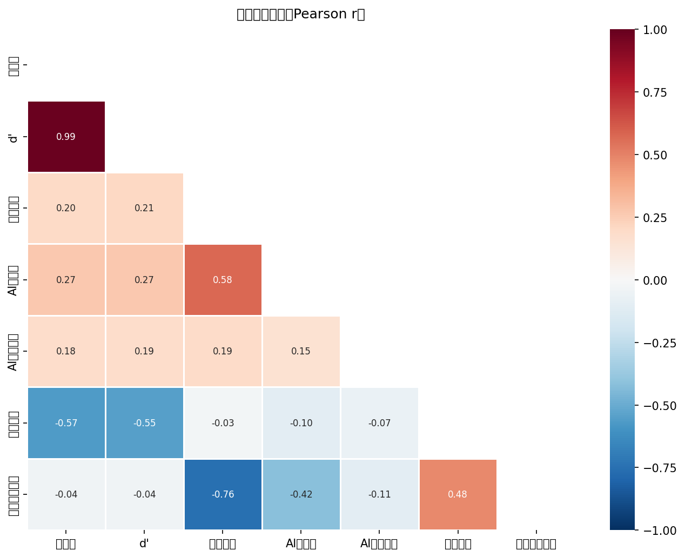

# Study 2 正式分析报告

**最终样本**: n=157（对照=83, 实验=74）| **日期**: 2026-03-02

---

## 一、数据与方法

### 1.1 数据说明

- **实验平台**: 在线实验（picquiz.zeabur.app）
- **数据集**: 实验平台在线收集的真实数据
- **排除图像**: ai_06, ai_11, ai_18（质量问题），保留 21 张有效图像（9张AI，12张真实）
- **组别**: 对照组 vs 实验组（干预：策略教学）

### 1.2 核心变量说明

| 变量名                   | 中文名称   | 操作化                                                  | 来源           | 量程  |
| --------------------- | ------ | ---------------------------------------------------- | ------------ | --- |
| acc_total             | 整体正确率  | 正确判断数 / 21                                           | responses    | 0–1 |
| d'（dprime）            | SDT敏感度 | Loglinear 校正：z(HR) − z(FAR)                          | 计算           | 连续  |
| c（判断标准）               | 判断偏向   | 负值=偏向判为AI；正值=偏向保守                                    | 计算           | 连续  |
| self_assessed_ability | 前测自评能力 | 自我评估辨别AI图片能力（前测）                                     | participants | 1–5 |
| self_performance      | 后测表现自评 | 对自己实验表现的整体自我评估（后测）                                   | post-survey  | 1–5 |
| calibration_gap       | 信心校准差距 | self_performance/5 − acc_total（正=过度自信）               | 计算           | 连续  |
| ai_familiarity        | AI熟悉度  | 对AI生成工具的熟悉程度                                         | participants | 1–5 |
| ai_exposure_num       | AI使用频率 | never=1 … very-often=5                               | participants | 1–5 |
| efficacy_change_proxy | 效能变化代理 | self_performance − self_assessed_ability（后−前测自评，探索性） | 计算           | 连续  |

### 1.3 样本过滤流程

| 步骤                      | 操作                | 保留 n                  |
| ----------------------- | ----------------- | --------------------- |
| 原始参与者（A+C）              | —                 | 202                   |
| 完成全部21张图像               | —                 | 119                   |
| 通过注意力检验                 | 排除 5 人            | 114                   |
| 手动质检排除                  | 排除 delete=1 共 3 人 | 111                   |
| Manipulation Check（实验组） | 实验组未通过 MC 者排除 6 人 | **157**（对照=83, 实验=74) |

## 二、基线等价性检验

> 随机分组假设：两组在人口统计学和基线能力上应无显著差异（*p* > .05）。

### 2.1 人口统计学分布与分组等价性（Table 1）

> ⚠ 注：数据中存在缺失值（性别缺失 5 人，年龄缺失 0 人），频数加总可能小于组别总 n。

| 变量 / 类别       | 对照组 (n=83) | 实验组 (n=74) | χ²   | df | *p*  | Cramér's *V* |
| ------------- | ---------- | ---------- | ---- | -- | ---- | ------------ |
| **性别**        |            |            | 2.56 | 1  | .110 | .13          |
| 　女            | 33 (39.8%) | 40 (54.1%) |      |    |      |              |
| 　男            | 47 (56.6%) | 32 (43.2%) |      |    |      |              |
| **年龄**        |            |            | 5.52 | 3  | .137 | .19          |
| 　18-24        | 32 (38.6%) | 42 (56.8%) |      |    |      |              |
| 　25-34        | 27 (32.5%) | 19 (25.7%) |      |    |      |              |
| 　35-44        | 7 (8.4%)   | 4 (5.4%)   |      |    |      |              |
| 　45-54        | 17 (20.5%) | 9 (12.2%)  |      |    |      |              |
| **教育程度（三分类）** |            |            | 0.36 | 2  | .834 | .05          |
| 　高中/大专        | 19 (22.9%) | 16 (21.6%) |      |    |      |              |
| 　本科           | 32 (38.6%) | 26 (35.1%) |      |    |      |              |
| 　硕博           | 32 (38.6%) | 32 (43.2%) |      |    |      |              |
| **AI使用频率**    |            |            | 1.77 | 4  | .777 | .11          |
| 　从不           | 3 (3.6%)   | 1 (1.4%)   |      |    |      |              |
| 　很少           | 11 (13.3%) | 13 (17.6%) |      |    |      |              |
| 　有时           | 28 (33.7%) | 25 (33.8%) |      |    |      |              |
| 　经常           | 22 (26.5%) | 16 (21.6%) |      |    |      |              |
| 　非常频繁         | 19 (22.9%) | 19 (25.7%) |      |    |      |              |

### 2.2 连续变量基线比较（Welch's t 检验，Table 2）

| 变量            | 对照组 M (SD)  | 实验组 M (SD)  | t     | df    | *p*  | Hedges' *g* |
| ------------- | ----------- | ----------- | ----- | ----- | ---- | ----------- |
| AI 熟悉度（1–5）   | 3.22 (1.13) | 3.47 (1.04) | 1.483 | 154.8 | .140 | .235        |
| 前测自评辨别能力（1–5） | 2.95 (1.18) | 3.08 (1.11) | 0.709 | 154.6 | .480 | .112        |
| AI 使用频率（1–5）  | 3.52 (1.10) | 3.53 (1.10) | 0.051 | 152.8 | .959 | .008        |

> **结论**: 两组在所有人口统计学变量（所有 χ² *p* > .05）和 AI 素养基线指标（所有 *p* > .05）上均无显著差异，随机分组成功。

## 三、干预主效应

### 3.1 组间均值比较（Welch's t 检验，Table 3a）

> 注：HR（命中率）= 正确识别AI图像的比例；FAR（虚报率）= 将真实图像误判为AI的比例。 CRR = 1 − FAR（与FAR互为补数，不独立报告）。

| 指标             | 对照组 M (SD)    | 实验组 M (SD)     | t      | df    | *p*    | Hedges' *g* |
| -------------- | ------------- | -------------- | ------ | ----- | ------ | ----------- |
| 整体正确率          | 0.600 (0.148) | 0.676 (0.154)  | 3.149  | 151.5 | .002** | .502        |
| d'（SDT敏感度）     | 0.511 (0.775) | 0.933 (0.878)  | 3.180  | 146.6 | .002** | .510        |
| c（判断标准，负=偏向AI） | 0.032 (0.319) | -0.001 (0.381) | -0.592 | 143.1 | .555   | -.095       |
| 命中率 HR         | 0.581 (0.170) | 0.659 (0.187)  | 2.727  | 148.2 | .007** | .436        |
| 虚报率 FAR        | 0.402 (0.177) | 0.339 (0.183)  | -2.183 | 151.5 | .031*  | -.348       |

> **注**：*d'* 与整体正确率相关 *r* = .987，两者近似线性变换；分别报告以呈现 SDT 信号检测框架。
> 组间 *t* 检验均使用 Welch 校正（不假定方差齐性），自由度为 Welch-Satterthwaite 近似值。

### 3.2 回归分析（控制人口统计学）：DV = 整体正确率 & d'

> 控制变量：性别、年龄段、学历（三分类）。参照组：性别=男，年龄=18–24，学历=本科。
> 标准化系数 β = B × SD_X / SD_Y（连续变量及哑变量均计算，结果供参考）。

#### 识别准确率（模型一：控制人口统计学）

> 自变量：group_c（C=1, A=0）  参照组：性别=男, 年龄=18–24, 学历=本科（三分类）  ◄ p < .05
| 变量                             |        B |      SE |    Beta |       t |          p |    VIF |
|--------------------------------|----------|---------|---------|---------|------------|--------|
| (常量)                           |    0.583 |   0.029 |         |  20.228 |     < .001 |        |
| 是否进行信息干预                       |    0.082 |   0.025 |   0.262 |   3.226 |     .002** |  1.060 | ◄
| 性别（女 vs 男）                     |   -0.028 |   0.025 |  -0.091 |  -1.127 |       .262 |  1.040 |
| 年龄 25–34（vs 18–24）             |    0.028 |   0.030 |   0.082 |   0.946 |       .346 |  1.195 |
| 年龄 35–44（vs 18–24）             |   -0.020 |   0.050 |  -0.033 |  -0.400 |       .690 |  1.109 |
| 年龄 45–54（vs 18–24）             |   -0.009 |   0.038 |  -0.021 |  -0.237 |       .813 |  1.293 |
| 学历 低（高中/大专 vs 本科）              |    0.018 |   0.035 |   0.048 |   0.522 |       .602 |  1.382 |
| 学历 高（硕博 vs 本科）                 |    0.046 |   0.029 |   0.144 |   1.609 |       .110 |  1.283 |

_R²=0.104, Adj.R²=0.060, F(7,144)=2.380, p = .025*_
_因变量：识别准确率（模型一：控制人口统计学）_

> **残差诊断**: Shapiro-Wilk *W* = 0.990, *p* = .340 （正态）; Breusch-Pagan *p* = .378 （同方差）; Durbin-Watson = 0.54

#### 敏感性指标 d'（模型一：控制人口统计学）

> 自变量：group_c（C=1, A=0）  参照组：性别=男, 年龄=18–24, 学历=本科（三分类）  ◄ p < .05
| 变量                             |        B |      SE |    Beta |       t |          p |    VIF |
|--------------------------------|----------|---------|---------|---------|------------|--------|
| (常量)                           |    0.413 |   0.158 |         |   2.613 |       .010 |        |
| 是否进行信息干预                       |    0.446 |   0.140 |   0.259 |   3.196 |     .002** |  1.060 | ◄
| 性别（女 vs 男）                     |   -0.106 |   0.138 |  -0.062 |  -0.769 |       .443 |  1.040 |
| 年龄 25–34（vs 18–24）             |    0.136 |   0.162 |   0.072 |   0.838 |       .403 |  1.195 |
| 年龄 35–44（vs 18–24）             |   -0.131 |   0.275 |  -0.039 |  -0.476 |       .635 |  1.109 |
| 年龄 45–54（vs 18–24）             |   -0.087 |   0.208 |  -0.038 |  -0.421 |       .674 |  1.293 |
| 学历 低（高中/大专 vs 本科）              |    0.076 |   0.191 |   0.037 |   0.399 |       .691 |  1.382 |
| 学历 高（硕博 vs 本科）                 |    0.270 |   0.156 |   0.154 |   1.725 |       .087 |  1.283 |

_R²=0.106, Adj.R²=0.062, F(7,144)=2.431, p = .022*_
_因变量：敏感性指标 d'（模型一：控制人口统计学）_

> **残差诊断**: Shapiro-Wilk *W* = 0.993, *p* = .683 （正态）; Breusch-Pagan *p* = .322 （同方差）; Durbin-Watson = 0.56

### 3.3 回归分析（控制AI素养相关）：DV = 整体正确率 & d'

> 控制变量：AI熟悉度（1–5）、前测自评能力（1–5）、AI使用频率（1–5）；均为连续变量。

#### 识别准确率（模型二：控制AI素养相关）

> 自变量：group_c（C=1, A=0）  参照组：性别=男, 年龄=18–24, 学历=本科（三分类）  ◄ p < .05
| 变量                             |        B |      SE |    Beta |       t |          p |    VIF |
|--------------------------------|----------|---------|---------|---------|------------|--------|
| (常量)                           |    0.420 |   0.051 |         |   8.271 |     < .001 |        |
| 是否进行信息干预                       |    0.068 |   0.023 |   0.220 |   2.905 |     .004** |  1.014 | ◄
| AI熟悉度（1–5）                     |    0.027 |   0.013 |   0.191 |   2.059 |      .041* |  1.523 | ◄
| 前测自评能力（1–5）                    |    0.006 |   0.013 |   0.048 |   0.516 |       .606 |  1.526 |
| AI使用频率（1–5）                    |    0.021 |   0.011 |   0.146 |   1.902 |       .059 |  1.040 |

_R²=0.141, Adj.R²=0.119, F(4,152)=6.260, p < .001***_
_因变量：识别准确率（模型二：控制AI素养相关）_

> **残差诊断**: Shapiro-Wilk *W* = 0.978, *p* = .013* （偏离正态（可能影响小样本推断））; Breusch-Pagan *p* = .675 （同方差）; Durbin-Watson = 0.61

#### 敏感性指标 d'（模型二：控制AI素养相关）

> 自变量：group_c（C=1, A=0）  参照组：性别=男, 年龄=18–24, 学历=本科（三分类）  ◄ p < .05
| 变量                             |        B |      SE |    Beta |       t |          p |    VIF |
|--------------------------------|----------|---------|---------|---------|------------|--------|
| (常量)                           |   -0.488 |   0.278 |         |  -1.757 |       .081 |        |
| 是否进行信息干预                       |    0.378 |   0.128 |   0.223 |   2.953 |     .004** |  1.014 | ◄
| AI熟悉度（1–5）                     |    0.149 |   0.072 |   0.191 |   2.060 |      .041* |  1.523 | ◄
| 前测自评能力（1–5）                    |    0.041 |   0.069 |   0.056 |   0.601 |       .549 |  1.526 |
| AI使用频率（1–5）                    |    0.113 |   0.059 |   0.146 |   1.912 |       .058 |  1.040 |

_R²=0.146, Adj.R²=0.123, F(4,152)=6.495, p < .001***_
_因变量：敏感性指标 d'（模型二：控制AI素养相关）_

> **残差诊断**: Shapiro-Wilk *W* = 0.988, *p* = .208 （正态）; Breusch-Pagan *p* = .314 （同方差）; Durbin-Watson = 0.63

### 3.4 层次回归：组别效应在控制协变量前后的变化

| 模型 | 纳入变量    | B（组别） | 95% CI         | R²   | ΔR²    | *p*（组别） |
| -- | ------- | ----- | -------------- | ---- | ------ | ------- |
| M1 | 仅组别     | 0.076 | [0.028, 0.124] | .060 | —      | .002**  |
| M2 | +AI熟悉度  | 0.067 | [0.021, 0.114] | .118 | +0.057 | .005**  |
| M3 | +前测自评能力 | 0.068 | [0.021, 0.114] | .121 | +0.003 | .005**  |

> **注**: 组别效应在 M1 中显著（粗效应），加入前测自评能力后减弱/消失（M3），表明两组基线能力差异（尽管不显著）在一定程度上解释了准确率差异。结论应聚焦控制协变量后的回归结果。

## 四、过度怀疑分析（T6）

### 4.1 混合 ANOVA（2组 × 2图像类型）

| 效应          | df₁ | df₂ | F      | *p*    | η²p  |
| ----------- | --- | --- | ------ | ------ | ---- |
| group       | 1   | 155 | 10.437 | .002** | .063 |
| image_type  | 1   | 155 | 0.125  | .724   | .001 |
| Interaction | 1   | 155 | 0.215  | .644   | .001 |

### 4.2 按图像类型的组间差异（简单效应）

| 图像类型   | 对照组 M (SD)    | 实验组 M (SD)    | t     | df    | *p*    | Hedges' *g* |
| ------ | ------------- | ------------- | ----- | ----- | ------ | ----------- |
| AI图像   | 0.590 (0.189) | 0.677 (0.208) | 2.727 | 148.2 | .007** | .436        |
| Real图像 | 0.606 (0.191) | 0.675 (0.199) | 2.182 | 151.5 | .031*  | .348        |

> **结果解读**: 实验组在AI图像上准确率高于对照组（0.677 vs 0.590，**p < .05**），在真实图像上也略高（0.675 vs 0.606，未显著）。group × image_type 交互 *p* = .644，不显著。**当前数据不支持"过度怀疑"（实验组真实图像准确率下降）的解读**；实验组判断标准 c 更负（见 3.1），反映更倾向判为AI，但尚未造成真实图像准确率下降。

## 五、信心与校准分析（T5）

### 5.1 后测表现自评与 calibration_gap 组间比较

| 指标                        | 对照组              | 实验组              | 统计量      | df    | *p*  | 效应量                |
| ------------------------- | ---------------- | ---------------- | -------- | ----- | ---- | ------------------ |
| 后测表现自评                    | Mdn=3.0, IQR=2.0 | Mdn=3.0, IQR=1.0 | U=3504   | —     | .108 | r = -.141（Z/√N 估计） |
| calibration_gap（M, SD）    | 0.015 (0.224)    | -0.013 (0.199)   | t=-0.840 | 155.0 | .402 | g = -.133          |
| calibration_gap vs 0（全样本） | —                | —                | t=0.090  | 156   | .928 | —                  |

> **calibration_gap** = self_performance/5 − acc_total（正值=过度自信，负值=过度保守）
> Mann-Whitney U 用于非正态 self_performance；Welch's t 用于 calibration_gap。

### 5.2 calibration_gap 回归（分别控制人口统计学 / AI素养相关，Table 5）

> 参照组：性别=男，年龄=18–24，学历=本科

#### 信心校准差距（模型一：控制人口统计学）

> 自变量：group_c（C=1, A=0）  参照组：性别=男, 年龄=18–24, 学历=本科（三分类）  ◄ p < .05
| 变量                             |        B |      SE |    Beta |       t |          p |    VIF |
|--------------------------------|----------|---------|---------|---------|------------|--------|
| (常量)                           |   -0.009 |   0.040 |         |  -0.229 |       .820 |        |
| 是否进行信息干预                       |   -0.017 |   0.036 |  -0.041 |  -0.491 |       .624 |  1.060 |
| 性别（女 vs 男）                     |    0.014 |   0.035 |   0.033 |   0.402 |       .689 |  1.040 |
| 年龄 25–34（vs 18–24）             |    0.032 |   0.041 |   0.068 |   0.768 |       .444 |  1.195 |
| 年龄 35–44（vs 18–24）             |    0.106 |   0.070 |   0.130 |   1.514 |       .132 |  1.109 |
| 年龄 45–54（vs 18–24）             |    0.116 |   0.053 |   0.203 |   2.198 |      .030* |  1.293 | ◄
| 学历 低（高中/大专 vs 本科）              |   -0.062 |   0.049 |  -0.122 |  -1.276 |       .204 |  1.382 |
| 学历 高（硕博 vs 本科）                 |   -0.018 |   0.040 |  -0.041 |  -0.445 |       .657 |  1.283 |

_R²=0.048, Adj.R²=0.002, F(7,144)=1.044, p = .403_
_因变量：信心校准差距（模型一：控制人口统计学）_

> **残差诊断**: Shapiro-Wilk *W* = 0.994, *p* = .776 （正态）; Breusch-Pagan *p* = .916 （同方差）; Durbin-Watson = 1.45

#### 信心校准差距（模型二：控制AI素养相关）

> 自变量：group_c（C=1, A=0）  参照组：性别=男, 年龄=18–24, 学历=本科（三分类）  ◄ p < .05
| 变量                             |        B |      SE |    Beta |       t |          p |    VIF |
|--------------------------------|----------|---------|---------|---------|------------|--------|
| (常量)                           |    0.102 |   0.074 |         |   1.365 |       .174 |        |
| 是否进行信息干预                       |   -0.024 |   0.034 |  -0.055 |  -0.685 |       .494 |  1.014 |
| AI熟悉度（1–5）                     |   -0.024 |   0.019 |  -0.124 |  -1.256 |       .211 |  1.523 |
| 前测自评能力（1–5）                    |    0.011 |   0.018 |   0.062 |   0.620 |       .536 |  1.526 |
| AI使用频率（1–5）                    |   -0.012 |   0.016 |  -0.062 |  -0.757 |       .450 |  1.040 |

_R²=0.020, Adj.R²=-0.006, F(4,152)=0.756, p = .555_
_因变量：信心校准差距（模型二：控制AI素养相关）_

> **残差诊断**: Shapiro-Wilk *W* = 0.994, *p* = .811 （正态）; Breusch-Pagan *p* = .291 （同方差）; Durbin-Watson = 1.49

## 六、逐图与图像类型分析

### 6.1 每张图 Fisher 精确检验（group × is_correct）

| 图像ID    | 类型   | 风格           | 对照组准确率 | 实验组准确率 | Δ(实验−对照) | OR    | *p*（未校正） | *p*（Bonferroni） |
| ------- | ---- | ------------ | ------ | ------ | -------- | ----- | -------- | --------------- |
| ai_19   | AI   | photograph   | 0.627  | 0.811  | +0.184   | 0.391 | .013*    | .120            |
| ai_08   | AI   | photograph   | 0.386  | 0.568  | +0.182   | 0.478 | .026*    | .103            |
| real_02 | Real | photograph   | 0.735  | 0.905  | +0.170   | 0.290 | .007**   | .079            |
| ai_16   | AI   | illustration | 0.398  | 0.554  | +0.156   | 0.531 | .056     | .449            |
| real_01 | Real | illustration | 0.361  | 0.500  | +0.139   | 0.566 | .106     | 1.000           |
| ai_13   | AI   | photograph   | 0.578  | 0.716  | +0.138   | 0.543 | .095     | .570            |
| real_11 | Real | photograph   | 0.675  | 0.811  | +0.136   | 0.484 | .069     | 1.000           |
| real_03 | Real | cartoon      | 0.614  | 0.743  | +0.129   | 0.551 | .091     | 1.000           |
| real_15 | Real | illustration | 0.253  | 0.365  | +0.112   | 0.590 | .165     | 1.000           |
| ai_02   | AI   | photograph   | 0.434  | 0.500  | +0.066   | 0.766 | .427     | .854            |
| real_05 | Real | illustration | 0.518  | 0.581  | +0.063   | 0.775 | .521     | 1.000           |
| real_06 | Real | photograph   | 0.783  | 0.838  | +0.055   | 0.699 | .422     | 1.000           |
| real_12 | Real | photograph   | 0.831  | 0.878  | +0.047   | 0.682 | .500     | 1.000           |
| ai_01   | AI   | illustration | 0.795  | 0.838  | +0.043   | 0.751 | .541     | .541            |
| real_16 | Real | photograph   | 0.759  | 0.797  | +0.038   | 0.801 | .701     | 1.000           |
| ai_04   | AI   | cartoon      | 0.795  | 0.811  | +0.016   | 0.906 | .843     | 1.000           |
| real_14 | Real | cartoon      | 0.434  | 0.446  | +0.012   | 0.952 | 1.000    | 1.000           |
| ai_09   | AI   | cartoon      | 0.867  | 0.878  | +0.011   | 0.906 | 1.000    | 1.000           |
| ai_15   | AI   | photograph   | 0.434  | 0.419  | -0.015   | 1.062 | .873     | 1.000           |
| real_20 | Real | cartoon      | 0.542  | 0.527  | -0.015   | 1.063 | .874     | 1.000           |
| real_04 | Real | photograph   | 0.771  | 0.703  | -0.068   | 1.425 | .366     | 1.000           |

> 原始 *p* < .05：**['ai_19', 'ai_08', 'real_02']**；Bonferroni 校正后（α = .05/21 = 0.0024）显著：**无**。

### 6.2 风格类型分析（photo vs not_photo）

> illustration 与 cartoon 合并为 not_photo；photograph 单独为 photo。

| 风格               | 对照组 M (SD)    | 实验组 M (SD)    | t     | df    | *p*    | Hedges' *g* |
| ---------------- | ------------- | ------------- | ----- | ----- | ------ | ----------- |
| photo（照片）        | 0.637 (0.169) | 0.722 (0.172) | 3.112 | 152.2 | .002** | .496        |
| not_photo（插图/卡通） | 0.558 (0.198) | 0.624 (0.178) | 2.217 | 155.0 | .028*  | .351        |

> **模型**: acc ~ group_c × style_photo（0=not_photo, 1=photo），n=314 行。
> F(3,310)=11.003, p < .001***

- Intercept: B=0.558, *p* = < .001***
- group_c: B=0.066, *p* = .021*
- style_photo: B=0.080, *p* = .005**
- group_c:style_photo: B=0.018, *p* = .651

### 6.3 可反向搜索性分析（reverse_searchable）

> **分析单位**：先对每位被试在各类别图像上取平均正确率（被试水平），再做 Welch's *t* 检验，避免观测值级别（n≈108×图像数）重复测量导致 df 虚大（原始行级别分析会出现 df>1000）。

| 类型           | 对照组均值 | 实验组均值 | t     | df    | *p*       | Hedges' *g* |
| ------------ | ----- | ----- | ----- | ----- | --------- | ----------- |
| 可反向搜索        | 0.613 | 0.664 | 1.762 | 141.1 | .080      | .284        |
| 不可反向搜索（仅AI图） | 0.589 | 0.685 | 3.448 | 154.5 | < .001*** | .547        |

### 6.4 AI 来源分析（仅AI图）

| AI来源       | 对照组 M (SD)    | 实验组 M (SD)    | t     | df    | *p*    | Hedges' *g* |
| ---------- | ------------- | ------------- | ----- | ----- | ------ | ----------- |
| ai-art     | 0.675 (0.270) | 0.716 (0.280) | 0.943 | 151.6 | .347   | .150        |
| midjourney | 0.610 (0.265) | 0.721 (0.253) | 2.668 | 154.2 | .008** | .423        |
| nanobanana | 0.486 (0.287) | 0.595 (0.309) | 2.278 | 149.7 | .024*  | .364        |

## 七、AI 素养调节效应

### 7.1 AI 素养与准确率的相关分析

| 变量          | r（与准确率） | *p*       | n   |
| ----------- | ------- | --------- | --- |
| AI熟悉度       | .267    | < .001*** | 157 |
| 前测自评能力      | .198    | .013*     | 157 |
| AI使用频率（1–5） | .185    | .020*     | 157 |

### 7.2 调节效应模型（前测自评能力 × 组别）

> **注**: 模型使用 self_assessed_ability 的中心化版本 sae_c，同时包含其余控制变量（不重复纳入 self_assessed_ability 原始值）。

| 变量                 | B      | SE    | 95% CI           | β    | t      | p      | VIF  |
| ------------------ | ------ | ----- | ---------------- | ---- | ------ | ------ | ---- |
| 截距                 | 0.506  | 0.053 | [0.402, 0.610]   | —    | 9.620  | —      | —    |
| 组别（C=1）            | 0.081  | 0.025 | [0.033, 0.130]   | .259 | 3.300  | .001** | 1.07 |
| 前测自评能力（中心化）        | 0.043  | 0.014 | [0.015, 0.071]   | .306 | 3.007  | .003** | 1.12 |
| 交互：组别 × 自评能力       | -0.047 | 0.022 | [-0.090, -0.004] | —    | -2.138 | .034*  | —    |
| 性别（女=1）            | -0.027 | 0.025 | [-0.076, 0.022]  | —    | -1.092 | .276   | 1.06 |
| 年龄 25–34（vs 18–24） | 0.025  | 0.029 | [-0.032, 0.082]  | —    | 0.863  | .390   | 1.22 |
| 年龄 35–44           | -0.015 | 0.049 | [-0.111, 0.082]  | —    | -0.300 | .764   | 1.13 |
| 年龄 45–54           | -0.002 | 0.037 | [-0.075, 0.071]  | —    | -0.059 | .953   | 1.32 |
| 学历 低（高中/大专 vs 本科）  | 0.028  | 0.034 | [-0.038, 0.095]  | .075 | 0.840  | .402   | 1.40 |
| 学历 高（硕博 vs 本科）     | 0.043  | 0.028 | [-0.012, 0.098]  | .134 | 1.534  | .127   | 1.30 |
| AI使用频率（1–5）        | 0.022  | 0.012 | [-0.001, 0.045]  | .150 | 1.858  | .065   | 1.13 |

_R² = .188, Adj.R² = .130, F(10, 141) = 3.265, p < .001***_

> **残差诊断**: Shapiro-Wilk *W* = 0.978, *p* = .017* （偏离正态（可能影响小样本推断））; Breusch-Pagan *p* = .744 （同方差）; Durbin-Watson = 0.75

### 7.3 简单斜率分析（group 效应 at −1SD / Mean / +1SD 自评能力）

| 水平                  | B（组别效应） | SE    | 95% CI          | t     | *p*       |
| ------------------- | ------- | ----- | --------------- | ----- | --------- |
| 低自评 −1SD (SAE≈1.94) | 0.134   | 0.035 | [0.065, 0.204]  | 3.812 | < .001*** |
| 均值     (SAE≈3.06)   | 0.081   | 0.025 | [0.033, 0.130]  | 3.300 | .001**    |
| 高自评 +1SD (SAE≈4.18) | 0.028   | 0.035 | [-0.040, 0.097] | 0.823 | .412      |

**Johnson-Neyman 近似显著性边界**（中心化 sae_c）: 0.702 到 2.755
→ 对应原始 self_assessed_ability: 3.76 到 5.81
→ group 效应在此区间**外**达 *p* < .05（交互方向 < 0）

### 7.4 调节效应模型（AI使用频率 × 组别）

> **注**: 模型使用 ai_exposure_num 的中心化版本 aie_c；控制变量包含 self_assessed_ability，但不重复纳入 ai_exposure_num 原始值。

| 变量                 | B      | SE    | 95% CI          | β    | t      | p      | VIF  |
| ------------------ | ------ | ----- | --------------- | ---- | ------ | ------ | ---- |
| 截距                 | 0.511  | 0.043 | [0.427, 0.595]  | —    | 11.990 | —      | —    |
| 组别（C=1）            | 0.079  | 0.025 | [0.030, 0.129]  | .253 | 3.185  | .002** | 1.07 |
| AI使用频率（中心化）        | 0.009  | 0.016 | [-0.023, 0.042] | .064 | 0.570  | .569   | 1.13 |
| 交互：组别 × AI频率       | 0.022  | 0.023 | [-0.023, 0.068] | —    | 0.974  | .332   | —    |
| 性别（女=1）            | -0.031 | 0.025 | [-0.080, 0.018] | —    | -1.246 | .215   | 1.06 |
| 年龄 25–34（vs 18–24） | 0.016  | 0.029 | [-0.042, 0.074] | —    | 0.550  | .583   | 1.22 |
| 年龄 35–44           | -0.032 | 0.050 | [-0.132, 0.067] | —    | -0.644 | .520   | 1.13 |
| 年龄 45–54           | -0.003 | 0.037 | [-0.076, 0.071] | —    | -0.072 | .943   | 1.32 |
| 学历 低（高中/大专 vs 本科）  | 0.028  | 0.034 | [-0.039, 0.096] | .075 | 0.831  | .407   | 1.40 |
| 学历 高（硕博 vs 本科）     | 0.051  | 0.028 | [-0.004, 0.107] | .160 | 1.830  | .069   | 1.30 |
| 前测自评能力（1–5）        | 0.024  | 0.011 | [0.002, 0.047]  | .173 | 2.129  | .035*  | 1.12 |

_R² = .167, Adj.R² = .108, F(10, 141) = 2.833, p = .003**_

> **残差诊断**: Shapiro-Wilk *W* = 0.988, *p* = .232 （正态）; Breusch-Pagan *p* = .118 （同方差）; Durbin-Watson = 0.70

### 7.5 简单斜率分析（group 效应 at −1SD / Mean / +1SD AI使用频率）

| 水平                  | B（组别效应） | SE    | 95% CI          | t     | *p*    |
| ------------------- | ------- | ----- | --------------- | ----- | ------ |
| 低频率 −1SD (AIE≈2.44) | 0.055   | 0.036 | [-0.016, 0.126] | 1.543 | .125   |
| 均值     (AIE≈3.52)   | 0.079   | 0.025 | [0.030, 0.129]  | 3.185 | .002** |
| 高频率 +1SD (AIE≈4.60) | 0.104   | 0.035 | [0.035, 0.172]  | 3.001 | .003** |

**Johnson-Neyman 近似显著性边界**（中心化 aie_c）: -5.731 到 -1.365
→ 对应原始 ai_exposure_num: -2.21 到 2.15
→ group 效应在此区间**外**达 _p_ < .05（交互方向 > 0）

## 八、异质性分析（T7, T8）

> **分组说明**: 学历三分类——低（高中/大专, n≈25）、中（本科, n≈45, 参照）、高（硕博, n≈45）。

### 8.1 辨别能力异质性（T7）

| 子群          | n   | B (组别) | t     | *p*    | Chow 检验             |
| ----------- | --- | ------ | ----- | ------ | ------------------- |
| 性别：男        | 79  | 0.100  | 3.062 | .003** | F=1.021, *p*=.363   |
| 性别：女        | 73  | 0.066  | 1.722 | .089   |                     |
| 年龄：≤34      | 120 | 0.090  | 3.346 | .001** | F=1.142, *p*=.322   |
| 年龄：≥35      | 37  | 0.014  | 0.251 | .803   |                     |
| 学历：低（高中/大专） | 35  | 0.053  | 1.256 | .218   | F=0.112, *p*=.894   |
| 学历：中（本科）    | 58  | 0.040  | 0.917 | .363   |                     |
| 学历：中（本科）    | 58  | 0.040  | 0.917 | .363   | F=2.229, *p*=.112   |
| 学历：高（硕博）    | 64  | 0.116  | 3.120 | .003** |                     |
| AI频率：低      | 81  | 0.046  | 1.441 | .154   | F=5.044, *p*=.008** |
| AI频率：高      | 76  | 0.111  | 3.206 | .002** |                     |
| 前测自评：低（1–2） | 52  | 0.091  | 2.173 | .035*  | F=2.647, *p*=.074   |
| 前测自评：高（3–5） | 105 | 0.060  | 2.028 | .045*  |                     |

### 8.2 信心校准异质性（T8）

| 子群          | n   | B (组别) | t      | *p*  | Chow 检验           |
| ----------- | --- | ------ | ------ | ---- | ----------------- |
| 性别：男        | 79  | -0.036 | -0.766 | .446 | F=0.156, *p*=.855 |
| 性别：女        | 73  | -0.029 | -0.551 | .584 |                   |
| 年龄：≤34      | 120 | -0.031 | -0.796 | .428 | F=2.694, *p*=.071 |
| 年龄：≥35      | 37  | 0.027  | 0.406  | .687 |                   |
| 学历：低（高中/大专） | 35  | 0.028  | 0.380  | .706 | F=0.443, *p*=.643 |
| 学历：中（本科）    | 58  | -0.012 | -0.213 | .832 |                   |
| 学历：中（本科）    | 58  | -0.012 | -0.213 | .832 | F=0.434, *p*=.649 |
| 学历：高（硕博）    | 64  | -0.072 | -1.415 | .162 |                   |
| AI频率：低      | 81  | 0.005  | 0.129  | .898 | F=1.278, *p*=.282 |
| AI频率：高      | 76  | -0.066 | -1.226 | .224 |                   |
| 前测自评：低（1–2） | 52  | -0.032 | -0.561 | .577 | F=0.065, *p*=.937 |
| 前测自评：高（3–5） | 105 | -0.024 | -0.569 | .570 |                   |

## 九、策略使用分析

### 9.1 逐图策略填写率（by 组别）

| group | 填写率   | 填写次数 | 总次数  |
| ----- | ----- | ---- | ---- |
| 实验    | 0.295 | 459  | 1554 |
| 对照    | 0.103 | 179  | 1743 |

### 9.2 策略类别 × 正确率

| 组别 | 策略类型      | n   | 正确率   |
| -- | --------- | --- | ----- |
| 对照 | Style     | 69  | 0.565 |
| 实验 | Style     | 284 | 0.722 |
| 对照 | Anatomy   | 34  | 0.765 |
| 实验 | Anatomy   | 143 | 0.734 |
| 实验 | Knowledge | 54  | 0.685 |
| 对照 | 直觉/其他     | 78  | 0.513 |
| 实验 | 直觉/其他     | 33  | 0.545 |

### 9.3 有无策略自报 → 准确率差异

| 组别 | 有策略自报         | 无策略自报          | 差值（有−无） |
| -- | ------------- | -------------- | ------- |
| 对照 | 0.575 (n=179) | 0.602 (n=1564) | -0.027  |
| 实验 | 0.704 (n=459) | 0.664 (n=1095) | +0.040  |

> 实验组 strategy_usage_degree × 准确率: *r* = .185, *p* = .114

## 十、相关矩阵（F3）

> 注：干预时长（intervention_duration_s）在 A 组中无实际干预（填充为 0），对全样本相关分析会人为压低相关值，故从相关矩阵中排除。
> 效能变化代理 = self_performance − self_assessed_ability（后测自评表现 − 前测自评能力；量表含义不同，仅作探索性指标）。

|        | 准确率       | d'        | 前测自评      | AI熟悉度     | AI使用频率 | 校准差距     | 效能变化代理 |
| ------ | --------- | --------- | --------- | --------- | ------ | -------- | ------ |
| 准确率    | 1.000     | —         | —         | —         | —      | —        | —      |
| d'     | 0.987***  | 1.000     | —         | —         | —      | —        | —      |
| 前测自评   | 0.198*    | 0.206**   | 1.000     | —         | —      | —        | —      |
| AI熟悉度  | 0.267***  | 0.271***  | 0.578***  | 1.000     | —      | —        | —      |
| AI使用频率 | 0.185*    | 0.187*    | 0.189*    | 0.152     | 1.000  | —        | —      |
| 校准差距   | -0.569*** | -0.553*** | -0.025    | -0.105    | -0.070 | 1.000    | —      |
| 效能变化代理 | -0.041    | -0.043    | -0.756*** | -0.420*** | -0.109 | 0.483*** | 1.000  |

*注：\* p < .05，\*\* p < .01，\*\*\* p < .001（双尾，未校正）*

## 十一、综合结论

**最终样本**: n=157（对照=83, 实验=74）

| 分析           | 主要结果                                  | 统计量        | *p*    |
| ------------ | ------------------------------------- | ---------- | ------ |
| 主效应：整体正确率    | 对照=0.600, 实验=0.676, g=.502            | t=3.149    | .002** |
| 主效应：d'       | 对照=0.511, 实验=0.933                    | 见 Table 3a | —      |
| 判断偏向 c       | 对照=0.032（保守）, 实验=-0.001（激进）           | 见 Table 3a | —      |
| 过度怀疑         | 实验在AI图更好（+0.087）；Real图差异不显著；数据不支持过度怀疑 | 交互 F       | .644   |
| 校准差距（全样本）    | M=+0.002（轻度过度自信）                      | t=0.090    | .928   |
| 调节：自评能力 × 组别 | 低自评者 C>A 显著；高自评者无差异                   | B=-0.047   | .034*  |
| 异质性          | 见 Table 7–8（Chow 检验）                  | —          | —      |

## 十二、干预相关专项分析

### 12.1 操纵检查（干预组实验）

实验组 n = 74

**阅读了干预材料（C 组）**
  是: n=74 (100.0%)
  不确定: n=0 (0.0%)
  否: n=0 (0.0%)
  → 明确阅读率: 74/74 = 100.0%

**阅读了策略列表（C 组）**
  是: n=74 (100.0%)
  否: n=0 (0.0%)

**策略使用程度（C 组，连续）**: M=3.419, SD=0.922, Mdn=3.000, [min=2.0, max=5.0], n=74
  与整体准确率相关: r=.185, p=.114

### 12.2 干预页面停留时间（intervention_duration_s）

实验组 n=74: M=21.9s, SD=20.7s, Mdn=16.0s, [min=4s, max=128s]
| 时长区间    | n  | %     |
| ------- | -- | ----- |
| <30s    | 58 | 78.4% |
| 30–60s  | 13 | 17.6% |
| 60–90s  | 1  | 1.4%  |
| 90–180s | 2  | 2.7%  |
| >180s   | 0  | 0.0%  |

实验组：停留时间 × 准确率相关: r=-.046, p=.698, n=74

### 12.3 Google Lens 使用行为

使用 Lens（OPEN_LENS）：对照组 27/83 (32.5%)，实验组 34/74 (45.9%)
Lens使用者准确率: M=0.670 (n=61) vs 未使用: M=0.614 (n=96), t=2.225, p=.028*, g=.366
实验组 Lens深度（操作次数）× 准确率: r=.120, p=.499, n=34

### 12.4 描述性统计汇总（各变量，按组别）

> 格式：A 组 M (SD)，C 组 M (SD)

| 变量                        | 对照组 M (SD)    | 实验组 M (SD)     |
| ------------------------- | ------------- | -------------- |
| 整体正确率                     | 0.600 (0.148) | 0.676 (0.154)  |
| AI图正确率                    | 0.590 (0.189) | 0.677 (0.208)  |
| 真实图正确率                    | 0.606 (0.191) | 0.675 (0.199)  |
| d'（SDT敏感度）                | 0.511 (0.775) | 0.933 (0.878)  |
| c（判断标准）                   | 0.032 (0.319) | -0.001 (0.381) |
| 平均信心评分                    | 2.761 (1.429) | 2.613 (1.584)  |
| 信心校准差距（self_perf/5 − acc） | 0.015 (0.224) | -0.013 (0.199) |
| AI熟悉度（1–5）                | 3.217 (1.127) | 3.473 (1.037)  |
| 前测自评能力（1–5）               | 2.952 (1.178) | 3.081 (1.107)  |
| AI使用频率（1–5）               | 3.518 (1.097) | 3.527 (1.101)  |
| 后测表现自评（1–5）               | 3.072 (0.985) | 3.311 (0.757)  |

### 12.5 前测基线差异（组间等价性检验）

**人口统计学（χ² 检验）**
  性别: χ²(1)=2.560, p=.110
  年龄段: χ²(3)=5.525, p=.137
  学历分组: χ²(2)=0.363, p=.834

**AI 素养相关（Welch t-test）**
  AI熟悉度: 对照 M=3.217±1.127, 实验 M=3.473±1.037, t(154.8)=1.483, p=.140, g=.235
  前测自评能力: 对照 M=2.952±1.178, 实验 M=3.081±1.107, t(154.6)=0.709, p=.480, g=.112
  AI使用频率: 对照 M=3.518±1.097, 实验 M=3.527±1.101, t(152.8)=0.051, p=.959, g=.008

**来源平衡（real/synth 在两组中的分布）**
  来源 × 组别: χ²(1)=1.052, p=.305

## 十三、图表

> 图表已保存至 `c:\Users\t-yimengwu\Desktop\study2\analysis\output_1/`（F1–F6 + F3 相关矩阵）

---

**注释**: \* *p* < .05, \*\* *p* < .01, \*\*\* *p* < .001（双尾）。所有 Welch's *t* 检验使用 Welch-Satterthwaite 自由度近似。
第六节 21 次 Fisher 精确检验已进行 Bonferroni 校正（α = 0.0024）。

*报告生成时间: 2026-03-02 | 输出文件: c:\Users\t-yimengwu\Desktop\study2\analysis\output_1/*
