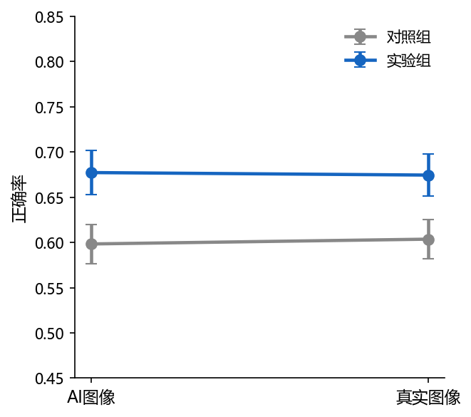
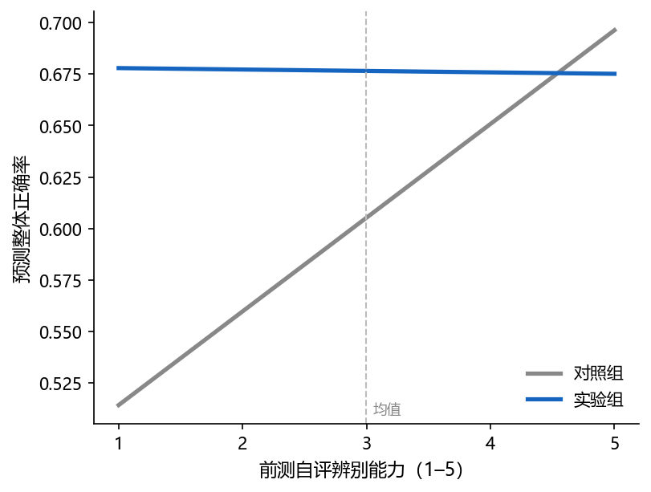

# Study 2 正式分析报告

**最终样本**: n=152（对照=78, 实验=74）| **日期**: 2026-03-03

---

## 基于当前这个文档结构来做分析，其他内容不变

## 【要补一个控制所有其他变量的大回归（人口和素养都控制）】

**【要画一个当前这种算法的调节效应的斜率分析的图，参考spss等专业应用中processon之类的画图的方式】**

**【学历还是全部用五分法所有涉及人口统计学都重算】**

【重做一个analysis代码】

## 一、数据与方法

### 1.1 数据说明

- **实验平台**: 在线实验（picquiz.zeabur.app）
- **数据集**: 实验平台在线收集的真实数据
- **排除图像**: ai_06, ai_11, ai_18（质量问题），保留 21 张有效图像（9张AI，12张真实）
- **组别**: 对照组 vs 实验组（干预：策略教学）

### 1.2 核心变量说明

| 变量名                   | 中文名称   | 操作化                                    | 来源           | 量程  |
| --------------------- | ------ | -------------------------------------- | ------------ | --- |
| acc_total             | 整体正确率  | 正确判断数 / 21                             | responses    | 0–1 |
| d'（dprime）            | SDT敏感度 | Loglinear 校正：z(HR) − z(FAR)            | 计算           | 连续  |
| c（判断标准）               | 判断偏向   | 负值=偏向判为AI；正值=偏向保守                      | 计算           | 连续  |
| self_assessed_ability | 前测自评能力 | 自我评估辨别AI图片能力（前测）                       | participants | 1–5 |
| self_performance      | 后测表现自评 | 对自己实验表现的整体自我评估（后测）                     | post-survey  | 1–5 |
| calibration_gap       | 信心校准差距 | self_performance/5 − acc_total（正=过度自信） | 计算           | 连续  |
| ai_exposure_num       | AI使用频率 | never=1 … very-often=5                 | participants | 1–5 |
|                       |        |                                        |              |     |

### 1.3 样本过滤流程

采用 G*Power 3.1 进行事前样本量估算，结果显示最少需要128例。实际共纳入受试者152例，其中实验组78例，对照组74例，满足统计功效要求。

| 步骤                      | 操作     | 保留 n |
| ----------------------- | ------ | ---- |
| 完成全部21张图像               | —      | 163  |
| 注意力检验                   | 排除 5 人 | 158  |
| Manipulation Check（实验组） | 排除6    | 152  |
| 最终                      |        | 152  |

## 二、基线等价性检验

> 随机分组假设：两组在人口统计学和基线能力上应无显著差异（*p* > .05）。

### 2.1 人口统计学分布与分组等价性（Table 1）

| 变量 / 类别       | 对照组 (n=78) | 实验组 (n=74) | χ²   | df  | *p*  | Cramér's *V* |
| ------------- | ---------- | ---------- | ---- | --- | ---- | ------------ |
| **性别**        |            |            | 2.60 | 1   | .107 | .13          |
| 女             | 32 (41.0%) | 41 (55.4%) |      |     |      |              |
| 男             | 46 (59.0%) | 33 (44.6%) |      |     |      |              |
| **年龄**        |            |            | 4.69 | 3   | .196 | .18          |
| 18-24         | 31 (39.7%) | 42 (56.8%) |      |     |      |              |
| 25-34         | 25 (32.1%) | 19 (25.7%) |      |     |      |              |
| 35-44         | 7 (9.0%)   | 4 (5.4%)   |      |     |      |              |
| 45-54         | 15 (19.2%) | 9 (12.2%)  |      |     |      |              |
| **教育程度（三分类）** |            |            | 0.86 | 2   | .651 | .08          |
| 高中/大专         | 19 (24.4%) | 16 (21.6%) |      |     |      |              |
| 本科            | 31 (39.7%) | 26 (35.1%) |      |     |      |              |
| 硕博            | 28 (35.9%) | 32 (43.2%) |      |     |      |              |
|               |            |            |      |     |      |              |
|               |            |            |      |     |      |              |
|               |            |            |      |     |      |              |
|               |            |            |      |     |      |              |
|               |            |            |      |     |      |              |
|               |            |            |      |     |      |              |

### 2.2 连续变量基线比较（Welch's t 检验，Table 2）

| 变量            | 对照组 M (SD)  | 实验组 M (SD)  | t     | df    | *p*  | Hedges' *g* |
| ------------- | ----------- | ----------- | ----- | ----- | ---- | ----------- |
| 前测自评辨别能力（1–5） | 2.90 (1.18) | 3.09 (1.12) | 1.055 | 150.0 | .293 | .170        |
| AI 使用频率（1–5）  | 3.50 (1.11) | 3.53 (1.10) | 0.150 | 149.7 | .881 | .024        |

> **结论**: 两组在所有人口统计学变量（所有 χ² *p* > .05）和 AI 素养基线指标（所有 *p* > .05）上均无显著差异，随机分组成功。

后续考虑学历分布不均匀，合并数据，得到高中+大专；本科；硕博的三分类

## 三、干预主效应

### 3.1 组间均值比较（Welch's t 检验，Table 3a）

> 注：HR（命中率）= 正确识别AI图像的比例；FAR（虚报率）= 将真实图像误判为AI的比例。 CRR = 1 − FAR（与FAR互为补数，不独立报告）。
> HR/FAR 使用 Loglinear 校正（极端值时各加 0.5 / 从分母减 1），因此与整体正确率（原始计数/21）的数值关系并非严格线性，两者报告口径略有差异。

| 指标             | 对照组 M (SD)    | 实验组 M (SD)     | t      | df    | *p*    | Hedges' *g* |
| -------------- | ------------- | -------------- | ------ | ----- | ------ | ----------- |
| 整体正确率          | 0.601 (0.150) | 0.676 (0.154)  | 3.012  | 149.1 | .003** | .487        |
| d'（SDT敏感度）     | 0.524 (0.787) | 0.933 (0.878)  | 3.023  | 146.2 | .003** | .490        |
| c（判断标准，负=偏向AI） | 0.019 (0.322) | -0.001 (0.381) | -0.360 | 143.2 | .720   | -.058       |
| 命中率 HR         | 0.588 (0.171) | 0.659 (0.187)  | 2.433  | 147.1 | .016*  | .394        |
| 虚报率 FAR        | 0.404 (0.178) | 0.339 (0.183)  | -2.230 | 149.1 | .027*  | -.360       |

### 3.2 回归分析（控制人口统计学）：DV = 整体正确率 & d'

> 控制变量：性别、年龄段、学历（三分类）。参照组：性别=男，年龄=18–24，学历=本科。
> 标准化系数 β = B × SD_X / SD_Y（连续变量及哑变量均计算，结果供参考）。

#### 识别准确率（模型一：控制人口统计学）

> 自变量：group_c（C=1, A=0）  参照组：性别=男, 年龄=18–24, 学历=本科（三分类）  ◄ p < .05

| 变量                 | B      | SE    | Beta   | t      | p      | VIF   |
| ------------------ | ------ | ----- | ------ | ------ | ------ | ----- |
| (常量)               | 0.585  | 0.029 |        | 20.459 | < .001 |       |
| 是否进行信息干预           | 0.076  | 0.025 | 0.243  | 2.983  | .003** | 1.064 |
| 性别（女 vs 男）         | -0.027 | 0.025 | -0.087 | -1.082 | .281   | 1.043 |
| 年龄 25–34（vs 18–24） | 0.031  | 0.029 | 0.090  | 1.046  | .297   | 1.179 |
| 年龄 35–44（vs 18–24） | -0.021 | 0.050 | -0.035 | -0.419 | .676   | 1.103 |
| 年龄 45–54（vs 18–24） | -0.011 | 0.038 | -0.027 | -0.302 | .763   | 1.281 |
| 学历 低（高中/大专 vs 本科）  | 0.018  | 0.034 | 0.050  | 0.535  | .594   | 1.379 |
| 学历 高（硕博 vs 本科）     | 0.048  | 0.028 | 0.150  | 1.677  | .096   | 1.288 |

_R²=0.101, Adj.R²=0.058, F(7,144)=2.318, p = .029*_
_因变量：识别准确率（模型一：控制人口统计学）_

#### 敏感性指标 d'（模型一：控制人口统计学）

> 自变量：group_c（C=1, A=0）  参照组：性别=男, 年龄=18–24, 学历=本科（三分类）  ◄ p < .05

| 变量                 | B      | SE    | Beta   | t      | p      | VIF   |
| ------------------ | ------ | ----- | ------ | ------ | ------ | ----- |
| (常量)               | 0.426  | 0.157 |        | 2.717  | .007   |       |
| 是否进行信息干预           | 0.404  | 0.139 | 0.237  | 2.910  | .004** | 1.064 |
| 性别（女 vs 男）         | -0.101 | 0.138 | -0.059 | -0.731 | .466   | 1.043 |
| 年龄 25–34（vs 18–24） | 0.155  | 0.161 | 0.082  | 0.962  | .338   | 1.179 |
| 年龄 35–44（vs 18–24） | -0.135 | 0.273 | -0.041 | -0.494 | .622   | 1.103 |
| 年龄 45–54（vs 18–24） | -0.092 | 0.209 | -0.040 | -0.443 | .659   | 1.281 |
| 学历 低（高中/大专 vs 本科）  | 0.075  | 0.188 | 0.037  | 0.399  | .690   | 1.379 |
| 学历 高（硕博 vs 本科）     | 0.281  | 0.156 | 0.161  | 1.797  | .075   | 1.288 |

_R²=0.102, Adj.R²=0.059, F(7,144)=2.347, p = .027*_
_因变量：敏感性指标 d'（模型一：控制人口统计学）_

### 3.3 回归分析（控制AI素养相关）：DV = 整体正确率 & d'

> 控制变量：AI使用频率（1–5）、前测自评能力（1–5）；均为连续变量。

识别准确率（模型二：控制AI素养相关）

> 自变量：group_c（C=1, A=0）；连续控制变量已中心化至各自均值  ◄ p < .05

| 变量          | B     | SE    | Beta  | t     | p      | VIF   |
| ----------- | ----- | ----- | ----- | ----- | ------ | ----- |
| (常量)        | 0.464 | 0.048 |       | 9.662 | < .001 |       |
| 是否进行信息干预    | 0.069 | 0.024 | 0.223 | 2.876 | .005** | 1.007 |
| AI使用频率（1–5） | 0.021 | 0.011 | 0.150 | 1.911 | .058   | 1.035 |
| 前测自评能力（1–5） | 0.022 | 0.011 | 0.160 | 2.031 | .044*  | 1.043 |

_R²=0.114, Adj.R²=0.096, F(3,148)=6.356, p < .001***_
_因变量：识别准确率（模型二：控制AI素养相关）_

#### 敏感性指标 d'（模型二：控制AI素养相关）

> 自变量：group_c（C=1, A=0）；连续控制变量已中心化至各自均值  ◄ p < .05

| 变量          | B      | SE    | Beta  | t      | p      | VIF   |
| ----------- | ------ | ----- | ----- | ------ | ------ | ----- |
| (常量)        | -0.251 | 0.263 |       | -0.956 | .341   |       |
| 是否进行信息干预    | 0.382  | 0.132 | 0.224 | 2.892  | .004** | 1.007 |
| AI使用频率（1–5） | 0.118  | 0.061 | 0.152 | 1.941  | .054   | 1.035 |
| 前测自评能力（1–5） | 0.125  | 0.058 | 0.168 | 2.137  | .034*  | 1.043 |

_R²=0.119, Adj.R²=0.101, F(3,148)=6.635, p < .001***_
_因变量：敏感性指标 d'（模型二：控制AI素养相关）_

## 四、过度怀疑分析（T6）

### 4.1 混合 ANOVA（2组 × 2图像类型）

| 效应          | df₁ | df₂ | F     | *p*    | η²p  |
| ----------- | --- | --- | ----- | ------ | ---- |
| group       | 1   | 150 | 9.328 | .003** | .059 |
| image_type  | 1   | 150 | 0.004 | .947   | .000 |
| Interaction | 1   | 150 | 0.038 | .846   | .000 |

### 4.2 按图像类型的组间差异（简单效应）

| 图像类型   | 对照组 M (SD)    | 实验组 M (SD)    | t     | df    | *p*   | Hedges' *g* |
| ------ | ------------- | ------------- | ----- | ----- | ----- | ----------- |
| AI图像   | 0.598 (0.191) | 0.677 (0.208) | 2.433 | 147.1 | .016* | .394        |
| Real图像 | 0.604 (0.193) | 0.675 (0.199) | 2.228 | 149.1 | .027* | .360        |

## 六、逐图与图像类型分析

### 6.1 每张图 Fisher 精确检验（group × is_correct）

| 图像ID    | 类型   | 风格           | 对照组准确率 | 实验组准确率 | Δ(实验−对照) | OR    | *p*（未校正） | *p*（Bonferroni） |
| ------- | ---- | ------------ | ------ | ------ | -------- | ----- | -------- | --------------- |
| ai_08   | AI   | photograph   | 0.385  | 0.568  | +0.183   | 0.476 | .034*    | .137            |
| ai_16   | AI   | illustration | 0.385  | 0.554  | +0.169   | 0.503 | .051     | .405            |
| real_02 | Real | photograph   | 0.744  | 0.905  | +0.162   | 0.303 | .011*    | .118            |
| real_11 | Real | photograph   | 0.654  | 0.811  | +0.157   | 0.441 | .044*    | .698            |
| ai_19   | AI   | photograph   | 0.667  | 0.811  | +0.144   | 0.467 | .065     | .582            |
| ai_13   | AI   | photograph   | 0.577  | 0.716  | +0.139   | 0.540 | .090     | .542            |
| real_01 | Real | illustration | 0.372  | 0.500  | +0.128   | 0.592 | .141     | 1.000           |
| real_03 | Real | cartoon      | 0.615  | 0.743  | +0.128   | 0.553 | .118     | 1.000           |
| real_15 | Real | illustration | 0.256  | 0.365  | +0.108   | 0.600 | .164     | 1.000           |
| real_05 | Real | illustration | 0.500  | 0.581  | +0.081   | 0.721 | .333     | 1.000           |
| ai_02   | AI   | photograph   | 0.423  | 0.500  | +0.077   | 0.733 | .416     | .832            |
| real_12 | Real | photograph   | 0.821  | 0.878  | +0.058   | 0.633 | .370     | 1.000           |
| real_06 | Real | photograph   | 0.782  | 0.838  | +0.056   | 0.694 | .415     | 1.000           |
| real_16 | Real | photograph   | 0.756  | 0.797  | +0.041   | 0.789 | .566     | 1.000           |
| real_14 | Real | cartoon      | 0.410  | 0.446  | +0.036   | 0.864 | .743     | 1.000           |
| ai_01   | AI   | illustration | 0.808  | 0.838  | +0.030   | 0.813 | .675     | .675            |
| ai_09   | AI   | cartoon      | 0.872  | 0.878  | +0.007   | 0.942 | 1.000    | 1.000           |
| ai_04   | AI   | cartoon      | 0.821  | 0.811  | -0.010   | 1.067 | 1.000    | 1.000           |
| ai_15   | AI   | photograph   | 0.449  | 0.419  | -0.030   | 1.129 | .745     | 1.000           |
| real_20 | Real | cartoon      | 0.564  | 0.527  | -0.037   | 1.161 | .745     | 1.000           |
| real_04 | Real | photograph   | 0.769  | 0.703  | -0.067   | 1.410 | .364     | 1.000           |

> 原始 *p* < .05：**['ai_08', 'real_02', 'real_11']**；Bonferroni 校正后（α = .05/21 = 0.0024）显著：**无**。

### 6.2 风格类型分析（photo vs not_photo）

> illustration 与 cartoon 合并为 not_photo；photograph 单独为 photo。

| 风格                                          | 对照组 M (SD)    | 实验组 M (SD)    | t     | df    | *p*    | Hedges' *g* |
| ------------------------------------------- | ------------- | ------------- | ----- | ----- | ------ | ----------- |
| photo（摄影风格）                                 | 0.639 (0.173) | 0.722 (0.172) | 2.990 | 149.6 | .003** | .483        |
| not_photo（图绘风格） | 0.560 (0.200) | 0.624 (0.178) | 2.087 | 149.4 | .039*  | .336        |

> **模型**: acc ~ group_c × style_photo（0=not_photo, 1=photo），n=304 行。
> F(3,300)=10.239, p < .001***

- Intercept: B=0.560, *p* = < .001***
- group_c: B=0.064, *p* = .030*
- style_photo: B=0.078, *p* = .007**
- group_c:style_photo: B=0.020, *p* = .638

### 6.3 可反向搜索性分析（reverse_searchable）

| 类型           | 对照组均值 | 实验组均值 | t     | df    | *p*    | Hedges' *g* |
| ------------ | ----- | ----- | ----- | ----- | ------ | ----------- |
| 可反向搜索        | 0.613 | 0.664 | 1.760 | 141.2 | .081   | .286        |
| 不可反向搜索（仅AI图） | 0.593 | 0.685 | 3.239 | 149.9 | .001** | .522        |

## 七、AI 素养调节效应

### 7.1 AI 素养与准确率的相关分析

| 变量          | r（与准确率） | *p*   | n   |
| ----------- | ------- | ----- | --- |
| 前测自评能力      | .207    | .010* | 152 |
| AI使用频率（1–5） | .183    | .024* | 152 |

### 7.2 调节效应模型（前测自评能力 × 组别）

> 两个版本：**完整模型**（含人口统计学+AI使用频率控制变量）；**简约模型**（仅组别 × 自评能力，无其他控制）。
> 均使用 self_assessed_ability 的中心化版本 sae_c。

**模型 I：完整模型（含人口统计学 + AI使用频率控制变量）**

| 变量                 | B      | SE    | 95% CI           | β    | t      | p      | VIF  |
| ------------------ | ------ | ----- | ---------------- | ---- | ------ | ------ | ---- |
| 截距                 | 0.523  | 0.050 | [0.423, 0.622]   | —    | 10.371 | —      | —    |
| 组别（C=1）            | 0.072  | 0.025 | [0.023, 0.120]   | .230 | 2.918  | .004** | 1.08 |
| 前测自评能力（中心化）        | 0.046  | 0.014 | [0.017, 0.074]   | .337 | 3.197  | .002** | 1.11 |
| 交互：组别 × 自评能力       | -0.046 | 0.021 | [-0.088, -0.004] | —    | -2.179 | .031*  | —    |
| 性别（女=1）            | -0.025 | 0.024 | [-0.073, 0.023]  | —    | -1.032 | .304   | 1.05 |
| 年龄 25–34（vs 18–24） | 0.028  | 0.029 | [-0.029, 0.085]  | —    | 0.969  | .334   | 1.21 |
| 年龄 35–44           | -0.019 | 0.048 | [-0.115, 0.077]  | —    | -0.387 | .699   | 1.12 |
| 年龄 45–54           | 0.000  | 0.037 | [-0.073, 0.073]  | —    | 0.008  | .994   | 1.30 |
| 学历 低（高中/大专 vs 本科）  | 0.025  | 0.033 | [-0.041, 0.090]  | .068 | 0.753  | .452   | 1.40 |
| 学历 高（硕博 vs 本科）     | 0.046  | 0.028 | [-0.010, 0.101]  | .144 | 1.629  | .106   | 1.32 |
| AI使用频率（1–5）        | 0.018  | 0.011 | [-0.004, 0.041]  | .129 | 1.605  | .111   | 1.12 |

_R² = .185, Adj.R² = .128, F(10, 141) = 3.209, p < .001***_

### 7.3 简单斜率分析（group 效应 at −1SD / Mean / +1SD 自评能力）

> 两个版本分别对应完整模型（模型 I）和简约模型（模型 II）。

**模型 I 简单斜率（完整控制变量）**

| 水平                  | B（组别效应） | SE    | 95% CI          | t     | *p*       |
| ------------------- | ------- | ----- | --------------- | ----- | --------- |
| 低自评 −1SD (SAE≈1.84) | 0.125   | 0.035 | [0.055, 0.194]  | 3.556 | < .001*** |
| 均值     (SAE≈2.99)   | 0.072   | 0.025 | [0.023, 0.120]  | 2.918 | .004**    |
| 高自评 +1SD (SAE≈4.15) | 0.018   | 0.034 | [-0.049, 0.086] | 0.534 | .594      |

Johnson-Neyman 近似显著性边界（中心化 sae_c）: 0.509 到 2.588
→ 对应原始 self_assessed_ability: 3.50 到 5.58
→ group 效应在此区间**外**达 *p* < .05（交互方向 < 0）

### 7.4 调节效应模型（AI使用频率 × 组别）

> 两个版本：**完整模型**（含人口统计学 + 前测自评能力控制变量）；**简约模型**（仅组别 × AI频率，无其他控制）。
> 均使用 ai_exposure_num 的中心化版本 aie_c。

**模型 I：完整模型（含人口统计学 + 前测自评能力控制变量）**

| 变量                 | B      | SE    | 95% CI          | β    | t      | p      | VIF  |
| ------------------ | ------ | ----- | --------------- | ---- | ------ | ------ | ---- |
| 截距                 | 0.511  | 0.041 | [0.429, 0.592]  | —    | 12.385 | —      | —    |
| 组别（C=1）            | 0.069  | 0.025 | [0.020, 0.118]  | .223 | 2.782  | .006** | 1.08 |
| AI使用频率（中心化）        | 0.008  | 0.016 | [-0.024, 0.039] | .055 | 0.487  | .627   | 1.12 |
| 交互：组别 × AI频率       | 0.020  | 0.022 | [-0.024, 0.064] | —    | 0.901  | .369   | —    |
| 性别（女=1）            | -0.029 | 0.025 | [-0.078, 0.019] | —    | -1.188 | .237   | 1.05 |
| 年龄 25–34（vs 18–24） | 0.018  | 0.029 | [-0.040, 0.075] | —    | 0.610  | .543   | 1.21 |
| 年龄 35–44           | -0.035 | 0.050 | [-0.133, 0.063] | —    | -0.699 | .486   | 1.12 |
| 年龄 45–54           | -0.003 | 0.038 | [-0.077, 0.071] | —    | -0.085 | .932   | 1.30 |
| 学历 低（高中/大专 vs 本科）  | 0.025  | 0.034 | [-0.042, 0.091] | .067 | 0.733  | .465   | 1.40 |
| 学历 高（硕博 vs 本科）     | 0.055  | 0.028 | [-0.000, 0.111] | .174 | 1.965  | .051   | 1.32 |
| 前测自评能力（1–5）        | 0.026  | 0.011 | [0.004, 0.048]  | .191 | 2.347  | .020*  | 1.11 |

_R² = .163, Adj.R² = .103, F(10, 141) = 2.742, p = .004**_

无明显调节效应

### 

## 十三、图表

> 图表已保存至 `c:\Users\t-yimengwu\Desktop\study2\analysis\output_1/`（F1–F6 + F3 相关矩阵）

---

**注释**: \* *p* < .05, \*\* *p* < .01, \*\*\* *p* < .001（双尾）。所有 Welch's *t* 检验使用 Welch-Satterthwaite 自由度近似。
第六节 21 次 Fisher 精确检验已进行 Bonferroni 校正（α = 0.0024）。

*报告生成时间: 2026-03-03 | 输出文件: c:\Users\t-yimengwu\Desktop\study2\analysis\output_1/*
