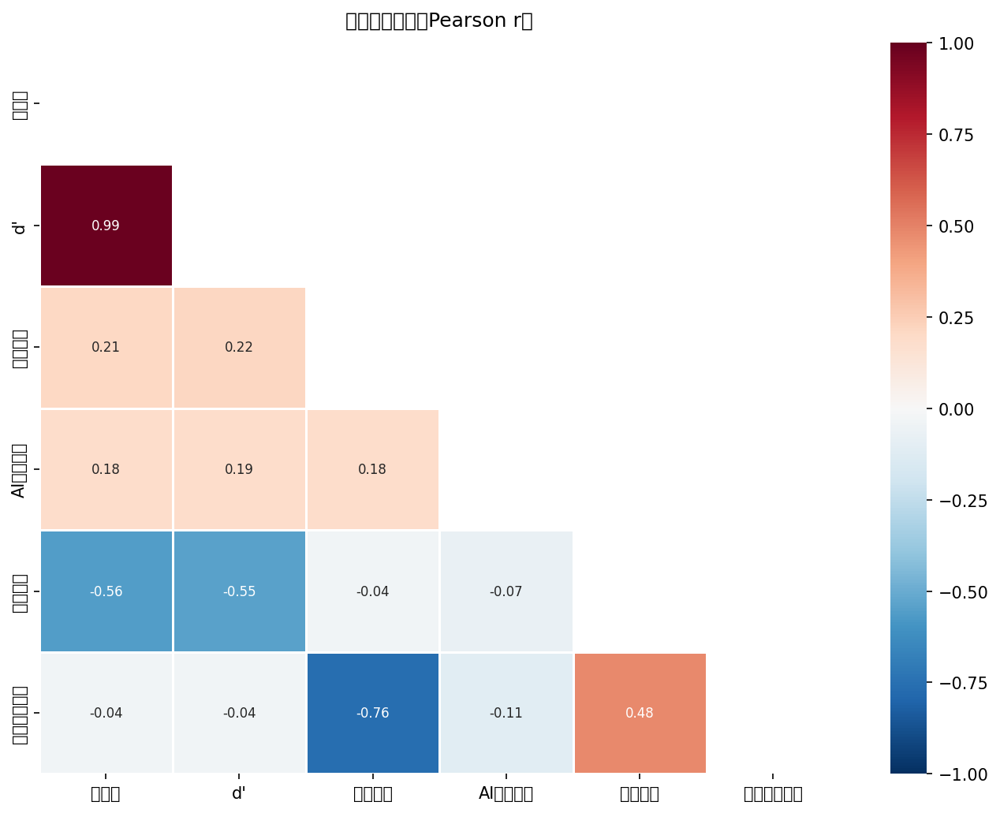
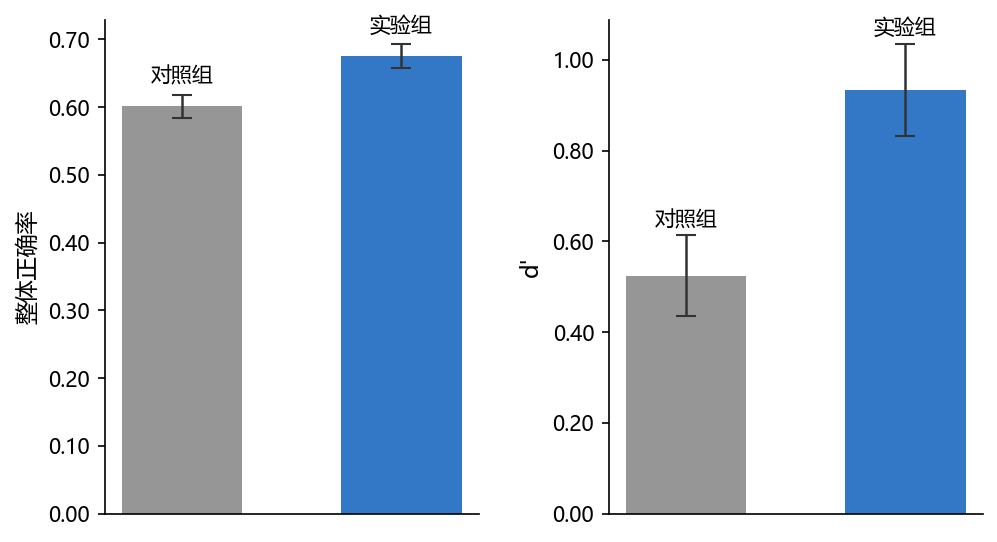
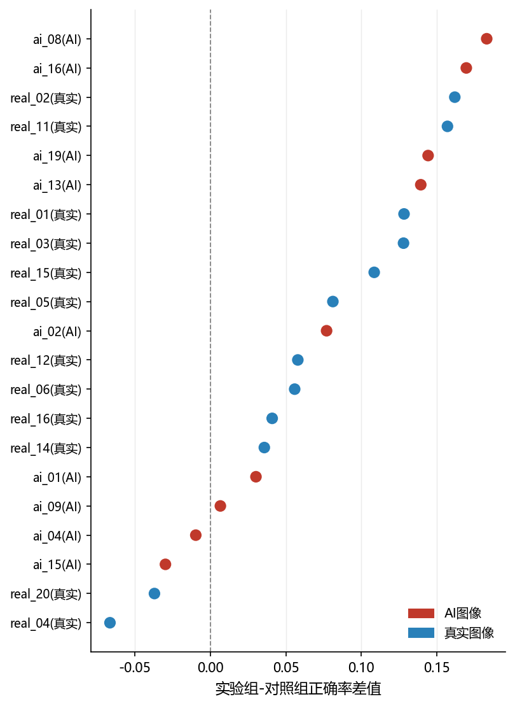
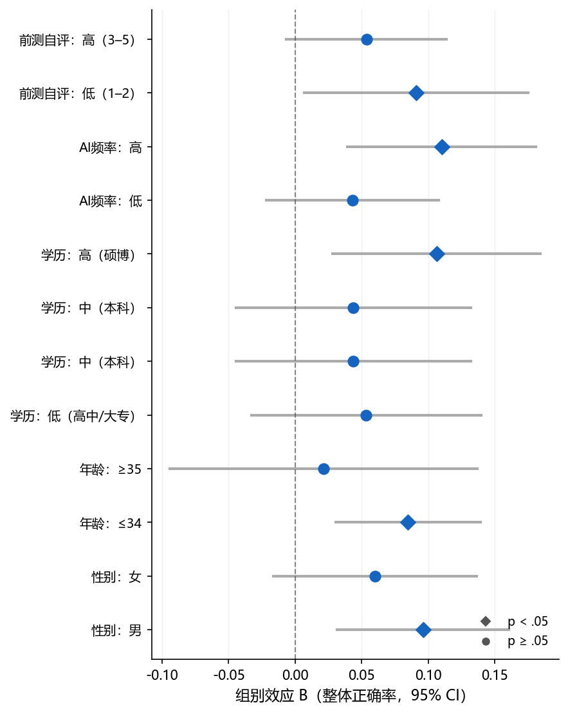

# Study 2 正式分析报告

**最终样本**: n=152（对照=78, 实验=74）| **日期**: 2026-03-04

---

## 一、数据与方法

### 1.1 数据说明

- **实验平台**: 在线实验（picquiz.zeabur.app）
- **数据集**: 实验平台在线收集的真实数据
- **排除图像**: ai_06, ai_11, ai_18（质量问题），保留 21 张有效图像（9张AI，12张真实）
- **组别**: 对照组 vs 实验组（干预：策略教学）

### 1.2 核心变量说明

| 变量名                   | 中文名称   | 操作化                                                  | 来源           | 量程  |
| --------------------- | ------ | ---------------------------------------------------- | ------------ | --- |
| acc_total             | 整体正确率  | 正确判断数 / 21                                           | responses    | 0–1 |
| d'（dprime）            | SDT敏感度 | Loglinear 校正：z(HR) − z(FAR)                          | 计算           | 连续  |
| c（判断标准）               | 判断偏向   | 负值=偏向判为AI；正值=偏向保守                                    | 计算           | 连续  |
| self_assessed_ability | 前测自评能力 | 自我评估辨别AI图片能力（前测）                                     | participants | 1–5 |
| self_performance      | 后测表现自评 | 对自己实验表现的整体自我评估（后测）                                   | post-survey  | 1–5 |
| calibration_gap       | 信心校准差距 | self_performance/5 − acc_total（正=过度自信）               | 计算           | 连续  |
| ai_exposure_num       | AI使用频率 | never=1 … very-often=5                               | participants | 1–5 |
| efficacy_change_proxy | 效能变化代理 | self_performance − self_assessed_ability（后−前测自评，探索性） | 计算           | 连续  |

### 1.3 样本过滤流程

| 步骤                      | 操作                | 保留 n                  |
| ----------------------- | ----------------- | --------------------- |
| 原始参与者（A+C）              | —                 | 202                   |
| 完成全部21张图像               | —                 | 119                   |
| 通过注意力检验                 | 排除 5 人            | 114                   |
| 手动质检排除                  | 排除 delete=1 共 2 人 | 112                   |
| Manipulation Check（实验组） | 实验组未通过 MC 者排除 6 人 | 106                   |
| 合并额外数据（已同等过滤）           | 新增 46 人           | **152**（对照=78, 实验=74) |

## 二、基线等价性检验

> 随机分组假设：两组在人口统计学和基线能力上应无显著差异（*p* > .05）。

### 2.1 人口统计学分布与分组等价性（Table 1）

| 变量 / 类别       | 对照组 (n=78) | 实验组 (n=74) | χ²   | df | *p*  | Cramér's *V* |
| ------------- | ---------- | ---------- | ---- | -- | ---- | ------------ |
| **性别**        |            |            | 2.60 | 1  | .107 | .13          |
| 　女            | 32 (41.0%) | 41 (55.4%) |      |    |      |              |
| 　男            | 46 (59.0%) | 33 (44.6%) |      |    |      |              |
| **年龄**        |            |            | 4.69 | 3  | .196 | .18          |
| 　18-24        | 31 (39.7%) | 42 (56.8%) |      |    |      |              |
| 　25-34        | 25 (32.1%) | 19 (25.7%) |      |    |      |              |
| 　35-44        | 7 (9.0%)   | 4 (5.4%)   |      |    |      |              |
| 　45-54        | 15 (19.2%) | 9 (12.2%)  |      |    |      |              |
| **教育程度（三分类）** |            |            | 0.86 | 2  | .651 | .08          |
| 　高中/大专        | 19 (24.4%) | 16 (21.6%) |      |    |      |              |
| 　本科           | 31 (39.7%) | 26 (35.1%) |      |    |      |              |
| 　硕博           | 28 (35.9%) | 32 (43.2%) |      |    |      |              |
| **AI使用频率**    |            |            | 1.55 | 4  | .817 | .10          |
| 　从不           | 3 (3.8%)   | 1 (1.4%)   |      |    |      |              |
| 　很少           | 11 (14.1%) | 13 (17.6%) |      |    |      |              |
| 　有时           | 26 (33.3%) | 25 (33.8%) |      |    |      |              |
| 　经常           | 20 (25.6%) | 16 (21.6%) |      |    |      |              |
| 　非常频繁         | 18 (23.1%) | 19 (25.7%) |      |    |      |              |

### 2.2 连续变量基线比较（Welch's t 检验，Table 2）

| 变量            | 对照组 M (SD)  | 实验组 M (SD)  | t     | df    | *p*  | Hedges' *g* |
| ------------- | ----------- | ----------- | ----- | ----- | ---- | ----------- |
| 前测自评辨别能力（1–5） | 2.90 (1.18) | 3.09 (1.12) | 1.055 | 150.0 | .293 | .170        |
| AI 使用频率（1–5）  | 3.50 (1.11) | 3.53 (1.10) | 0.150 | 149.7 | .881 | .024        |

> **结论**: 两组在所有人口统计学变量（所有 χ² *p* > .05）和 AI 素养基线指标（所有 *p* > .05）上均无显著差异，随机分组成功。

## 三、干预主效应

### 3.1 组间均值比较（Welch's t 检验，Table 3a）

> 注：HR（命中率）= 正确识别AI图像的比例；FAR（虚报率）= 将真实图像误判为AI的比例。 CRR = 1 − FAR（与FAR互为补数，不独立报告）。
> HR/FAR 使用 Loglinear 校正（极端值时各加 0.5 / 从分母减 1），因此与整体正确率（原始计数/21）的数值关系并非严格线性，两者报告口径略有差异。

| 指标             | 对照组 M (SD)    | 实验组 M (SD)     | t      | df    | *p*    | Hedges' *g* |
| -------------- | ------------- | -------------- | ------ | ----- | ------ | ----------- |
| 整体正确率          | 0.601 (0.150) | 0.676 (0.154)  | 3.012  | 149.1 | .003** | .487        |
| d'（SDT敏感度）     | 0.524 (0.787) | 0.933 (0.878)  | 3.023  | 146.2 | .003** | .490        |
| c（判断标准，负=偏向AI） | 0.019 (0.322) | -0.001 (0.381) | -0.360 | 143.2 | .720   | -.058       |
| 命中率 HR         | 0.588 (0.171) | 0.659 (0.187)  | 2.433  | 147.1 | .016*  | .394        |
| 虚报率 FAR        | 0.404 (0.178) | 0.339 (0.183)  | -2.230 | 149.1 | .027*  | -.360       |

> **注**：*d'* 与整体正确率在本样本中近似线性相关（*r* = .987），可能因判断标准 *c* 的个体差异较小（SD ≈ 0.38）所致；分别报告以呈现 SDT 信号检测框架。
> 组间 *t* 检验均使用 Welch 校正（不假定方差齐性），自由度为 Welch-Satterthwaite 近似值。

### 3.2 回归分析（控制人口统计学）：DV = 整体正确率 & d'

> 控制变量：性别、年龄段、学历（三分类）。参照组：性别=男，年龄=18–24，学历=本科。
> 标准化系数 β = B × SD_X / SD_Y（连续变量及哑变量均计算，结果供参考）。

#### 识别准确率（模型一：控制人口统计学）

> 自变量：group_c（C=1, A=0）  参照组：性别=男, 年龄=18–24, 学历=本科（三分类）  ◄ p < .05
| 变量                             |        B |      SE |    Beta |       t |          p |    VIF |
|--------------------------------|----------|---------|---------|---------|------------|--------|
| (常量)                           |    0.585 |   0.029 |         |  20.459 |     < .001 |        |
| 是否进行信息干预                       |    0.076 |   0.025 |   0.243 |   2.983 |     .003** |  1.064 | ◄
| 性别（女 vs 男）                     |   -0.027 |   0.025 |  -0.087 |  -1.082 |       .281 |  1.043 |
| 年龄 25–34（vs 18–24）             |    0.031 |   0.029 |   0.090 |   1.046 |       .297 |  1.179 |
| 年龄 35–44（vs 18–24）             |   -0.021 |   0.050 |  -0.035 |  -0.419 |       .676 |  1.103 |
| 年龄 45–54（vs 18–24）             |   -0.011 |   0.038 |  -0.027 |  -0.302 |       .763 |  1.281 |
| 学历 低（高中/大专 vs 本科）              |    0.018 |   0.034 |   0.050 |   0.535 |       .594 |  1.379 |
| 学历 高（硕博 vs 本科）                 |    0.048 |   0.028 |   0.150 |   1.677 |       .096 |  1.288 |

_R²=0.101, Adj.R²=0.058, F(7,144)=2.318, p = .029*_
_因变量：识别准确率（模型一：控制人口统计学）_

> **残差诊断**: Shapiro-Wilk *W* = 0.990, *p* = .341 （正态）; Breusch-Pagan *p* = .305 （同方差）; Durbin-Watson = 0.60

#### 敏感性指标 d'（模型一：控制人口统计学）

> 自变量：group_c（C=1, A=0）  参照组：性别=男, 年龄=18–24, 学历=本科（三分类）  ◄ p < .05
| 变量                             |        B |      SE |    Beta |       t |          p |    VIF |
|--------------------------------|----------|---------|---------|---------|------------|--------|
| (常量)                           |    0.426 |   0.157 |         |   2.717 |       .007 |        |
| 是否进行信息干预                       |    0.404 |   0.139 |   0.237 |   2.910 |     .004** |  1.064 | ◄
| 性别（女 vs 男）                     |   -0.101 |   0.138 |  -0.059 |  -0.731 |       .466 |  1.043 |
| 年龄 25–34（vs 18–24）             |    0.155 |   0.161 |   0.082 |   0.962 |       .338 |  1.179 |
| 年龄 35–44（vs 18–24）             |   -0.135 |   0.273 |  -0.041 |  -0.494 |       .622 |  1.103 |
| 年龄 45–54（vs 18–24）             |   -0.092 |   0.209 |  -0.040 |  -0.443 |       .659 |  1.281 |
| 学历 低（高中/大专 vs 本科）              |    0.075 |   0.188 |   0.037 |   0.399 |       .690 |  1.379 |
| 学历 高（硕博 vs 本科）                 |    0.281 |   0.156 |   0.161 |   1.797 |       .075 |  1.288 |

_R²=0.102, Adj.R²=0.059, F(7,144)=2.347, p = .027*_
_因变量：敏感性指标 d'（模型一：控制人口统计学）_

> **残差诊断**: Shapiro-Wilk *W* = 0.992, *p* = .586 （正态）; Breusch-Pagan *p* = .272 （同方差）; Durbin-Watson = 0.63

### 3.3 回归分析（控制AI素养相关）：DV = 整体正确率 & d'

> 控制变量：AI使用频率（1–5）、前测自评能力（1–5）；均为连续变量。

#### 识别准确率（模型二：控制AI素养相关）

> 自变量：group_c（C=1, A=0）；连续控制变量已中心化至各自均值  ◄ p < .05
| 变量                             |        B |      SE |    Beta |       t |          p |    VIF |
|--------------------------------|----------|---------|---------|---------|------------|--------|
| (常量)                           |    0.464 |   0.048 |         |   9.662 |     < .001 |        |
| 是否进行信息干预                       |    0.069 |   0.024 |   0.223 |   2.876 |     .005** |  1.007 | ◄
| AI使用频率（1–5）                    |    0.021 |   0.011 |   0.150 |   1.911 |       .058 |  1.035 |
| 前测自评能力（1–5）                    |    0.022 |   0.011 |   0.160 |   2.031 |      .044* |  1.043 | ◄

_R²=0.114, Adj.R²=0.096, F(3,148)=6.356, p < .001***_
_因变量：识别准确率（模型二：控制AI素养相关）_

> **残差诊断**: Shapiro-Wilk *W* = 0.980, *p* = .024* （偏离正态（可能影响小样本推断））; Breusch-Pagan *p* = .694 （同方差）; Durbin-Watson = 0.60

#### 敏感性指标 d'（模型二：控制AI素养相关）

> 自变量：group_c（C=1, A=0）；连续控制变量已中心化至各自均值  ◄ p < .05
| 变量                             |        B |      SE |    Beta |       t |          p |    VIF |
|--------------------------------|----------|---------|---------|---------|------------|--------|
| (常量)                           |   -0.251 |   0.263 |         |  -0.956 |       .341 |        |
| 是否进行信息干预                       |    0.382 |   0.132 |   0.224 |   2.892 |     .004** |  1.007 | ◄
| AI使用频率（1–5）                    |    0.118 |   0.061 |   0.152 |   1.941 |       .054 |  1.035 |
| 前测自评能力（1–5）                    |    0.125 |   0.058 |   0.168 |   2.137 |      .034* |  1.043 | ◄

_R²=0.119, Adj.R²=0.101, F(3,148)=6.635, p < .001***_
_因变量：敏感性指标 d'（模型二：控制AI素养相关）_

> **残差诊断**: Shapiro-Wilk *W* = 0.990, *p* = .379 （正态）; Breusch-Pagan *p* = .242 （同方差）; Durbin-Watson = 0.62

### 3.4 层次回归：组别效应在控制协变量前后的变化

| 模型 | 纳入变量    | B（组别） | 95% CI         | R²   | ΔR²    | *p*（组别） |
| -- | ------- | ----- | -------------- | ---- | ------ | ------- |
| M1 | 仅组别     | 0.074 | [0.026, 0.123] | .057 | —      | .003**  |
| M2 | +前测自评能力 | 0.069 | [0.021, 0.117] | .092 | +0.035 | .005**  |

> **注**: 组别效应在 M1 中 显著（B=0.074, *p*=.003），加入前测自评能力后基本保持稳定（M2: B=0.069, *p*=.005，变化幅度=-6.8%），显著。结论应聚焦控制协变量后的回归结果。

## 四、过度怀疑分析（T6）

### 4.1 混合 ANOVA（2组 × 2图像类型）

| 效应          | df₁ | df₂ | F     | *p*    | η²p  |
| ----------- | --- | --- | ----- | ------ | ---- |
| group       | 1   | 150 | 9.328 | .003** | .059 |
| image_type  | 1   | 150 | 0.004 | .947   | .000 |
| Interaction | 1   | 150 | 0.038 | .846   | .000 |

### 4.2 按图像类型的组间差异（简单效应）

| 图像类型   | 对照组 M (SD)    | 实验组 M (SD)    | t     | df    | *p*   | Hedges' *g* |
| ------ | ------------- | ------------- | ----- | ----- | ----- | ----------- |
| AI图像   | 0.598 (0.191) | 0.677 (0.208) | 2.433 | 147.1 | .016* | .394        |
| Real图像 | 0.604 (0.193) | 0.675 (0.199) | 2.228 | 149.1 | .027* | .360        |

> **结果解读**: 实验组在AI图像上准确率高于对照组（0.677 vs 0.598，**p < .05**），在真实图像上也略高（0.675 vs 0.604，未显著）。group × image_type 交互 *p* = .846，不显著。**当前数据不支持"过度怀疑"（实验组真实图像准确率下降）的解读**；实验组判断标准 c 更负（见 3.1），反映更倾向判为AI，但尚未造成真实图像准确率下降。

## 五、信心与校准分析（T5）

### 5.1 后测表现自评与 calibration_gap 组间比较

| 指标                        | 对照组              | 实验组              | 统计量      | df    | *p*  | 效应量                |
| ------------------------- | ---------------- | ---------------- | -------- | ----- | ---- | ------------------ |
| 后测表现自评                    | Mdn=3.0, IQR=2.0 | Mdn=3.0, IQR=1.0 | U=3344   | —     | .075 | r = -.159（Z/√N 估计） |
| calibration_gap（M, SD）    | 0.006 (0.221)    | -0.013 (0.199)   | t=-0.581 | 149.6 | .562 | g = -.094          |
| calibration_gap vs 0（全样本） | —                | —                | t=-0.194 | 151   | .846 | —                  |

> **calibration_gap** = self_performance/5 − acc_total（正值=过度自信，负值=过度保守）
> Mann-Whitney U 用于非正态 self_performance；Welch's t 用于 calibration_gap。

### 5.2 calibration_gap 回归（分别控制人口统计学 / AI素养相关，Table 5）

> 模型一参照组：性别=男，年龄=18–24，学历=本科；模型二仅含连续变量（无哑变量参照组）。

#### 信心校准差距（模型一：控制人口统计学）

> 自变量：group_c（C=1, A=0）  参照组：性别=男, 年龄=18–24, 学历=本科（三分类）  ◄ p < .05
| 变量                             |        B |      SE |    Beta |       t |          p |    VIF |
|--------------------------------|----------|---------|---------|---------|------------|--------|
| (常量)                           |   -0.023 |   0.039 |         |  -0.599 |       .550 |        |
| 是否进行信息干预                       |   -0.005 |   0.035 |  -0.011 |  -0.137 |       .891 |  1.064 |
| 性别（女 vs 男）                     |    0.021 |   0.034 |   0.051 |   0.620 |       .536 |  1.043 |
| 年龄 25–34（vs 18–24）             |    0.048 |   0.040 |   0.103 |   1.186 |       .238 |  1.179 |
| 年龄 35–44（vs 18–24）             |    0.127 |   0.068 |   0.157 |   1.864 |       .064 |  1.103 |
| 年龄 45–54（vs 18–24）             |    0.142 |   0.052 |   0.247 |   2.714 |     .007** |  1.281 | ◄
| 学历 低（高中/大专 vs 本科）              |   -0.080 |   0.047 |  -0.161 |  -1.712 |       .089 |  1.379 |
| 学历 高（硕博 vs 本科）                 |   -0.037 |   0.039 |  -0.086 |  -0.950 |       .344 |  1.288 |

_R²=0.073, Adj.R²=0.028, F(7,144)=1.619, p = .135_
_因变量：信心校准差距（模型一：控制人口统计学）_

> **残差诊断**: Shapiro-Wilk *W* = 0.993, *p* = .707 （正态）; Breusch-Pagan *p* = .880 （同方差）; Durbin-Watson = 1.41

#### 信心校准差距（模型二：控制AI素养相关）

> 自变量：group_c（C=1, A=0）；连续控制变量已中心化至各自均值  ◄ p < .05
| 变量                             |        B |      SE |    Beta |       t |          p |    VIF |
|--------------------------------|----------|---------|---------|---------|------------|--------|
| (常量)                           |    0.064 |   0.069 |         |   0.940 |       .349 |        |
| 是否进行信息干预                       |   -0.019 |   0.034 |  -0.045 |  -0.542 |       .588 |  1.007 |
| AI使用频率（1–5）                    |   -0.013 |   0.016 |  -0.070 |  -0.844 |       .400 |  1.035 |
| 前测自评能力（1–5）                    |   -0.004 |   0.015 |  -0.021 |  -0.256 |       .798 |  1.043 |

_R²=0.008, Adj.R²=-0.012, F(3,148)=0.407, p = .748_
_因变量：信心校准差距（模型二：控制AI素养相关）_

> **残差诊断**: Shapiro-Wilk *W* = 0.994, *p* = .807 （正态）; Breusch-Pagan *p* = .250 （同方差）; Durbin-Watson = 1.38

## 六、逐图与图像类型分析

### 6.1 每张图 Fisher 精确检验（group × is_correct）

| 图像ID    | 类型   | 风格           | 对照组准确率 | 实验组准确率 | Δ(实验−对照) | OR    | *p*（未校正） | *p*（Bonferroni） |
| ------- | ---- | ------------ | ------ | ------ | -------- | ----- | -------- | --------------- |
| ai_08   | AI   | photograph   | 0.385  | 0.568  | +0.183   | 0.476 | .034*    | .137            |
| ai_16   | AI   | illustration | 0.385  | 0.554  | +0.169   | 0.503 | .051     | .405            |
| real_02 | Real | photograph   | 0.744  | 0.905  | +0.162   | 0.303 | .011*    | .118            |
| real_11 | Real | photograph   | 0.654  | 0.811  | +0.157   | 0.441 | .044*    | .698            |
| ai_19   | AI   | photograph   | 0.667  | 0.811  | +0.144   | 0.467 | .065     | .582            |
| ai_13   | AI   | photograph   | 0.577  | 0.716  | +0.139   | 0.540 | .090     | .542            |
| real_01 | Real | illustration | 0.372  | 0.500  | +0.128   | 0.592 | .141     | 1.000           |
| real_03 | Real | cartoon      | 0.615  | 0.743  | +0.128   | 0.553 | .118     | 1.000           |
| real_15 | Real | illustration | 0.256  | 0.365  | +0.108   | 0.600 | .164     | 1.000           |
| real_05 | Real | illustration | 0.500  | 0.581  | +0.081   | 0.721 | .333     | 1.000           |
| ai_02   | AI   | photograph   | 0.423  | 0.500  | +0.077   | 0.733 | .416     | .832            |
| real_12 | Real | photograph   | 0.821  | 0.878  | +0.058   | 0.633 | .370     | 1.000           |
| real_06 | Real | photograph   | 0.782  | 0.838  | +0.056   | 0.694 | .415     | 1.000           |
| real_16 | Real | photograph   | 0.756  | 0.797  | +0.041   | 0.789 | .566     | 1.000           |
| real_14 | Real | cartoon      | 0.410  | 0.446  | +0.036   | 0.864 | .743     | 1.000           |
| ai_01   | AI   | illustration | 0.808  | 0.838  | +0.030   | 0.813 | .675     | .675            |
| ai_09   | AI   | cartoon      | 0.872  | 0.878  | +0.007   | 0.942 | 1.000    | 1.000           |
| ai_04   | AI   | cartoon      | 0.821  | 0.811  | -0.010   | 1.067 | 1.000    | 1.000           |
| ai_15   | AI   | photograph   | 0.449  | 0.419  | -0.030   | 1.129 | .745     | 1.000           |
| real_20 | Real | cartoon      | 0.564  | 0.527  | -0.037   | 1.161 | .745     | 1.000           |
| real_04 | Real | photograph   | 0.769  | 0.703  | -0.067   | 1.410 | .364     | 1.000           |

> 原始 *p* < .05：**['ai_08', 'real_02', 'real_11']**；Bonferroni 校正后（α = .05/21 = 0.0024）显著：**无**。

### 6.2 风格类型分析（photo vs not_photo）

> illustration 与 cartoon 合并为 not_photo；photograph 单独为 photo。

| 风格               | 对照组 M (SD)    | 实验组 M (SD)    | t     | df    | *p*    | Hedges' *g* |
| ---------------- | ------------- | ------------- | ----- | ----- | ------ | ----------- |
| photo（照片）        | 0.639 (0.173) | 0.722 (0.172) | 2.990 | 149.6 | .003** | .483        |
| not_photo（插图/卡通） | 0.560 (0.200) | 0.624 (0.178) | 2.087 | 149.4 | .039*  | .336        |

> **模型**: acc ~ group_c × style_photo（0=not_photo, 1=photo），n=304 行。
> F(3,300)=10.239, p < .001***

- Intercept: B=0.560, *p* = < .001***
- group_c: B=0.064, *p* = .030*
- style_photo: B=0.078, *p* = .007**
- group_c:style_photo: B=0.020, *p* = .638

### 6.3 可反向搜索性分析（reverse_searchable）

> **分析单位**：先对每位被试在各类别图像上取平均正确率（被试水平），再做 Welch's *t* 检验，避免观测值级别（n≈108×图像数）重复测量导致 df 虚大（原始行级别分析会出现 df>1000）。

| 类型           | 对照组均值 | 实验组均值 | t     | df    | *p*    | Hedges' *g* |
| ------------ | ----- | ----- | ----- | ----- | ------ | ----------- |
| 可反向搜索        | 0.613 | 0.664 | 1.760 | 141.2 | .081   | .286        |
| 不可反向搜索（仅AI图） | 0.593 | 0.685 | 3.239 | 149.9 | .001** | .522        |

### 6.4 AI 来源分析（仅AI图）

| AI来源       | 对照组 M (SD)    | 实验组 M (SD)    | t     | df    | *p*   | Hedges' *g* |
| ---------- | ------------- | ------------- | ----- | ----- | ----- | ----------- |
| ai-art     | 0.684 (0.263) | 0.716 (0.280) | 0.737 | 148.0 | .462  | .119        |
| midjourney | 0.611 (0.265) | 0.721 (0.253) | 2.606 | 150.0 | .010* | .420        |
| nanobanana | 0.500 (0.283) | 0.595 (0.309) | 1.967 | 147.2 | .051  | .318        |

## 七、AI 素养调节效应

### 7.1 AI 素养与准确率的相关分析

| 变量          | r（与准确率） | *p*   | n   |
| ----------- | ------- | ----- | --- |
| 前测自评能力      | .207    | .010* | 152 |
| AI使用频率（1–5） | .183    | .024* | 152 |

### 7.2 调节效应模型（前测自评能力 × 组别）

> 两个版本：**完整模型**（含人口统计学+AI使用频率控制变量）；**简约模型**（仅组别 × 自评能力，无其他控制）。
> 均使用 self_assessed_ability 的中心化版本 sae_c。

**模型 I：完整模型（含人口统计学 + AI使用频率控制变量）**

| 变量                 | B      | SE    | 95% CI           | β    | t      | p      | VIF  |
| ------------------ | ------ | ----- | ---------------- | ---- | ------ | ------ | ---- |
| 截距                 | 0.523  | 0.050 | [0.423, 0.622]   | —    | 10.371 | —      | —    |
| 组别（C=1）            | 0.072  | 0.025 | [0.023, 0.120]   | .230 | 2.918  | .004** | 1.08 |
| 前测自评能力（中心化）        | 0.046  | 0.014 | [0.017, 0.074]   | .337 | 3.197  | .002** | 1.11 |
| 交互：组别 × 自评能力       | -0.046 | 0.021 | [-0.088, -0.004] | —    | -2.179 | .031*  | —    |
| 性别（女=1）            | -0.025 | 0.024 | [-0.073, 0.023]  | —    | -1.032 | .304   | 1.05 |
| 年龄 25–34（vs 18–24） | 0.028  | 0.029 | [-0.029, 0.085]  | —    | 0.969  | .334   | 1.21 |
| 年龄 35–44           | -0.019 | 0.048 | [-0.115, 0.077]  | —    | -0.387 | .699   | 1.12 |
| 年龄 45–54           | 0.000  | 0.037 | [-0.073, 0.073]  | —    | 0.008  | .994   | 1.30 |
| 学历 低（高中/大专 vs 本科）  | 0.025  | 0.033 | [-0.041, 0.090]  | .068 | 0.753  | .452   | 1.40 |
| 学历 高（硕博 vs 本科）     | 0.046  | 0.028 | [-0.010, 0.101]  | .144 | 1.629  | .106   | 1.32 |
| AI使用频率（1–5）        | 0.018  | 0.011 | [-0.004, 0.041]  | .129 | 1.605  | .111   | 1.12 |

_R² = .185, Adj.R² = .128, F(10, 141) = 3.209, p < .001***_

> **残差诊断**: Shapiro-Wilk *W* = 0.980, *p* = .029* （偏离正态（可能影响小样本推断））; Breusch-Pagan *p* = .566 （同方差）; Durbin-Watson = 0.78

**模型 II：简约模型（仅 group_c × sae_c，无其他控制变量）**

| 变量           | B      | SE    | 95% CI           | β    | t      | p         | VIF  |
| ------------ | ------ | ----- | ---------------- | ---- | ------ | --------- | ---- |
| 截距           | 0.606  | 0.017 | [0.573, 0.639]   | —    | 36.323 | —         | —    |
| 组别（C=1）      | 0.070  | 0.024 | [0.022, 0.117]   | .224 | 2.916  | .004**    | 1.01 |
| 前测自评能力（中心化）  | 0.050  | 0.014 | [0.022, 0.078]   | .368 | 3.506  | < .001*** | 1.01 |
| 交互：组别 × 自评能力 | -0.053 | 0.021 | [-0.094, -0.011] | —    | -2.517 | .013*     | —    |

_R² = .130, Adj.R² = .112, F(3, 148) = 7.343, p < .001***_

> **残差诊断**: Shapiro-Wilk *W* = 0.983, *p* = .053 （正态）; Breusch-Pagan *p* = .689 （同方差）; Durbin-Watson = 0.59

### 7.3 简单斜率分析（group 效应 at −1SD / Mean / +1SD 自评能力）

> 两个版本分别对应完整模型（模型 I）和简约模型（模型 II）。

**模型 I 简单斜率（完整控制变量）**

| 水平                  | B（组别效应） | SE    | 95% CI          | t     | *p*       |
| ------------------- | ------- | ----- | --------------- | ----- | --------- |
| 低自评 −1SD (SAE≈1.84) | 0.125   | 0.035 | [0.055, 0.194]  | 3.556 | < .001*** |
| 均值     (SAE≈2.99)   | 0.072   | 0.025 | [0.023, 0.120]  | 2.918 | .004**    |
| 高自评 +1SD (SAE≈4.15) | 0.018   | 0.034 | [-0.049, 0.086] | 0.534 | .594      |

Johnson-Neyman 近似显著性边界（中心化 sae_c）: 0.509 到 2.588
→ 对应原始 self_assessed_ability: 3.50 到 5.58
→ group 效应在此区间**外**达 *p* < .05（交互方向 < 0）

**模型 II 简单斜率（简约：无控制变量）**

| 水平                  | B（组别效应） | SE    | 95% CI          | t     | *p*       |
| ------------------- | ------- | ----- | --------------- | ----- | --------- |
| 低自评 −1SD (SAE≈1.84) | 0.130   | 0.034 | [0.063, 0.198]  | 3.825 | < .001*** |
| 均值     (SAE≈2.99)   | 0.070   | 0.024 | [0.022, 0.117]  | 2.916 | .004**    |
| 高自评 +1SD (SAE≈4.15) | 0.009   | 0.034 | [-0.058, 0.076] | 0.272 | .786      |

Johnson-Neyman 近似显著性边界（中心化 sae_c）: 0.436 到 2.222
→ 对应原始 self_assessed_ability: 3.43 到 5.22
→ group 效应在此区间**外**达 *p* < .05（交互方向 < 0）

### 7.4 调节效应模型（AI使用频率 × 组别）

> 两个版本：**完整模型**（含人口统计学 + 前测自评能力控制变量）；**简约模型**（仅组别 × AI频率，无其他控制）。
> 均使用 ai_exposure_num 的中心化版本 aie_c。

**模型 I：完整模型（含人口统计学 + 前测自评能力控制变量）**

| 变量                 | B      | SE    | 95% CI          | β    | t      | p      | VIF  |
| ------------------ | ------ | ----- | --------------- | ---- | ------ | ------ | ---- |
| 截距                 | 0.511  | 0.041 | [0.429, 0.592]  | —    | 12.385 | —      | —    |
| 组别（C=1）            | 0.069  | 0.025 | [0.020, 0.118]  | .223 | 2.782  | .006** | 1.08 |
| AI使用频率（中心化）        | 0.008  | 0.016 | [-0.024, 0.039] | .055 | 0.487  | .627   | 1.12 |
| 交互：组别 × AI频率       | 0.020  | 0.022 | [-0.024, 0.064] | —    | 0.901  | .369   | —    |
| 性别（女=1）            | -0.029 | 0.025 | [-0.078, 0.019] | —    | -1.188 | .237   | 1.05 |
| 年龄 25–34（vs 18–24） | 0.018  | 0.029 | [-0.040, 0.075] | —    | 0.610  | .543   | 1.21 |
| 年龄 35–44           | -0.035 | 0.050 | [-0.133, 0.063] | —    | -0.699 | .486   | 1.12 |
| 年龄 45–54           | -0.003 | 0.038 | [-0.077, 0.071] | —    | -0.085 | .932   | 1.30 |
| 学历 低（高中/大专 vs 本科）  | 0.025  | 0.034 | [-0.042, 0.091] | .067 | 0.733  | .465   | 1.40 |
| 学历 高（硕博 vs 本科）     | 0.055  | 0.028 | [-0.000, 0.111] | .174 | 1.965  | .051   | 1.32 |
| 前测自评能力（1–5）        | 0.026  | 0.011 | [0.004, 0.048]  | .191 | 2.347  | .020*  | 1.11 |

_R² = .163, Adj.R² = .103, F(10, 141) = 2.742, p = .004**_

> **残差诊断**: Shapiro-Wilk *W* = 0.988, *p* = .212 （正态）; Breusch-Pagan *p* = .058 （同方差）; Durbin-Watson = 0.74

**模型 II：简约模型（仅 group_c × aie_c，无其他控制变量）**

| 变量           | B     | SE    | 95% CI          | β    | t      | p      | VIF  |
| ------------ | ----- | ----- | --------------- | ---- | ------ | ------ | ---- |
| 截距           | 0.602 | 0.017 | [0.568, 0.635]  | —    | 35.461 | —      | —    |
| 组别（C=1）      | 0.074 | 0.024 | [0.026, 0.122]  | .237 | 3.025  | .003** | 1.00 |
| AI使用频率（中心化）  | 0.016 | 0.015 | [-0.015, 0.046] | .111 | 1.024  | .307   | 1.00 |
| 交互：组别 × AI频率 | 0.020 | 0.022 | [-0.024, 0.064] | —    | 0.913  | .363   | —    |

_R² = .095, Adj.R² = .076, F(3, 148) = 5.151, p = .002**_

> **残差诊断**: Shapiro-Wilk *W* = 0.987, *p* = .188 （正态）; Breusch-Pagan *p* = .020* （疑似异方差）; Durbin-Watson = 0.59

### 7.5 简单斜率分析（group 效应 at −1SD / Mean / +1SD AI使用频率）

> 两个版本分别对应完整模型（模型 I）和简约模型（模型 II）。

**模型 I 简单斜率（完整控制变量）**

| 水平                  | B（组别效应） | SE    | 95% CI          | t     | *p*    |
| ------------------- | ------- | ----- | --------------- | ----- | ------ |
| 低频率 −1SD (AIE≈2.41) | 0.047   | 0.036 | [-0.023, 0.117] | 1.322 | .188   |
| 均值     (AIE≈3.51)   | 0.069   | 0.025 | [0.020, 0.118]  | 2.782 | .006** |
| 高频率 +1SD (AIE≈4.62) | 0.091   | 0.034 | [0.024, 0.159]  | 2.667 | .009** |

Johnson-Neyman 近似显著性边界（中心化 aie_c）: -5.893 到 -1.022
→ 对应原始 ai_exposure_num: -2.38 到 2.49
→ group 效应在此区间**外**达 _p_ < .05（交互方向 > 0）

**模型 II 简单斜率（简约：无控制变量）**

| 水平                  | B（组别效应） | SE    | 95% CI          | t     | *p*    |
| ------------------- | ------- | ----- | --------------- | ----- | ------ |
| 低频率 −1SD (AIE≈2.41) | 0.051   | 0.034 | [-0.017, 0.119] | 1.488 | .139   |
| 均值     (AIE≈3.51)   | 0.074   | 0.024 | [0.026, 0.122]  | 3.025 | .003** |
| 高频率 +1SD (AIE≈4.62) | 0.096   | 0.034 | [0.028, 0.164]  | 2.783 | .006** |

Johnson-Neyman 近似显著性边界（中心化 aie_c）: -6.006 到 -1.284
→ 对应原始 ai_exposure_num: -2.49 到 2.23
→ group 效应在此区间**外**达 _p_ < .05（交互方向 > 0）

## 八、异质性分析（T7, T8）

> **分组说明**: 学历三分类——低（高中/大专, n≈25）、中（本科, n≈45, 参照）、高（硕博, n≈45）。

### 8.1 辨别能力异质性（T7）

| 子群               | n   | B (组别) | t     | *p*    | Chow 检验             |
| ---------------- | --- | ------ | ----- | ------ | ------------------- |
| 性别：男             | 79  | 0.096  | 2.968 | .004** | F=1.014, *p*=.365   |
| 性别：女             | 73  | 0.060  | 1.573 | .120   |                     |
| *— 年龄 —*         |     |        |       |        |                     |
| 年龄：≤34           | 117 | 0.085  | 3.083 | .003** | F=1.112, *p*=.331   |
| 年龄：≥35           | 35  | 0.022  | 0.379 | .707   |                     |
| *— 学历（低 vs 中） —* |     |        |       |        |                     |
| 学历：低（高中/大专）      | 35  | 0.053  | 1.256 | .218   | F=0.130, *p*=.878   |
| 学历：中（本科）         | 57  | 0.044  | 0.995 | .324   |                     |
| *— 学历（中 vs 高） —* |     |        |       |        |                     |
| 学历：中（本科）         | 57  | 0.044  | 0.995 | .324   | F=2.324, *p*=.103   |
| 学历：高（硕博）         | 60  | 0.106  | 2.725 | .008** |                     |
| *— AI使用频率 —*     |     |        |       |        |                     |
| AI频率：低           | 79  | 0.043  | 1.322 | .190   | F=4.876, *p*=.009** |
| AI频率：高           | 73  | 0.110  | 3.097 | .003** |                     |
| *— 前测自评能力 —*     |     |        |       |        |                     |
| 前测自评：低（1–2）      | 52  | 0.091  | 2.173 | .035*  | F=2.900, *p*=.058   |
| 前测自评：高（3–5）      | 100 | 0.054  | 1.760 | .082   |                     |

### 8.2 信心校准异质性（T8）

| 子群               | n   | B (组别) | t      | *p*  | Chow 检验            |
| ---------------- | --- | ------ | ------ | ---- | ------------------ |
| 性别：男             | 79  | -0.013 | -0.283 | .778 | F=0.450, *p*=.638  |
| 性别：女             | 73  | -0.036 | -0.690 | .493 |                    |
| *— 年龄 —*         |     |        |        |      |                    |
| 年龄：≤34           | 117 | -0.018 | -0.464 | .644 | F=3.193, *p*=.044* |
| 年龄：≥35           | 35  | 0.023  | 0.325  | .747 |                    |
| *— 学历（低 vs 中） —* |     |        |        |      |                    |
| 学历：低（高中/大专）      | 35  | 0.028  | 0.380  | .706 | F=0.501, *p*=.608  |
| 学历：中（本科）         | 57  | -0.017 | -0.287 | .775 |                    |
| *— 学历（中 vs 高） —* |     |        |        |      |                    |
| 学历：中（本科）         | 57  | -0.017 | -0.287 | .775 | F=0.512, *p*=.600  |
| 学历：高（硕博）         | 60  | -0.046 | -0.908 | .368 |                    |
| *— AI使用频率 —*     |     |        |        |      |                    |
| AI频率：低           | 79  | 0.008  | 0.193  | .847 | F=1.371, *p*=.257  |
| AI频率：高           | 73  | -0.052 | -0.962 | .339 |                    |
| *— 前测自评能力 —*     |     |        |        |      |                    |
| 前测自评：低（1–2）      | 52  | -0.032 | -0.561 | .577 | F=0.214, *p*=.807  |
| 前测自评：高（3–5）      | 100 | -0.009 | -0.212 | .832 |                    |

## 九、策略使用分析

### 9.1 逐图策略填写率（by 组别）

| group | 填写率   | 填写次数 | 总次数  |
| ----- | ----- | ---- | ---- |
| 实验    | 0.295 | 459  | 1554 |
| 对照    | 0.100 | 164  | 1638 |

### 9.2 策略类别 × 正确率

| 组别 | 策略类型      | n   | 正确率   |
| -- | --------- | --- | ----- |
| 对照 | Style     | 66  | 0.561 |
| 实验 | Style     | 284 | 0.722 |
| 对照 | Anatomy   | 31  | 0.774 |
| 实验 | Anatomy   | 143 | 0.734 |
| 实验 | Knowledge | 54  | 0.685 |
| 对照 | 直觉/其他     | 69  | 0.536 |
| 实验 | 直觉/其他     | 33  | 0.545 |

### 9.3 有无策略自报 → 准确率差异

| 组别 | 有策略自报         | 无策略自报          | 差值（有−无） |
| -- | ------------- | -------------- | ------- |
| 对照 | 0.585 (n=164) | 0.603 (n=1474) | -0.018  |
| 实验 | 0.704 (n=459) | 0.664 (n=1095) | +0.040  |

> 实验组 strategy_usage_degree × 准确率: *r* = .185, *p* = .114

## 十、相关矩阵（F3）

> 注：干预时长（intervention_duration_s）在 A 组中无实际干预（填充为 0），对全样本相关分析会人为压低相关值，故从相关矩阵中排除。
> 效能变化代理 = self_performance − self_assessed_ability（后测自评表现 − 前测自评能力；量表含义不同，仅作探索性指标）。

|        | 准确率       | d'        | 前测自评      | AI使用频率 | 校准差距     | 效能变化代理 |
| ------ | --------- | --------- | --------- | ------ | -------- | ------ |
| 准确率    | 1.000     | —         | —         | —      | —        | —      |
| d'     | 0.987***  | 1.000     | —         | —      | —        | —      |
| 前测自评   | 0.207*    | 0.216**   | 1.000     | —      | —        | —      |
| AI使用频率 | 0.183*    | 0.186*    | 0.185*    | 1.000  | —        | —      |
| 校准差距   | -0.561*** | -0.545*** | -0.038    | -0.075 | 1.000    | —      |
| 效能变化代理 | -0.036    | -0.039    | -0.760*** | -0.110 | 0.484*** | 1.000  |

*注：\* p < .05，\*\* p < .01，\*\*\* p < .001（双尾，未校正）*

## 十一、综合结论

**最终样本**: n=152（对照=78, 实验=74）

| 分析           | 主要结果                                  | 统计量        | *p*    |
| ------------ | ------------------------------------- | ---------- | ------ |
| 主效应：整体正确率    | 对照=0.601, 实验=0.676, g=.487            | t=3.012    | .003** |
| 主效应：d'       | 对照=0.524, 实验=0.933                    | 见 Table 3a | —      |
| 判断偏向 c       | 对照=0.019（保守）, 实验=-0.001（激进）           | 见 Table 3a | —      |
| 过度怀疑         | 实验在AI图更好（+0.079）；Real图差异不显著；数据不支持过度怀疑 | 交互 F       | .846   |
| 校准差距（全样本）    | M=-0.003（轻度过度自信）                      | t=-0.194   | .846   |
| 调节：自评能力 × 组别 | 低自评者 C>A 显著；高自评者无差异                   | B=-0.046   | .031*  |
| 异质性          | 见 Table 7–8（Chow 检验）                  | —          | —      |

## 十二、干预相关专项分析

### 12.1 操纵检查（干预组实验）

实验组 n = 74

**阅读了干预材料（C 组）**
  是: n=74 (100.0%)
  不确定: n=0 (0.0%)
  否: n=0 (0.0%)
  → 明确阅读率: 74/74 = 100.0%

**阅读了策略列表（C 组）**
  是: n=74 (100.0%)
  否: n=0 (0.0%)

**策略使用程度（C 组，连续）**: M=3.419, SD=0.922, Mdn=3.000, [min=2.0, max=5.0], n=74
  与整体准确率相关: r=.185, p=.114

### 12.2 干预页面停留时间（intervention_duration_s）

实验组 n=74: M=21.9s, SD=20.7s, Mdn=16.0s, [min=4s, max=128s]
| 时长区间    | n  | %     |
| ------- | -- | ----- |
| <30s    | 58 | 78.4% |
| 30–60s  | 13 | 17.6% |
| 60–90s  | 1  | 1.4%  |
| 90–180s | 2  | 2.7%  |
| >180s   | 0  | 0.0%  |

实验组：停留时间 × 准确率相关: r=-.046, p=.698, n=74

### 12.3 Google Lens 使用行为

使用 Lens（OPEN_LENS）：对照组 26/78 (33.3%)，实验组 34/74 (45.9%)
Lens使用者准确率: M=0.671 (n=60) vs 未使用: M=0.615 (n=92), t=2.177, p=.031*, g=.362
实验组 Lens深度（操作次数）× 准确率: r=.120, p=.499, n=34

### 12.4 描述性统计汇总（各变量，按组别）

> 格式：A 组 M (SD)，C 组 M (SD)

| 变量                        | 对照组 M (SD)    | 实验组 M (SD)     |
| ------------------------- | ------------- | -------------- |
| 整体正确率                     | 0.601 (0.150) | 0.676 (0.154)  |
| AI图正确率                    | 0.598 (0.191) | 0.677 (0.208)  |
| 真实图正确率                    | 0.604 (0.193) | 0.675 (0.199)  |
| d'（SDT敏感度）                | 0.524 (0.787) | 0.933 (0.878)  |
| c（判断标准）                   | 0.019 (0.322) | -0.001 (0.381) |
| 平均信心评分                    | 2.725 (1.465) | 2.613 (1.584)  |
| 信心校准差距（self_perf/5 − acc） | 0.006 (0.221) | -0.013 (0.199) |
| 前测自评能力（1–5）               | 2.897 (1.180) | 3.095 (1.125)  |
| AI使用频率（1–5）               | 3.500 (1.114) | 3.527 (1.101)  |
| 后测表现自评（1–5）               | 3.038 (0.986) | 3.311 (0.757)  |

### 12.5 前测基线差异（组间等价性检验）

**人口统计学（χ² 检验）**
  性别: χ²(1)=2.596, p=.107
  年龄段: χ²(3)=4.692, p=.196
  学历分组: χ²(2)=0.858, p=.651

**AI 素养相关（Welch t-test）**
  前测自评能力: 对照 M=2.897±1.180, 实验 M=3.095±1.125, t(150.0)=1.055, p=.293, g=.170
  AI使用频率: 对照 M=3.500±1.114, 实验 M=3.527±1.101, t(149.7)=0.150, p=.881, g=.024

**来源平衡（real/synth 在两组中的分布）**
  来源 × 组别: χ²(1)=0.562, p=.454

## 十三、图表

> 图表已保存至 `c:\Users\t-yimengwu\Desktop\study2\analysis\output_1/`（F1–F6 + F3 相关矩阵）

---

**注释**: \* *p* < .05, \*\* *p* < .01, \*\*\* *p* < .001（双尾）。所有 Welch's *t* 检验使用 Welch-Satterthwaite 自由度近似。
第六节 21 次 Fisher 精确检验已进行 Bonferroni 校正（α = 0.0024）。

*报告生成时间: 2026-03-04 | 输出文件: c:\Users\t-yimengwu\Desktop\study2\analysis\output_1/*
