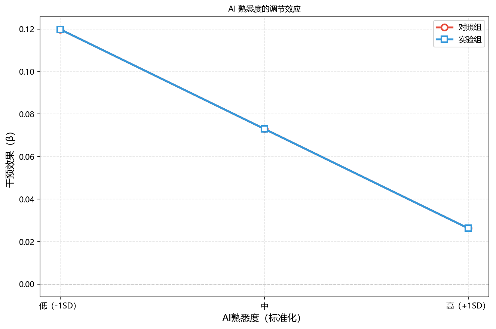
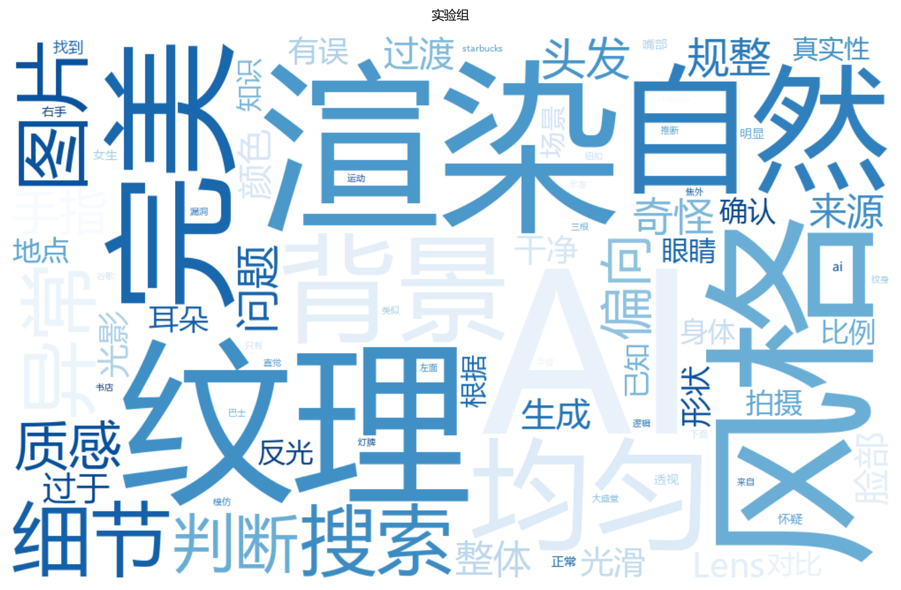
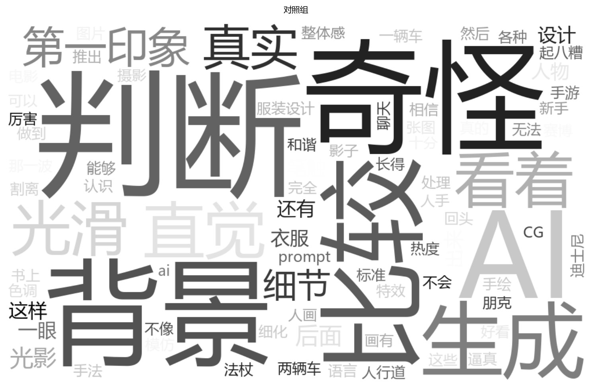
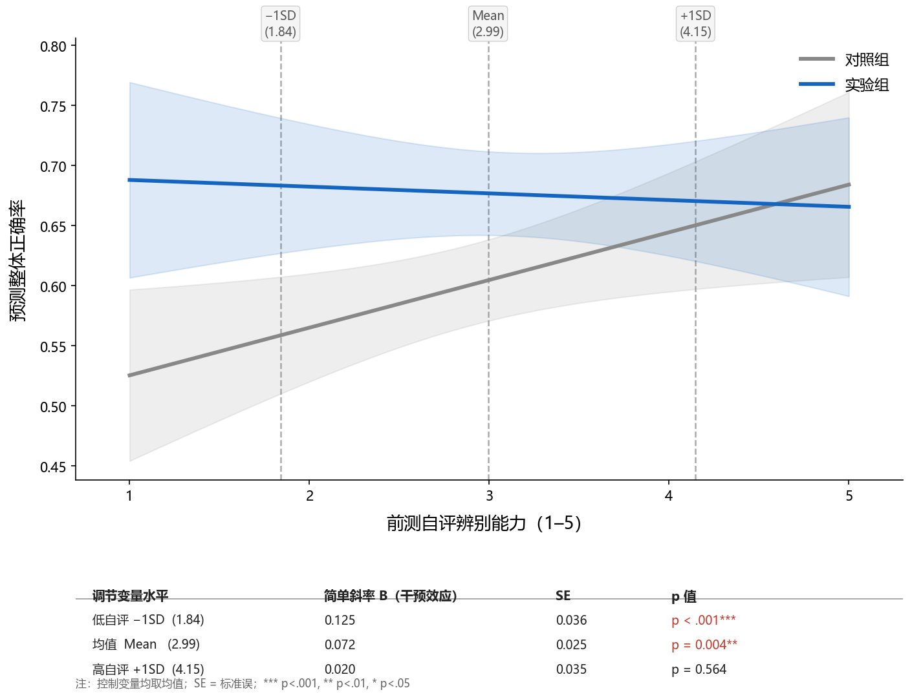

# Study 2 正式分析报告（v3）

**最终样本**: n=152（对照=78, 实验=74）| **日期**: 2026-03-05

---

## 一、数据与方法

### 1.1 数据说明

- 实验平台: 在线实验（picquiz.zeabur.app）
- 排除图像: ai_06, ai_11, ai_18（质量问题），保留 21 张（9张AI，12张真实）
- 组别: 对照组 vs 实验组（干预：策略教学）
- 学历编码: 五分法（edu_ord 1-5，参照=3本科）

### 1.2 核心变量说明

| 变量名                   | 中文名称   | 操作化                                  | 来源           | 量程  |
| --------------------- | ------ | ------------------------------------ | ------------ | --- |
| acc_total             | 整体正确率  | 正确判断数/21 | responses    | 0-1 |
| d' (dprime)           | SDT敏感度 | Loglinear校正：z(HR)-z(FAR)             | 计算           | 连续  |
| c                     | 判断偏向   | 负值=偏向判为AI；正值=保守                      | 计算           | 连续  |
| self_assessed_ability | 前测自评能力 | 自我评估辨别AI图片能力（前测）                     | participants | 1-5 |
| ai_familiarity        | AI熟悉度  | 对AI工具/应用的总体熟悉程度                      | participants | 1-5 |
| ai_exposure_num       | AI使用频率 | never=1...very-often=5               | participants | 1-5 |
| self_performance      | 后测表现自评 | 对自己实验表现的整体自评（后测）                     | post-survey  | 1-5 |
| strategy_usage_degree | 策略使用程度 | 实验组干预后策略使用自评                         | post-survey  | 1-5 |

### 1.3 样本过滤流程

| 步骤                      | 操作      | 保留 n              |
| ----------------------- | ------- | ----------------- |
| 完成全部21张图像               | -       | 163               |
| 通过注意力检验                 | 排除 5 人  | 158               |
| 手动质检排除                  | 排除 2 人  | 156               |
| Manipulation Check（实验组） | 排除 6 人  | 106               |
| 合并额外数据                  | 新增 46 人 | 152（对照=78, 实验=74) |

## 二、基线等价性检验

> 随机分组假设：两组在人口统计学和基线能力上应无显著差异（p > .05）。

### 2.1 人口统计学分布与分组等价性（Table 1）

| 变量/类别         | 对照组 (n=78) | 实验组 (n=74) | chi2 | df  | p    | Cramers V |
| ------------- | ---------- | ---------- | ---- | --- | ---- | --------- |
| **性别**        |            |            | 2.60 | 1   | .107 | .13       |
| 女             | 32 (41.0%) | 41 (55.4%) |      |     |      |           |
| 男             | 46 (59.0%) | 33 (44.6%) |      |     |      |           |
| **年龄**        |            |            | 4.69 | 3   | .196 | .18       |
| 18-24         | 31 (39.7%) | 42 (56.8%) |      |     |      |           |
| 25-34         | 25 (32.1%) | 19 (25.7%) |      |     |      |           |
| 35-44         | 7 (9.0%)   | 4 (5.4%)   |      |     |      |           |
| 45-54         | 15 (19.2%) | 9 (12.2%)  |      |     |      |           |
| **教育程度（五分法）** |            |            | 2.81 | 4   | .591 | .14       |
| 高中            | 4 (5.1%)   | 8 (10.8%)  |      |     |      |           |
| 大专            | 15 (19.2%) | 10 (13.5%) |      |     |      |           |
| 本科            | 31 (39.7%) | 28 (37.8%) |      |     |      |           |
| 硕士            | 23 (29.5%) | 21 (28.4%) |      |     |      |           |
| 博士            | 5 (6.4%)   | 7 (9.5%)   |      |     |      |           |
| **AI使用频率**    |            |            | 1.55 | 4   | .817 | .10       |
| 从不            | 3 (3.8%)   | 1 (1.4%)   |      |     |      |           |
| 很少            | 11 (14.1%) | 13 (17.6%) |      |     |      |           |
| 有时            | 26 (33.3%) | 25 (33.8%) |      |     |      |           |
| 经常            | 20 (25.6%) | 16 (21.6%) |      |     |      |           |
| 非常频繁          | 18 (23.1%) | 19 (25.7%) |      |     |      |           |

### 2.2 连续变量基线比较（Welch t，Table 2）

| 变量            | 对照组 M (SD)  | 实验组 M (SD)  | t     | df    | p    | Hedges g |
| ------------- | ----------- | ----------- | ----- | ----- | ---- | -------- |
| 前测自评辨别能力（1-5） | 2.90 (1.18) | 3.09 (1.12) | 1.055 | 150.0 | .293 | .170     |
| AI使用频率（1-5）   | 3.50 (1.11) | 3.53 (1.10) | 0.150 | 149.7 | .881 | .024     |
| AI熟悉度（1-5）    | 3.33 (1.03) | 3.36 (1.04) | 0.188 | 149.3 | .851 | .030     |

> 结论: 两组在所有人口统计学变量（chi2 p>.05）和AI素养基线指标（p>.05）上均无显著差异。

## 三、干预主效应

### 3.1 组间均值比较（Welch t，Table 3a）

> HR（命中率）= 正确识别AI图像的比例；FAR（虚报率）= 将真实图像误判为AI的比例。
> HR/FAR 使用 Loglinear 校正（加 0.5 / 分母加 1），与整体正确率口径略有差异。

| 指标             | 对照组 M (SD)    | 实验组 M (SD)     | t      | df    | p      | Hedges g |
| -------------- | ------------- | -------------- | ------ | ----- | ------ | -------- |
| 整体正确率          | 0.601 (0.150) | 0.676 (0.154)  | 3.012  | 149.1 | .003** | .487     |
| d'（SDT敏感度）     | 0.524 (0.787) | 0.933 (0.878)  | 3.023  | 146.2 | .003** | .490     |
| c（判断标准，负=偏向AI） | 0.019 (0.322) | -0.001 (0.381) | -0.360 | 143.2 | .720   | -.058    |
| 命中率 HR         | 0.588 (0.171) | 0.659 (0.187)  | 2.433  | 147.1 | .016*  | .394     |
| 虚报率 FAR        | 0.404 (0.178) | 0.339 (0.183)  | -2.230 | 149.1 | .027*  | -.360    |

### 3.2 回归分析（控制人口统计学）：DV = 整体正确率 & d'

> 控制变量：性别、年龄段、学历（参照=本科）。

#### 识别准确率（模型一：控制人口统计学）

> 参照组：性别=男, 年龄=18-24, 学历=本科  *标注 p<.05

| 变量                 | B      | SE    | Beta  | t      | p      | VIF   |
| ------------------ | ------ | ----- | ----- | ------ | ------ | ----- |
| (常量)               | 0.593  | 0.029 |       | 20.698 | < .001 |       |
| 组别（C=1）            | 0.076  | 0.026 | 0.245 | 2.942  | .004** | 1.080 |
| 性别（女=1）            | -0.026 | 0.026 |       | -1.027 | .306   | 1.066 |
| 年龄 25-34（vs 18-24） | 0.033  | 0.030 |       | 1.094  | .276   | 1.195 |
| 年龄 35-44（vs 18-24） | -0.018 | 0.051 |       | -0.359 | .720   | 1.128 |
| 年龄 45-54（vs 18-24） | -0.015 | 0.038 |       | -0.383 | .702   | 1.270 |
| 学历 高中（vs 本科）       | 0.037  | 0.050 |       | 0.750  | .454   | 1.167 |
| 学历 大专（vs 本科）       | 0.009  | 0.039 |       | 0.226  | .821   | 1.330 |
| 学历 硕士（vs 本科）       | 0.026  | 0.031 |       | 0.836  | .405   | 1.290 |
| 学历 博士（vs 本科）       | 0.036  | 0.049 |       | 0.747  | .456   | 1.123 |

R2=0.092, Adj.R2=0.034, F(9,142)=1.591, p = .123
因变量：识别准确率（模型一：控制人口统计学）

> 残差诊断: Shapiro-Wilk W=0.990, p=.380 (正态); Breusch-Pagan p=.224 (同方差); Durbin-Watson=0.80

#### d'（模型一：控制人口统计学）

> 参照组：性别=男, 年龄=18-24, 学历=本科  *标注 p<.05

| 变量                 | B      | SE    | Beta  | t      | p      | VIF   |
| ------------------ | ------ | ----- | ----- | ------ | ------ | ----- |
| (常量)               | 0.477  | 0.157 |       | 3.034  | .003   |       |
| 组别（C=1）            | 0.410  | 0.142 | 0.241 | 2.890  | .004** | 1.080 |
| 性别（女=1）            | -0.100 | 0.141 |       | -0.706 | .482   | 1.066 |
| 年龄 25-34（vs 18-24） | 0.169  | 0.165 |       | 1.025  | .307   | 1.195 |
| 年龄 35-44（vs 18-24） | -0.125 | 0.280 |       | -0.446 | .656   | 1.128 |
| 年龄 45-54（vs 18-24） | -0.112 | 0.211 |       | -0.531 | .596   | 1.270 |
| 学历 高中（vs 本科）       | 0.139  | 0.274 |       | 0.508  | .612   | 1.167 |
| 学历 大专（vs 本科）       | 0.022  | 0.212 |       | 0.102  | .919   | 1.330 |
| 学历 硕士（vs 本科）       | 0.135  | 0.171 |       | 0.787  | .433   | 1.290 |
| 学历 博士（vs 本科）       | 0.234  | 0.268 |       | 0.874  | .384   | 1.123 |

R2=0.089, Adj.R2=0.031, F(9,142)=1.545, p = .138
因变量：d'（模型一：控制人口统计学）

> 残差诊断: Shapiro-Wilk W=0.989, p=.313 (正态); Breusch-Pagan p=.192 (同方差); Durbin-Watson=0.71

### 3.3 回归分析（控制AI素养相关）：DV = 整体正确率 & d'

> 控制变量：AI使用频率、前测自评能力、AI熟悉度（均为连续变量，1-5量表）。

#### 识别准确率（模型二：控制AI素养相关）

> 连续控制变量已中心化  *标注 p<.05

| 变量             | B     | SE    | Beta  | t     | p      | VIF   |
| -------------- | ----- | ----- | ----- | ----- | ------ | ----- |
| (常量)           | 0.444 | 0.054 |       | 8.284 | < .001 |       |
| 组别（C=1）        | 0.070 | 0.024 | 0.226 | 2.907 | .004** | 1.009 |
| AI使用频率（1-5）    | 0.021 | 0.011 | 0.145 | 1.841 | .068   | 1.041 |
| 前测自评能力（1-5）    | 0.015 | 0.013 | 0.114 | 1.179 | .240   | 1.556 |
| ai_familiarity | 0.012 | 0.015 | 0.080 | 0.839 | .403   | 1.536 |

R2=0.118, Adj.R2=0.094, F(4,147)=4.934, p < .001***
因变量：识别准确率（模型二：控制AI素养相关）

> 残差诊断: Shapiro-Wilk W=0.978, p=.015* (偏离正态); Breusch-Pagan p=.810 (同方差); Durbin-Watson=0.95

#### d'（模型二：控制AI素养相关）

> 连续控制变量已中心化  *标注 p<.05

| 变量             | B      | SE    | Beta  | t      | p      | VIF   |
| -------------- | ------ | ----- | ----- | ------ | ------ | ----- |
| (常量)           | -0.375 | 0.293 |       | -1.279 | .203   |       |
| 组别（C=1）        | 0.387  | 0.132 | 0.227 | 2.929  | .004** | 1.009 |
| AI使用频率（1-5）    | 0.114  | 0.061 | 0.147 | 1.864  | .064   | 1.041 |
| 前测自评能力（1-5）    | 0.086  | 0.071 | 0.116 | 1.200  | .232   | 1.556 |
| ai_familiarity | 0.076  | 0.079 | 0.091 | 0.955  | .341   | 1.536 |

R2=0.124, Adj.R2=0.100, F(4,147)=5.201, p < .001***
因变量：d'（模型二：控制AI素养相关）

> 残差诊断: Shapiro-Wilk W=0.989, p=.284 (正态); Breusch-Pagan p=.377 (同方差); Durbin-Watson=0.84

### 3.4 综合回归（同时控制人口统计学 + AI素养）：DV = 整体正确率 & d'

> 模型三：同一模型中同时纳入人口统计学（性别+年龄+学历五分法）和AI素养变量（AI使用频率+前测自评能力+AI熟悉度），
> 检验干预效果在控制所有协变量后的稳健性。参照组：性别=男, 年龄=18-24, 学历=本科。

#### 识别准确率（模型三：同时控制人口统计学+AI素养）

> 参照组：性别=男, 年龄=18-24, 学历=本科  *标注 p<.05

| 变量                 | B      | SE    | Beta  | t      | p      | VIF   |
| ------------------ | ------ | ----- | ----- | ------ | ------ | ----- |
| (常量)               | 0.423  | 0.062 |       | 6.811  | < .001 |       |
| 组别（C=1）            | 0.071  | 0.025 | 0.227 | 2.790  | .006** | 1.094 |
| 性别（女=1）            | -0.029 | 0.025 |       | -1.171 | .243   | 1.077 |
| 年龄 25-34（vs 18-24） | 0.021  | 0.030 |       | 0.704  | .482   | 1.234 |
| 年龄 35-44（vs 18-24） | -0.024 | 0.050 |       | -0.469 | .640   | 1.155 |
| 年龄 45-54（vs 18-24） | -0.001 | 0.038 |       | -0.022 | .983   | 1.306 |
| 学历 高中（vs 本科）       | 0.049  | 0.049 |       | 1.014  | .313   | 1.182 |
| 学历 大专（vs 本科）       | 0.016  | 0.038 |       | 0.432  | .666   | 1.360 |
| 学历 硕士（vs 本科）       | 0.031  | 0.031 |       | 1.023  | .308   | 1.325 |
| 学历 博士（vs 本科）       | 0.070  | 0.049 |       | 1.427  | .156   | 1.178 |
| AI使用频率（1-5）        | 0.020  | 0.012 | 0.141 | 1.712  | .089   | 1.123 |
| 前测自评能力（1-5）        | 0.019  | 0.013 | 0.138 | 1.385  | .168   | 1.625 |
| ai_familiarity     | 0.013  | 0.015 | 0.085 | 0.857  | .393   | 1.608 |

R2=0.156, Adj.R2=0.083, F(12,139)=2.144, p = .018*
因变量：识别准确率（模型三：同时控制人口统计学+AI素养）

> 残差诊断: Shapiro-Wilk W=0.983, p=.058 (正态); Breusch-Pagan p=.509 (同方差); Durbin-Watson=0.96

#### d'（模型三：同时控制人口统计学+AI素养）

> 参照组：性别=男, 年龄=18-24, 学历=本科  *标注 p<.05

| 变量                 | B      | SE    | Beta  | t      | p      | VIF   |
| ------------------ | ------ | ----- | ----- | ------ | ------ | ----- |
| (常量)               | -0.480 | 0.341 |       | -1.410 | .161   |       |
| 组别（C=1）            | 0.380  | 0.139 | 0.223 | 2.737  | .007** | 1.094 |
| 性别（女=1）            | -0.118 | 0.138 |       | -0.858 | .393   | 1.077 |
| 年龄 25-34（vs 18-24） | 0.099  | 0.162 |       | 0.611  | .542   | 1.234 |
| 年龄 35-44（vs 18-24） | -0.158 | 0.275 |       | -0.575 | .566   | 1.155 |
| 年龄 45-54（vs 18-24） | -0.035 | 0.208 |       | -0.168 | .867   | 1.306 |
| 学历 高中（vs 本科）       | 0.205  | 0.267 |       | 0.768  | .444   | 1.182 |
| 学历 大专（vs 本科）       | 0.067  | 0.209 |       | 0.320  | .749   | 1.360 |
| 学历 硕士（vs 本科）       | 0.168  | 0.168 |       | 0.997  | .320   | 1.325 |
| 学历 博士（vs 本科）       | 0.423  | 0.267 |       | 1.585  | .115   | 1.178 |
| AI使用频率（1-5）        | 0.108  | 0.064 | 0.139 | 1.687  | .094   | 1.123 |
| 前测自评能力（1-5）        | 0.105  | 0.074 | 0.142 | 1.434  | .154   | 1.625 |
| ai_familiarity     | 0.078  | 0.082 | 0.094 | 0.949  | .345   | 1.608 |

R2=0.158, Adj.R2=0.085, F(12,139)=2.175, p = .016*
因变量：d'（模型三：同时控制人口统计学+AI素养）

> 残差诊断: Shapiro-Wilk W=0.986, p=.131 (正态); Breusch-Pagan p=.339 (同方差); Durbin-Watson=0.86

> **三模型比较（DV = 整体正确率）**：

| 模型         | 控制变量            | B（组别） | p（组别）  | R2   | Adj.R2 |
| ---------- | --------------- | ----- | ------ | ---- | ------ |
| M1（控制人口）   | 学历五分法+性别+年龄     | 0.076 | .004** | .092 | .034   |
| M2（控制AI素养） | 使用频率+自评能力+熟悉度   | 0.070 | .004** | .118 | .094   |
| M3（综合控制）   | 人口统计学+AI素养（全控制） | 0.071 | .006** | .156 | .083   |

### 3.5 AI 熟悉度调节干预效果

> 模型：acc_total ~ group_c * aif_c + gender_female + age_25_34 + age_35_44 + age_45_54 + edu_hs + edu_sc + edu_ma + edu_phd + ai_exposure_num + self_assessed_ability
> aif_c = AI 熟悉度（中心化）；group_c = 组别中心化（对照=-0.5，实验=0.5）
> 控制变量：人口统计学 + 自评能力 + 使用频率（其他两个AI素养维度）

#### acc_total（模型：AI熟悉度调节）

> 参照组：性别=男, 年龄=18-24, 学历=本科  *标注 p<.05

| 变量                 | B      | SE    | Beta   | t      | p      | VIF   |
| ------------------ | ------ | ----- | ------ | ------ | ------ | ----- |
| (常量)               | 0.472  | 0.060 |        | 7.902  | < .001 |       |
| 组别（C=1）            | 0.073  | 0.025 | 0.235  | 2.906  | .004** | 1.097 |
| aif_c              | 0.037  | 0.020 | 0.246  | 1.892  | .061   | 2.841 |
| group_c:aif_c      | -0.045 | 0.024 | -0.211 | -1.885 | .062   | 2.097 |
| 性别（女=1）            | -0.029 | 0.025 |        | -1.162 | .247   | 1.077 |
| 年龄 25-34（vs 18-24） | 0.027  | 0.030 |        | 0.898  | .371   | 1.247 |
| 年龄 35-44（vs 18-24） | -0.021 | 0.050 |        | -0.419 | .676   | 1.156 |
| 年龄 45-54（vs 18-24） | 0.003  | 0.038 |        | 0.068  | .946   | 1.309 |
| 学历 高中（vs 本科）       | 0.040  | 0.049 |        | 0.823  | .412   | 1.195 |
| 学历 大专（vs 本科）       | 0.018  | 0.038 |        | 0.489  | .626   | 1.361 |
| 学历 硕士（vs 本科）       | 0.032  | 0.030 |        | 1.056  | .293   | 1.325 |
| 学历 博士（vs 本科）       | 0.059  | 0.049 |        | 1.222  | .224   | 1.192 |
| AI使用频率（1-5）        | 0.021  | 0.012 | 0.150  | 1.830  | .069   | 1.126 |
| 前测自评能力（1-5）        | 0.014  | 0.013 | 0.107  | 1.070  | .286   | 1.669 |

R2=0.177, Adj.R2=0.100, F(13,138)=2.289, p = .009**
因变量：acc_total（模型：AI熟悉度调节）

**交互项（group_c × aif_c）**: t=-1.885, p=.062
交互不显著，AI 熟悉度未显著调节干预效果。

**按 AI 熟悉度水平的简单斜率**：
| AI熟悉度水平 | β（组别） | SE    | t     | p         |
| ------- | ----- | ----- | ----- | --------- |
| 低（-1SD） | 0.120 | 0.035 | 3.392 | < .001*** |
| 中       | 0.073 | 0.025 | 2.906 | .004**    |
| 高（+1SD） | 0.026 | 0.035 | 0.743 | .459      |

#### 3.5.1 AI 熟悉度调节效应可视化

## 四、过度怀疑分析（T6）

### 4.1 混合 ANOVA（2组 x 2图像类型）

| 效应          | df1 | df2 | F     | p      | eta2p |
| ----------- | --- | --- | ----- | ------ | ----- |
| group       | 1   | 150 | 9.328 | .003** | .059  |
| image_type  | 1   | 150 | 0.004 | .947   | .000  |
| Interaction | 1   | 150 | 0.038 | .846   | .000  |

### 4.2 按图像类型的组间差异（简单效应）

| 图像类型   | 对照组 M (SD)    | 实验组 M (SD)    | t     | df    | p     | Hedges g |
| ------ | ------------- | ------------- | ----- | ----- | ----- | -------- |
| AI图像   | 0.598 (0.191) | 0.677 (0.208) | 2.433 | 147.1 | .016* | .394     |
| Real图像 | 0.604 (0.193) | 0.675 (0.199) | 2.228 | 149.1 | .027* | .360     |

> 实验组在AI图（0.677 vs 0.598）和真实图（0.675 vs 0.604）上均高于对照组。group x image_type 交互 p=.846，不显著。数据不支持"过度怀疑"解读。

## 六、逐图与图像类型分析

### 6.1 每张图 Fisher 精确检验（group x is_correct）

| 图像ID    | 类型   | 风格           | 对照准确率 | 实验准确率 | Delta  | OR    | p（未校正） | p（Bonferroni） |
| ------- | ---- | ------------ | ----- | ----- | ------ | ----- | ------ | ------------- |
| ai_08   | AI   | photograph   | 0.385 | 0.568 | +0.183 | 0.476 | .034*  | .137          |
| ai_16   | AI   | illustration | 0.385 | 0.554 | +0.169 | 0.503 | .051   | .405          |
| real_02 | Real | photograph   | 0.744 | 0.905 | +0.162 | 0.303 | .011*  | .118          |
| real_11 | Real | photograph   | 0.654 | 0.811 | +0.157 | 0.441 | .044*  | .698          |
| ai_19   | AI   | photograph   | 0.667 | 0.811 | +0.144 | 0.467 | .065   | .582          |
| ai_13   | AI   | photograph   | 0.577 | 0.716 | +0.139 | 0.540 | .090   | .542          |
| real_01 | Real | illustration | 0.372 | 0.500 | +0.128 | 0.592 | .141   | 1.000         |
| real_03 | Real | cartoon      | 0.615 | 0.743 | +0.128 | 0.553 | .118   | 1.000         |
| real_15 | Real | illustration | 0.256 | 0.365 | +0.108 | 0.600 | .164   | 1.000         |
| real_05 | Real | illustration | 0.500 | 0.581 | +0.081 | 0.721 | .333   | 1.000         |
| ai_02   | AI   | photograph   | 0.423 | 0.500 | +0.077 | 0.733 | .416   | .832          |
| real_12 | Real | photograph   | 0.821 | 0.878 | +0.058 | 0.633 | .370   | 1.000         |
| real_06 | Real | photograph   | 0.782 | 0.838 | +0.056 | 0.694 | .415   | 1.000         |
| real_16 | Real | photograph   | 0.756 | 0.797 | +0.041 | 0.789 | .566   | 1.000         |
| real_14 | Real | cartoon      | 0.410 | 0.446 | +0.036 | 0.864 | .743   | 1.000         |
| ai_01   | AI   | illustration | 0.808 | 0.838 | +0.030 | 0.813 | .675   | .675          |
| ai_09   | AI   | cartoon      | 0.872 | 0.878 | +0.007 | 0.942 | 1.000  | 1.000         |
| ai_04   | AI   | cartoon      | 0.821 | 0.811 | -0.010 | 1.067 | 1.000  | 1.000         |
| ai_15   | AI   | photograph   | 0.449 | 0.419 | -0.030 | 1.129 | .745   | 1.000         |
| real_20 | Real | cartoon      | 0.564 | 0.527 | -0.037 | 1.161 | .745   | 1.000         |
| real_04 | Real | photograph   | 0.769 | 0.703 | -0.067 | 1.410 | .364   | 1.000         |

> 原始p<.05：['ai_08', 'real_02', 'real_11']；Bonferroni校正后（alpha=.05/21=0.0024）显著：无。

### 6.2 风格类型分析（photo vs not_photo）

> illustration 与 cartoon 合并为 not_photo；photograph 单独为 photo。

| 风格               | 对照组 M (SD)    | 实验组 M (SD)    | t     | df    | p      | Hedges g |
| ---------------- | ------------- | ------------- | ----- | ----- | ------ | -------- |
| photo（摄影风格）      | 0.639 (0.173) | 0.722 (0.172) | 2.990 | 149.6 | .003** | .483     |
| not_photo（插图/卡通） | 0.560 (0.200) | 0.624 (0.178) | 2.087 | 149.4 | .039*  | .336     |

> 模型: acc ~ group_c x style_photo（n=304 行）, F(3,300)=10.239, p < .001***

- Intercept: B=0.560, p=< .001***
- group_c: B=0.064, p=.030*
- style_photo: B=0.078, p=.007**
- group_c:style_photo: B=0.020, p=.638

### 6.3 可反向搜索性分析（reverse_searchable）

> 先聚合到被试水平，再做 Welch t 检验（避免 df 虚大）。

| 类型           | 对照组均值 | 实验组均值 | t     | df    | p      | Hedges g |
| ------------ | ----- | ----- | ----- | ----- | ------ | -------- |
| 可反向搜索        | 0.613 | 0.664 | 1.760 | 141.2 | .081   | .286     |
| 不可反向搜索（仅AI图） | 0.593 | 0.685 | 3.239 | 149.9 | .001** | .522     |

## 七、AI 素养调节效应

### 7.1 AI 素养与准确率的相关分析

| 变量          | r（与准确率） | p     | n   |
| ----------- | ------- | ----- | --- |
| 前测自评能力      | .207    | .010* | 152 |
| AI使用频率（1-5） | .183    | .024* | 152 |
| AI熟悉度（1-5）  | .175    | .031* | 152 |

### 7.2 调节效应模型（前测自评能力 x 组别）

> 完整模型（含人口统计学+AI使用频率）；简约模型（仅组别x自评能力）。
> 均使用 self_assessed_ability 的中心化版本 sae_c。

**模型 I：完整模型（含人口统计学 + AI使用频率控制变量）**

| 变量                 | B      | SE    | 95% CI           | beta | t      | p      | VIF  |
| ------------------ | ------ | ----- | ---------------- | ---- | ------ | ------ | ---- |
| 截距                 | 0.489  | 0.071 | [0.348, 0.629]   | -    | 6.881  | -      | -    |
| 组别（C=1）            | 0.072  | 0.025 | [0.023, 0.122]   | .233 | 2.890  | .004** | 1.09 |
| 前测自评能力（中心化）        | 0.040  | 0.017 | [0.007, 0.073]   | .294 | 2.377  | .019*  | 1.62 |
| 交互：组别 x 自评能力       | -0.045 | 0.022 | [-0.088, -0.002] | -    | -2.080 | .039*  | -    |
| 性别（女=1）            | -0.025 | 0.025 | [-0.074, 0.025]  | -    | -0.991 | .323   | 1.08 |
| 年龄 25-34（vs 18-24） | 0.029  | 0.030 | [-0.029, 0.087]  | -    | 0.980  | .329   | 1.23 |
| 年龄 35-44（vs 18-24） | -0.016 | 0.050 | [-0.114, 0.082]  | -    | -0.322 | .748   | 1.15 |
| 年龄 45-54（vs 18-24） | 0.000  | 0.037 | [-0.074, 0.075]  | -    | 0.011  | .991   | 1.31 |
| 学历 高中（vs 本科）       | 0.041  | 0.048 | [-0.054, 0.137]  | -    | 0.854  | .394   | 1.18 |
| 学历 大专（vs 本科）       | 0.019  | 0.038 | [-0.056, 0.093]  | -    | 0.493  | .623   | 1.36 |
| 学历 硕士（vs 本科）       | 0.023  | 0.031 | [-0.038, 0.084]  | -    | 0.750  | .454   | 1.32 |
| 学历 博士（vs 本科）       | 0.053  | 0.049 | [-0.043, 0.150]  | -    | 1.092  | .277   | 1.18 |
| AI使用频率（1-5）        | 0.020  | 0.012 | [-0.003, 0.043]  | .143 | 1.750  | .082   | 1.12 |
| ai_familiarity     | 0.010  | 0.015 | [-0.020, 0.039]  | .064 | 0.654  | .514   | 1.61 |

R2=.182, Adj.R2=.105, F(13,138)=2.359, p = .007**

> 残差诊断: Shapiro-Wilk W=0.983, p=.052 (正态); Breusch-Pagan p=.526 (同方差); Durbin-Watson=1.01

**模型 II：简约模型（仅 group_c x sae_c）**

| 变量           | B      | SE    | 95% CI           | beta | t      | p         | VIF  |
| ------------ | ------ | ----- | ---------------- | ---- | ------ | --------- | ---- |
| 截距           | 0.606  | 0.017 | [0.573, 0.639]   | -    | 36.323 | -         | -    |
| 组别（C=1）      | 0.070  | 0.024 | [0.022, 0.117]   | .224 | 2.916  | .004**    | 1.01 |
| 前测自评能力（中心化）  | 0.050  | 0.014 | [0.022, 0.078]   | .368 | 3.506  | < .001*** | 1.01 |
| 交互：组别 x 自评能力 | -0.053 | 0.021 | [-0.094, -0.011] | -    | -2.517 | .013*     | -    |

R2=.130, Adj.R2=.112, F(3,148)=7.343, p < .001***

> 残差诊断: Shapiro-Wilk W=0.983, p=.053 (正态); Breusch-Pagan p=.689 (同方差); Durbin-Watson=0.95

### 7.3 简单斜率分析（group 效应 at -1SD / Mean / +1SD 自评能力）

> 基于完整模型（模型 I）。调节效应图见 F4（PROCESS/SPSS 风格）。

**模型 I 简单斜率（完整控制变量）**

| 水平                  | B（组别效应） | SE    | 95% CI          | t     | p         |
| ------------------- | ------- | ----- | --------------- | ----- | --------- |
| 低自评 -1SD (SAE=1.84) | 0.125   | 0.036 | [0.053, 0.196]  | 3.457 | < .001*** |
| 均值     (SAE=2.99)   | 0.072   | 0.025 | [0.023, 0.122]  | 2.890 | .004**    |
| 高自评 +1SD (SAE=4.15) | 0.020   | 0.035 | [-0.049, 0.089] | 0.578 | .564      |

Johnson-Neyman 近似显著性边界（中心化 sae_c）: 0.514 - 2.683
对应原始 self_assessed_ability: 3.51 - 5.68
group 效应在此区间外达 p<.05（交互方向 < 0）

### 7.4 调节效应模型（AI使用频率 x 组别）

> 完整模型（含人口统计学+前测自评能力控制变量）。aie_c 为 ai_exposure_num 中心化版本。

| 变量                 | B      | SE    | 95% CI          | beta | t      | p      | VIF  |
| ------------------ | ------ | ----- | --------------- | ---- | ------ | ------ | ---- |
| 截距                 | 0.495  | 0.051 | [0.394, 0.597]  | -    | 9.662  | -      | -    |
| 组别（C=1）            | 0.069  | 0.025 | [0.019, 0.119]  | .223 | 2.729  | .007** | 1.09 |
| AI使用频率（中心化）        | 0.010  | 0.016 | [-0.022, 0.042] | .069 | 0.603  | .547   | 1.12 |
| 交互：组别 x AI频率       | 0.021  | 0.023 | [-0.024, 0.066] | -    | 0.913  | .363   | -    |
| 性别（女=1）            | -0.027 | 0.025 | [-0.077, 0.023] | -    | -1.076 | .284   | 1.08 |
| 年龄 25-34（vs 18-24） | 0.018  | 0.030 | [-0.041, 0.077] | -    | 0.598  | .551   | 1.23 |
| 年龄 35-44（vs 18-24） | -0.030 | 0.051 | [-0.130, 0.070] | -    | -0.591 | .555   | 1.15 |
| 年龄 45-54（vs 18-24） | -0.001 | 0.038 | [-0.076, 0.074] | -    | -0.036 | .971   | 1.31 |
| 学历 高中（vs 本科）       | 0.053  | 0.049 | [-0.044, 0.150] | -    | 1.078  | .283   | 1.18 |
| 学历 大专（vs 本科）       | 0.012  | 0.038 | [-0.064, 0.088] | -    | 0.322  | .748   | 1.36 |
| 学历 硕士（vs 本科）       | 0.033  | 0.031 | [-0.028, 0.094] | -    | 1.076  | .284   | 1.32 |
| 学历 博士（vs 本科）       | 0.070  | 0.049 | [-0.027, 0.166] | -    | 1.428  | .156   | 1.18 |
| 前测自评能力（1-5）        | 0.020  | 0.013 | [-0.007, 0.046] | .146 | 1.463  | .146   | 1.62 |
| ai_familiarity     | 0.011  | 0.015 | [-0.018, 0.041] | .076 | 0.763  | .447   | 1.61 |

R2=.161, Adj.R2=.082, F(13,138)=2.041, p = .022*

> 残差诊断: Shapiro-Wilk W=0.987, p=.155 (正态); Breusch-Pagan p=.105 (同方差); Durbin-Watson=0.96

> 组别 x AI使用频率 交互项 p=.363，不显著，AI使用频率对干预效果无显著调节作用。

## 九、策略使用分析

> 本节仅针对实验组：（1）策略使用程度量化分析；（2）逐图自报策略词频分析；
> （3）开放式策略描述词频与聚类分析。

### 9.1 策略使用程度（实验组，strategy_usage_degree）

**描述统计**: n=74, M=3.419, SD=0.922, Mdn=3.000, 范围=[2, 5]
| 策略使用程度（1-5） | n  | %     |
| ----------- | -- | ----- |
| 2           | 12 | 16.2% |
| 3           | 29 | 39.2% |
| 4           | 23 | 31.1% |
| 5           | 10 | 13.5% |

**与整体正确率的相关**: r=.185, p=.114, n=74
**与 d' 的相关**: r=.193, p=.099, n=74

**高/低策略使用组比较**（中位数切分，Mdn=3）:
| 组别       | n  | M (SD)        | t     | p    | Hedges g |
| -------- | -- | ------------- | ----- | ---- | -------- |
| 高使用（>3）  | 33 | 0.710 (0.164) | 1.719 | .090 | .404     |
| 低使用（<=3） | 41 | 0.648 (0.141) |       |      |          |

### 9.2 逐图自报策略词频分析（reasoning 字段，jieba 分词）

实验组有填写 reasoning：459 条；对照组：164 条

**实验组 Top-20 高频词（reasoning，jieba 分词）**：
| 排名 | 词语 | 频次  |
| -- | -- | --- |
| 1  | AI | 100 |
| 2  | 渲染 | 63  |
| 3  | 纹理 | 62  |
| 4  | 风格 | 60  |
| 5  | 自然 | 60  |
| 6  | 完美 | 59  |
| 7  | 均匀 | 58  |
| 8  | 背景 | 58  |
| 9  | 细节 | 57  |
| 10 | 异常 | 54  |
| 11 | 搜索 | 51  |
| 12 | 图片 | 50  |
| 13 | 判断 | 40  |
| 14 | 质感 | 39  |
| 15 | 偏向 | 39  |
| 16 | 手指 | 34  |
| 17 | 头发 | 34  |
| 18 | 问题 | 34  |
| 19 | 规整 | 34  |
| 20 | 奇怪 | 33  |

**对照组 Top-20 高频词（reasoning，jieba 分词）**：
| 排名 | 词语   | 频次 |
| -- | ---- | -- |
| 1  | 判断   | 31 |
| 2  | 奇怪   | 25 |
| 3  | AI   | 23 |
| 4  | 背景   | 22 |
| 5  | 比较   | 19 |
| 6  | 生成   | 18 |
| 7  | 直觉   | 18 |
| 8  | 看着   | 18 |
| 9  | 光滑   | 18 |
| 10 | 真实   | 17 |
| 11 | 第一印象 | 13 |
| 12 | 细节   | 8  |
| 13 | 后面   | 3  |
| 14 | 光影   | 3  |
| 15 | 还有   | 2  |
| 16 | 衣服   | 2  |
| 17 | 设计   | 2  |
| 18 | 出来   | 2  |
| 19 | 这样   | 2  |
| 20 | 笔触   | 2  |

**实验组 TF-IDF 关键词（区分性词汇，jieba.analyse）**：
| 排名 | 关键词  | TF-IDF 权重 |
| -- | ---- | --------- |
| 1  | AI   | 0.6372    |
| 2  | 纹理   | 0.3041    |
| 3  | 渲染   | 0.2968    |
| 4  | 完美   | 0.2359    |
| 5  | 均匀   | 0.2244    |
| 6  | 细节   | 0.2189    |
| 7  | 搜索   | 0.2031    |
| 8  | 质感   | 0.1928    |
| 9  | 风格   | 0.1902    |
| 10 | 背景   | 0.1803    |
| 11 | Lens | 0.1784    |
| 12 | 偏向   | 0.1776    |
| 13 | 规整   | 0.1771    |
| 14 | 异常   | 0.1726    |
| 15 | 图片   | 0.1699    |
| 16 | 感觉   | 0.1654    |
| 17 | 自然   | 0.1618    |
| 18 | 脸部   | 0.1482    |
| 19 | 光影   | 0.1434    |
| 20 | 手指   | 0.1272    |

**对照组 TF-IDF 关键词（区分性词汇，jieba.analyse）**：
| 排名 | 关键词  | TF-IDF 权重 |
| -- | ---- | --------- |
| 1  | 看起来  | 0.6030    |
| 2  | AI   | 0.5776    |
| 3  | 感觉   | 0.5333    |
| 4  | 有点   | 0.5175    |
| 5  | 判断   | 0.3770    |
| 6  | 奇怪   | 0.3393    |
| 7  | 直觉   | 0.3310    |
| 8  | 光滑   | 0.3009    |
| 9  | 第一印象 | 0.2992    |
| 10 | 背景   | 0.2696    |
| 11 | 生成   | 0.2566    |
| 12 | 真实   | 0.2329    |
| 13 | 看着   | 0.2049    |
| 14 | 比较   | 0.1905    |
| 15 | 细节   | 0.1211    |
| 16 | 光影   | 0.0606    |
| 17 | 像是   | 0.0536    |
| 18 | 笔触   | 0.0402    |
| 19 | 后面   | 0.0385    |
| 20 | 割离   | 0.0277    |

### 9.3 策略词云图（干预组 vs 对照组）

> 词云基于 reasoning 字段 jieba 分词结果（过滤停用词及单字），字号反映词频。

**策略类型 x 组别 x 准确率**：
| 组别 | 策略类型   | n（次） | 正确率   |
| -- | ------ | ---- | ----- |
| 对照 | 解剖细节   | 31   | 0.774 |
| 实验 | 解剖细节   | 143  | 0.734 |
| 对照 | 风格纹理   | 42   | 0.452 |
| 实验 | 风格纹理   | 262  | 0.725 |
| 实验 | 知识验证   | 54   | 0.685 |
| 对照 | 直觉经验   | 31   | 0.419 |
| 实验 | 直觉经验   | 1    | 1.000 |
| 对照 | 其他/未分类 | 61   | 0.672 |
| 实验 | 其他/未分类 | 35   | 0.514 |

### 9.3 开放式整体策略描述（open_method 字段，jieba 分词）

实验组 open_method 填写：13 人；对照组：15 人

**实验组 open_method Top-15 高频词（jieba 分词）**：
| 排名 | 词语     | 频次 |
| -- | ------ | -- |
| 1  | 手指     | 3  |
| 2  | 搜索     | 2  |
| 3  | 数量     | 2  |
| 4  | 照片     | 2  |
| 5  | 使用     | 1  |
| 6  | Google | 1  |
| 7  | 还有     | 1  |
| 8  | 常识     | 1  |
| 9  | 主要     | 1  |
| 10 | 第一印象   | 1  |
| 11 | 拿不准    | 1  |
| 12 | 仔细     | 1  |
| 13 | 看看     | 1  |
| 14 | 纹理     | 1  |
| 15 | 差异     | 1  |

**实验组 open_method TF-IDF 关键词**：
| 排名 | 关键词    | TF-IDF 权重 |
| -- | ------ | --------- |
| 1  | 手指     | 0.4898    |
| 2  | 感觉     | 0.3936    |
| 3  | 搜索     | 0.3474    |
| 4  | 照片     | 0.3371    |
| 5  | 人体工学   | 0.2977    |
| 6  | Google | 0.2780    |
| 7  | 搜图     | 0.2780    |
| 8  | AI     | 0.2780    |
| 9  | 第一印象   | 0.2548    |
| 10 | 数量     | 0.2462    |
| 11 | 拿不准    | 0.2369    |
| 12 | 手部     | 0.2363    |
| 13 | 纹理     | 0.2140    |
| 14 | 画风     | 0.2104    |
| 15 | 透视     | 0.2048    |

**对照组 open_method Top-15 高频词（jieba 分词）**：
| 排名 | 词语  | 频次 |
| -- | --- | -- |
| 1  | 图片  | 4  |
| 2  | 背景  | 2  |
| 3  | 是否  | 2  |
| 4  | 图像  | 2  |
| 5  | AI  | 2  |
| 6  | 生成  | 2  |
| 7  | 细节  | 1  |
| 8  | 光影  | 1  |
| 9  | 标准  | 1  |
| 10 | 直觉  | 1  |
| 11 | hmm | 1  |
| 12 | 肉眼  | 1  |
| 13 | 动画  | 1  |
| 14 | 这些  | 1  |
| 15 | 人物  | 1  |

**对照组 open_method TF-IDF 关键词**：
| 排名 | 关键词  | TF-IDF 权重 |
| -- | ---- | --------- |
| 1  | 图片   | 0.4636    |
| 2  | AI   | 0.4347    |
| 3  | 感觉   | 0.4103    |
| 4  | 图像   | 0.2821    |
| 5  | 生成   | 0.2467    |
| 6  | 真实度  | 0.2401    |
| 7  | hmm  | 0.2174    |
| 8  | 图层   | 0.2174    |
| 9  | 背景   | 0.2121    |
| 10 | 像素   | 0.2035    |
| 11 | 清晰度  | 0.1974    |
| 12 | 说不上来 | 0.1950    |
| 13 | 凭感觉  | 0.1915    |
| 14 | 是否   | 0.1907    |
| 15 | 动画   | 0.1831    |

**实验组自报策略原文（全部）**：

1. 搜索
2. 使用Google搜索，还有常识
3. 主要是看感觉，第一印象，拿不准的再仔细看看
4. 纹理差异，是否符合人体工学，谷歌搜图
5. 感觉
6. AI生成的比较假
7. 数手指，看整体，看构图
8. 逻辑和人体结构学
9. 感觉
10. 直觉，风格
11. 手指数量，画风
12. 手部透视，手指数量
13. 日常照片是真实照片

**对照组自报策略原文（全部）**：

1. 背景细节 光影 是否特别标准
2. 靠感觉
3. 直觉
4. hmm
5. 肉眼
6. 动画这些图像是AI生成
7. 图片的背景和人物是否融合
8. 绘画风格，手的形状
9. 用像素
10. 过往经验以及一种感觉，说不上来。我觉得AI生成图片有种不适合的感觉，很突兀，夸张，有一些地方处理随意。
11. 图片逻辑  色彩
12. 凭感觉，图像的清晰度和真实度
13. 感觉
14. 图片质感
15. 图层，合理性

### 9.4 策略聚类分析（实验组 reasoning 文本，jieba + TF-IDF + K-Means）

> 对实验组每位被试的 reasoning 文本汇总后，先用 jieba 分词，
> 再 TF-IDF 向量化 + K-Means 聚类，用轮廓系数选择最优 K。

**轮廓系数（Silhouette Score）**：
| K | Silhouette | 备注   |
| - | ---------- | ---- |
| 2 | 0.246      | 最优 ✓ |
| 3 | 0.107      |      |
| 4 | 0.102      |      |
| 5 | 0.102      |      |
| 6 | 0.114      |      |

**K=2 聚类结果**（最优轮廓系数=0.246）：
| 聚类   | n（被试） | 平均准确率 M (SD)  | 代表词（TF-IDF Top-8）       |
| ---- | ----- | ------------- | ----------------------- |
| 聚类 1 | 6     | 0.564 (0.220) | 手指、女生、正常、明显、嘴部、奇怪、过于、细节 |
| 聚类 2 | 47    | 0.735 (0.115) | ai、纹理、风格、完美、渲染、自然、均匀、背景 |

**各聚类部分代表性 reasoning（前3人示例）**：

*聚类 1（共 6 人）*

- Pdc165136-ff71-4ab3-8e4b-5afe4edf0d1b: shibuya那个灯牌应该是是starbucks，左面的大盛堂书店招牌也不对；左三女生没影子
- P572cc315-3457-446d-9de2-5477fb08fd31: 感觉非常像真实的，属于在社交媒体出现我根本不会怀疑的程度，唯一让我怀疑的就是这个女生的右耳不是很明显；衣服上有光斑；嘴部不正常
- Peb3dd866-661a-490b-b487-cb0906195fe6: 手指

*聚类 2（共 47 人）*

- P7bdd05f3-157f-460a-9fa7-78218f38e94a: 纹身、手臂细节等丰富；来自谷歌图片搜索；巴士的字太真了
- Pf3dcf613-ca02-4ab6-9062-b3d656bdca0a: 左手（画面右侧）不像人画的；没啥大的判断依据，就是感觉像
- P4a56e17e-344c-4772-8201-8d2a699b8a61: 风格过于完美和干净；搜索确认了拍摄地点；整体感觉太"完美"，AI风格

## 十三、图表

> 图表已保存至 C:\Users\t-yimengwu\Desktop\study2\analysis\output_1/F4_moderation_v3.png

---

注释: * p<.05, ** p<.01, *** p<.001（双尾）。所有 Welch t 检验使用 Welch-Satterthwaite 自由度近似。
第六节 21 次 Fisher 精确检验已进行 Bonferroni 校正（alpha=0.0024）。

*报告生成时间: 2026-03-05 | 输出文件: C:\Users\t-yimengwu\Desktop\study2\analysis\output_1/*
